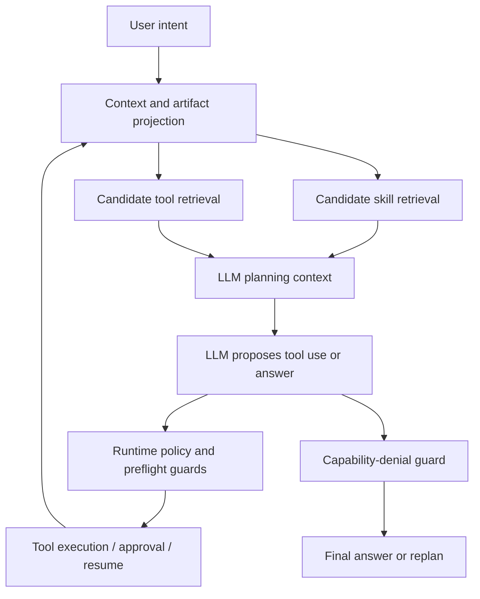

# Agent Skill Orchestration v2 Design

## Goal

Evolve the Harness Loop Agent from single-skill pre-routing toward Codex/Claude Code style agentic orchestration: the LLM remains responsible for understanding and planning, while the backend supplies bounded context, candidate capabilities, tool contracts, permissions, approvals, object-reference guards, audit evidence, and correction loops.

This design is not a defect-only fix. It must scale as new skills are added for defects, test plans, visual flows, execution diagnosis, media evidence, notification configuration, mock services, dataset management, permissions, and future platform domains.

## Problem

The current runtime can expose the complete platform capability set through `GET /agents/capabilities`, but each run's model-visible context is aggressively trimmed by `AgentSkillPlanner` and `AgentCapabilityResolver`. That trimming is useful for context budget and safety, but the current scoring model mixes three different concepts:

- the user's current target action;
- historical artifact follow-up actions;
- skill/tool keyword relevance.

In the observed run, the user asked to create defects from failed test cases. The runtime snapshot already contained `defect.create_saved`, and `defect-triage` declared the correct tools. However, the previous `test_case_query_snapshot` carried `update_assertions` as an available follow-up action. Artifact scoring then promoted `http-test-case-design` as the primary skill and hid the defect tools from the LLM. The model incorrectly concluded that the platform had no direct defect creation interface.

This is an architectural failure mode: historical artifacts were allowed to behave like the business goal. As skill count grows, this pattern will create more cross-domain failures, such as report-to-plan, execution-to-defect, defect-to-regression-case, or media-to-defect workflows.

## Principles

1. The LLM is the reasoning and planning core. Backend routing should retrieve candidate skills and tools, not prematurely replace business understanding with a single deterministic route.
2. The current user goal has priority over historical artifact actions. Artifacts provide evidence, object references, and recovery context unless the user makes an ambiguous deictic follow-up such as "execute it", "save this", or "fix those".
3. Skill retrieval is not skill routing. Multiple relevant skills may be loaded when a task crosses domains.
4. Tool catalog retrieval is not permission. The model may see candidate tool contracts, while ToolRuntime still enforces permission, approval, schema, object-reference freshness, project isolation, and replay policy.
5. LLM plans are not direct execution. ToolCall execution remains mediated by schema preflight, object-reference guard rules, approval policy, ledger events, and resume semantics.
6. System guards are safety rails, not the business brain. They should prevent unsupported claims, missing prerequisites, unsafe writes, stale references, and cross-project leakage without hard-coding every business workflow.

## Target Architecture



The first implementation increment keeps the existing runner loop and data model. It changes the planner/resolver behavior so that explicit cross-domain goals retrieve multiple candidate capabilities instead of collapsing to one historical artifact action.

## Core Concepts

### IntentAction

Introduce a small structured action model used internally by planner and resolver:

```python
@dataclass(frozen=True)
class AgentIntentAction:
    action: str | None
    target_domain: str | None
    source_domains: tuple[str, ...]
    explicit: bool
    is_deictic_followup: bool
    reason_codes: tuple[str, ...]
```

Examples:

- "根据失败用例创建缺陷" -> `action=create`, `target_domain=defect`, `source_domains=("test_case",)`, `explicit=True`.
- "执行它" after a saved scenario artifact -> `action=execute`, `target_domain=scenario`, `is_deictic_followup=True`.
- "根据报告生成测试计划" -> `action=create`, `target_domain=test_plan`, `source_domains=("report",)`.
- "根据这个缺陷生成回归用例" -> `action=create`, `target_domain=test_case`, `source_domains=("defect",)`.

The model is intentionally small. It is not a full workflow engine; it gives deterministic guardrails enough structure to avoid cross-domain route collapse.

### Artifact role

Artifact interpretation must distinguish target artifacts from evidence artifacts.

- Target artifact: the user wants to operate on the artifact itself, often through a deictic phrase. Example: "保存这些断言" after assertion draft generation.
- Evidence artifact: the user wants to use the artifact as source material for another domain. Example: failed test cases used to create defects.

Artifact follow-up actions should strongly affect routing only when the current user intent is deictic or semantically compatible with the artifact action. Otherwise they should contribute evidence source context and supporting tools, not override the explicit target domain.

### Candidate skills

`AgentSkillPlanner` should still rank skills, but the result should be treated as retrieval. For cross-domain tasks, it may include:

- a primary target skill;
- supporting evidence skills;
- discarded artifact candidates with explicit reasons.

The first increment can preserve the current `primary_skill` field for compatibility while allowing `supporting_skills` and `allowed_skills` to include evidence-domain skills and their read tools.

### Candidate tools

`AgentCapabilityResolver` should resolve tools from the action model:

- target-domain tools for the primary action;
- read/query tools for evidence domains;
- `project.read_context` when project/environment context may be required;
- approval-producing tools only as candidates; execution still requires ToolRuntime policy.

For the failed-test-case-to-defect case, the model-visible tools should include at least:

- `defect.create_saved`;
- `defect.query_project_defects`;
- `testcase.query_project_cases`;
- `project.read_context`;
- optional execution/report read tools if evidence comes from those artifacts.

## Unsupported Capability and Denial Guard

If a final model answer claims that a platform action is unavailable, the runtime should compare the claim against the runtime snapshot and capability graph.

Examples of denial language:

- "没有接口";
- "不支持";
- "无法创建";
- "只能手动复制";
- "当前工具不具备".

If a matching tool exists globally but was not present in the routed catalog, the run should not silently complete as an unsupported capability. The runtime should record a route-mismatch observation and either:

1. replan with widened candidate skills/tools when safe; or
2. produce a diagnostic final message that says the route did not include an available capability and asks the user to retry after backend repair.

The first increment should at minimum prevent false "platform unsupported" final answers for actions that exist in the runtime snapshot.

## Compatibility

- Do not remove or rename existing ToolSpec names.
- Do not weaken ToolRuntime permission, approval, schema preflight, object-reference freshness, or project isolation.
- Keep current single-primary-skill fields for existing frontend diagnostics and tests.
- Add new route decision metadata only as backend-internal fields unless a frontend contract update is explicitly needed.
- Keep full capabilities public behavior unchanged: `/agents/capabilities` remains the full manifest, while per-run context is a bounded candidate view.
- Preserve current asynchronous runner, approval, resume, and EventStore architecture.

## First Increment Scope

The first implementation increment should include:

1. Add `AgentIntentAction` and a deterministic parser for common platform actions/domains.
2. Teach artifact action acceptance to require semantic compatibility. Historical artifact write actions should only dominate for deictic follow-ups or matching target domains.
3. Let explicit target-domain skills outrank incompatible artifact actions.
4. Let evidence-domain read tools remain visible alongside target-domain write tools.
5. Add first-class task type mappings for platform skills already present, including defect, test plan, visual flow, and execution diagnosis where missing.
6. Add regression tests for cross-domain follow-ups:
   - failed test cases -> create defects;
   - execution failure -> create defect;
   - report summary -> create test plan;
   - defect snapshot -> create regression test case.
7. Add documentation describing skill retrieval versus skill routing.

## Out of Scope for First Increment

- Replacing the entire model loop.
- Adding a new database table for plans.
- Changing approval storage or ToolCall ledger schema.
- Exposing all tools to the LLM for every run.
- Adding new business tool families not already represented in ToolRegistry.
- Changing frontend behavior beyond existing diagnostics unless tests reveal a strict contract mismatch.

## Success Criteria

- The latest failing pattern routes to `defect-triage` with `defect.create_saved` visible while retaining test case evidence tooling.
- Existing scenario, testcase, environment, execution, plan, flow, and defect route tests continue to pass.
- Cross-domain follow-ups use historical artifacts as evidence instead of allowing artifact actions to steal the primary target.
- Model-visible tool catalogs remain bounded and auditable.
- ToolRuntime safety gates remain the final authority for writes, execution, approval, object references, and permissions.
