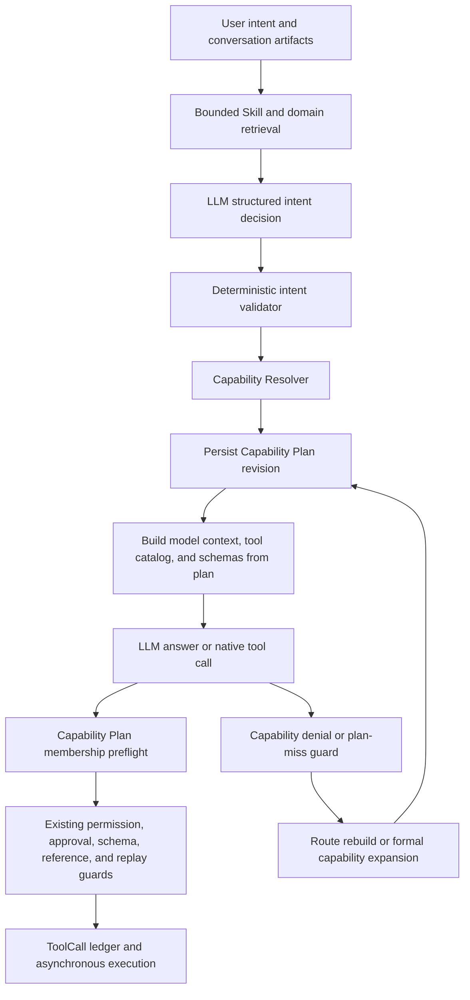

# Agent Unified Capability Plan Design

## Goal

Evolve the Harness Loop Agent into an LLM-driven planner with one auditable capability decision per run iteration. The LLM produces structured `action`, `target_domain`, `source_domains`, and `confidence`; deterministic backend code validates that decision, persists the resolved Capability Plan, enforces it at ToolRuntime, and rebuilds it when a safe capability expansion is required.

This design addresses the complete cross-domain orchestration problem. It must work for defects, test cases, scenarios, reports, test plans, visual flows, execution diagnosis, media, environment configuration, and future Skill domains without adding phrase-specific business rules.

## Current Failure

The current system has four different capability views:

1. `AgentContextManager.allowed_tools`, which is shown to the model;
2. `AgentRuntimeSnapshot.tools_json`, which represents all globally registered tools;
3. the capability-denial guard, which checks the full runtime snapshot;
4. ToolRuntime, which accepts any registered tool that passes schema and policy validation.

The views are not tied together by a persisted plan identifier. A model can therefore be told that a tool is unavailable, be corrected by a guard that sees the tool globally, and then be asked to call it without receiving its schema. This is a split-brain capability model.

The intent layer also relies on phrase ordering. For example, a create request containing the literal phrase `测试用例` is currently forced to target `test_case`, even when the grammatical object after `创建` is `缺陷`. Historical artifacts amplify the mistake but are not required to trigger it.

## Alternatives Considered

### 1. Expand deterministic keyword rules

This is the smallest patch but is rejected. Every new paraphrase or domain pair creates another ordering exception, and deterministic code becomes the business-understanding engine.

### 2. Expose every tool every turn

This removes route misses but is rejected. It increases context size, weakens bounded capability retrieval, makes tool choice noisier, and conflicts with the existing routed-context architecture.

### 3. LLM intent decision plus persisted Capability Plan

This is the selected design. The LLM owns semantic target/source understanding. Deterministic code validates domains, actions, schemas, permissions, approvals, object references, project isolation, replay policy, and capability-plan membership.

## Architecture



The existing asynchronous worker, EventStore, outbox, ToolCall ledger, approval, resume, reconciliation, and checkpoint semantics remain unchanged.

## Structured LLM Intent Decision

Introduce a provider-independent model:

```python
class AgentIntentDecision(BaseModel):
    action: Literal["analyze", "query", "create", "update", "execute", "delete", "transition", "export"] | None
    target_domain: str | None
    source_domains: list[str] = Field(default_factory=list)
    confidence: float
```

The intent decision request contains only:

- the current user request;
- compact conversation artifact handles and their domain roles;
- the bounded list of registered domains and supported actions;
- no raw secrets, full tool outputs, or full tool schemas.

The LLM returns JSON and the backend validates it with Pydantic. Deterministic validation enforces:

- `confidence` is between `0` and `1`;
- `target_domain` is registered;
- every source domain is registered and differs from the target;
- the requested action exists for the target domain;
- artifact-derived targets are accepted only for deictic follow-ups or semantically matching actions;
- writes are not enabled from an invalid or unresolved target.

The existing keyword parser becomes a bounded fallback and diagnostic signal. It no longer has authority to override a valid LLM target. Invalid or low-confidence model output receives one structured repair attempt. If repair still fails, the fallback may produce a read-only plan or a clarification response; it cannot authorize a write from ambiguous target inference.

## Skill Retrieval and Capability Resolution

`AgentSkillPlanner` remains a candidate retriever, not the final business router. It may use metadata, artifact handles, and lightweight lexical signals to bound the candidate domains passed to the intent model.

After intent validation:

- the target-domain Skill becomes primary;
- source-domain Skills become supporting evidence Skills;
- target-domain tools for the requested action are eligible;
- source-domain tools are limited to read/query/deterministic evidence operations unless the user explicitly requests a second target action;
- historical artifact actions cannot replace an explicit LLM target.

## Persisted Capability Plan

Add `ai_agent_capability_plans` with these fields:

- `capability_plan_id`: globally unique stable identifier;
- `run_id`, `iteration`, `revision`;
- `parent_capability_plan_id` for route rebuild and expansion lineage;
- `runtime_snapshot_id`;
- `status`: `active`, `superseded`, `rejected`;
- `source`: `llm_intent`, `intent_repair`, `deterministic_fallback`, `carry_forward`, `route_rebuild`, or `capability_expansion`;
- `intent_decision_json`;
- `skill_plan_json`;
- `allowed_tools_json`;
- `tool_aliases_json` for provider-safe native function names;
- `required_facts_json`, `reason_codes_json`, and `plan_hash`;
- timestamps.

Constraints:

- unique `(run_id, iteration, revision)`;
- at most one active plan for a run iteration, enforced transactionally by superseding the previous revision before activating the next revision;
- every plan references the run's immutable runtime snapshot;
- plan hashes cover the structured intent, selected Skills, allowed tools, aliases, and runtime snapshot identifier.

Add nullable compatibility columns:

- `ai_agent_runs.active_capability_plan_id`;
- `ai_agent_tool_calls.capability_plan_id`.

Existing rows remain readable with `NULL`. New model-driven ToolCalls must carry a non-null plan ID. The active plan ID is also written into model-call trace events, plan events, checkpoints, and ToolCall summaries.

Each run iteration is associated with one active plan record. The initial iteration performs the structured intent decision. Later tool-loop iterations carry the validated decision and bounded capability set forward into a new iteration record without another intent-model call unless the user goal, authoritative artifact context, runtime snapshot, or route state changes. Route rebuilds and expansions create higher revisions within the affected iteration.

## Single Capability Source of Truth

The persisted active plan is authoritative for all per-turn capability decisions:

- Skill Planner and Capability Resolver create the plan payload;
- `AgentContextManager` renders only the plan's Skills, tool catalog, and tool contracts;
- the model call is tagged with `capability_plan_id`;
- the denial guard reads the same active plan;
- ToolRuntime verifies that the requested canonical tool belongs to the plan;
- approvals and execution continue using ToolSpec and RuntimeSnapshot safety data after plan membership succeeds.

`AgentRuntimeSnapshot` remains the global capability inventory. It is not a substitute for the active per-turn plan.

## Capability Denial and Route Rebuild

When the model claims an operation is unavailable:

1. If the matching tool is already in the active plan, record `model.capability_denial_in_plan` and replan using the same plan and contracts.
2. If the tool exists in the runtime snapshot but is absent from the active plan, record `planner.route_mismatch_detected` and rebuild the route.
3. If the rebuilt structured intent validates the capability, persist a new plan revision, supersede the old revision, regenerate the tool catalog and schemas, and then replan.
4. If the tool does not exist globally, allow an unsupported-capability conclusion with structured evidence.

The guard must never tell the model to call a tool that is absent from the active plan.

## Plan Membership and Formal Expansion

ToolRuntime performs capability-plan membership validation before creating a ToolCall:

- a tool in the active plan continues to existing schema, permission, approval, object-reference, project-isolation, and replay validation;
- a globally registered tool outside the plan is not executed implicitly;
- a plan miss records `planner.capability_expansion_requested` and runs bounded expansion validation;
- a valid expansion creates a new plan revision and requires the model to emit the tool call again against that revision;
- an invalid expansion records `planner.capability_expansion_rejected` and returns a structured planning diagnostic.

Read-only and write tools use the same expansion protocol. Write tools still require all existing approval and policy checks after expansion.

## Native Structured Tool Calling

DeepSeek's current Chat Completions API supports OpenAI-compatible tool calls, including streaming and schema-based function parameters. The migration is capability-gated and does not depend on beta strict mode.

Extend the provider-neutral AI contract with:

- tool definitions;
- `tool_choice`;
- assistant tool-call messages with nullable text content;
- tool-result messages;
- optional provider reasoning content that can be passed back on tool-call turns;
- streamed tool-call deltas and a deterministic assembler.

Message validation remains role-aware: ordinary system/user/assistant text messages require non-empty content, an assistant message may omit content only when it contains tool calls, and a tool-result message requires `tool_call_id` plus serialized content. When DeepSeek thinking mode returns a tool call, its `reasoning_content` is retained in the in-memory/provider message envelope and passed back on the next provider request as required by the provider protocol; it is not exposed as an assistant answer or persisted as raw chain-of-thought.

The current ledger admits one blocking tool decision per loop step. Native requests therefore set `parallel_tool_calls=false`. If a provider still returns multiple calls, the response is rejected with `model.native_tool_call_invalid` and repaired into one ordered call; it is not partially executed.

Canonical ToolSpec names are not renamed. Because provider function-name rules may be narrower than ToolSpec names, each plan persists a collision-safe provider alias mapped to the canonical name.

Each native function uses this argument envelope:

```json
{
  "input": {},
  "reason": "optional planning reason",
  "evidence_refs": []
}
```

`input` uses the exact ToolSpec input schema from the plan's runtime snapshot. This preserves the existing `AgentToolRequest` boundary and prevents HTML, nested JSON, quotes, and newlines from being interpolated into hand-written fenced JSON.

During migration:

- native tool calling is enabled through provider capability configuration;
- native calls are preferred when available;
- the fenced `agent_tool_request` parser remains as a compatibility fallback;
- native and fenced requests normalize into the same `AgentToolRequest` and ToolCall ledger path;
- prompts no longer require fenced JSON when native tools are enabled;
- no provider response may bypass plan membership or existing runtime safety checks.

## Performance Boundaries

- Perform at most one structured intent-model call at run start, plus one bounded repair only when validation fails.
- Reuse the validated intent decision across ordinary tool-loop iterations through `carry_forward` plans.
- Re-run intent planning only when the user goal, authoritative artifact context, runtime snapshot, or route state changes.
- Hash compact intent input and resolved plans so unchanged decisions can be audited and reused without duplicating large schemas.
- Load exact tool schemas from the referenced runtime snapshot only for the bounded `allowed_tools` set.
- Do not add synchronous database polling or change existing worker/queue semantics.

## Events and Diagnostics

Add bounded, non-secret event payloads:

- `planner.intent_decision_created`;
- `planner.intent_decision_repaired`;
- `planner.intent_decision_fallback`;
- `planner.capability_plan_created`;
- `planner.capability_plan_superseded`;
- `planner.route_mismatch_detected`;
- `planner.capability_expansion_requested`;
- `planner.capability_expansion_applied`;
- `planner.capability_expansion_rejected`;
- `model.native_tool_call_detected`;
- `model.native_tool_call_invalid`.

Every event carries `run_id`, `iteration`, `capability_plan_id`, and the relevant reason codes. Raw prompts, raw secrets, and unredacted tool arguments are not persisted in these event payloads.

## Compatibility and Migration

- Preserve all existing ToolSpec names and backend handlers.
- Preserve the current asynchronous runner and worker queue.
- Preserve approval, resume, reconciliation, idempotency, schema preflight, object-reference freshness, project isolation, and replay policy.
- Preserve existing public run and ToolCall responses; new plan identifiers are additive and nullable for historical data.
- Keep the fenced parser until native calling has passed provider integration and fallback tests.
- Use a new Alembic migration after the current `0039` revision; no destructive backfill is required.
- The frontend may optionally display plan IDs and route-rebuild events, but no existing frontend workflow depends on them.

## Testing Strategy

### Intent paraphrase matrix

At minimum cover these equivalent or inverse role patterns:

- `给错误的测试用例创建缺陷`;
- `根据失败用例创建对应的缺陷`;
- `把失败执行转成缺陷`;
- `根据报告生成测试计划`;
- `使用这个缺陷生成回归测试用例`;
- `给这个测试计划创建执行场景`;
- deictic follow-ups such as `执行它` and `保存这些断言`.

Assertions validate action, target, sources, confidence handling, primary/supporting Skills, and allowed target/source tools. Tests vary word order and synonyms so one literal phrase cannot satisfy the matrix.

### Capability-plan invariants

- each model-planning iteration has one active persisted plan;
- prompt catalog, schema contracts, guard, and ToolRuntime use the same plan ID;
- route rebuild supersedes rather than mutates the old plan;
- ToolCalls record the plan revision that authorized them;
- an out-of-plan tool cannot be executed directly;
- a valid expansion creates a new revision before retry;
- a globally missing tool is not falsely treated as a route mismatch.

### Native tool-call compatibility

- stream fragments assemble one native tool call deterministically across arbitrary chunk boundaries;
- unexpected parallel tool calls are rejected before any ToolCall is created;
- nested HTML, embedded JSON, quotes, backslashes, Unicode, and newlines parse without fence repair;
- provider aliases map back to canonical ToolSpec names;
- malformed native arguments produce structured validation events;
- thinking-mode tool turns preserve required provider reasoning state without exposing chain-of-thought;
- providers without native tool support continue through fenced fallback;
- both protocols enter the same ToolCall approval and asynchronous execution path.

### Regression scope

Run focused Agent routing/runtime tests, platform tool tests, migration tests, full backend unittest discovery, and documentation consistency checks. Re-run the original run-518 phrasing through `AgentContextManager` and the conversation runner with a controlled model response.

## Success Criteria

1. LLM output, not domain-word ordering, determines structured target/source intent.
2. Every new run iteration has a persisted active Capability Plan and stable plan ID.
3. Planner, model context, guard, and ToolRuntime consume the same plan revision.
4. A runtime-global but plan-hidden tool triggers route rebuild, not model blame or direct execution.
5. Replanning includes the rebuilt tool catalog and exact schema contract.
6. Plan-external tools are rejected or formally expanded before execution.
7. Native tool calls safely carry HTML and nested JSON; fenced JSON remains only a tested fallback.
8. Paraphrase and cross-domain matrices prevent phrase-specific regressions.
9. Existing asynchronous execution, approval, safety, and business behavior remain unchanged.
