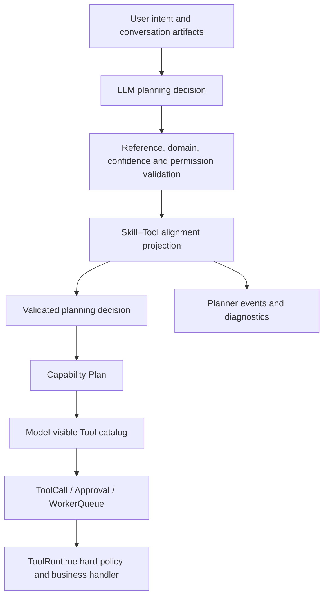

# Agent Skill–Tool Capability Alignment Design

**Date:** 2026-07-13

**Status:** Approved for implementation planning

## 1. Problem

The unified LLM planning control plane currently requires every selected Tool to be declared by at least one selected Skill. The validation is fail-closed and raises `planner_tool_not_declared_by_skill` before a Capability Plan, ToolCall, Approval, or WorkerQueue item is created.

The latest failed run exposed a mismatch between semantic Skill selection and Tool ownership metadata:

- user intent: `修复断言`;
- selected Tools: `testcase.update_assertions` and `testcase.batch_update_assertions`;
- `assertion-extractor-binding` is the semantically strongest Skill, but its frozen `tool_names` is empty;
- `http-test-case-design` declares the selected Tools, but the LLM is not required to select that supporting Skill;
- the bounded repair receives only the error code and undeclared Tool names, so a deterministic model can repeat the same invalid decision.

The same structural risk exists beyond assertion repair. Several Skills contain workflow text that uses registered Tools while their frontmatter has no structured `tools` declaration. Fixing only the assertion phrase or only one Skill would leave the architecture vulnerable to the next multi-domain or newly added Skill.

## 2. Goals

1. Keep the LLM responsible for semantic planning: goal, action, Skills, Tools, artifacts, facts, and requested effect scope.
2. Prevent incomplete Skill metadata from terminating a valid plan when every selected Tool is registered and otherwise authorized.
3. Preserve hard runtime enforcement for unknown Tools, permissions, effect classes, schema, approvals, object-reference freshness, project isolation, replay policy, and worker execution.
4. Make Skill–Tool alignment observable and auditable without turning it into the business routing brain.
5. Make future Skill additions safe through explicit metadata validation and regression contracts.
6. Preserve existing REST, SSE, ToolCall, Approval, Capability Plan, asynchronous worker, and database contracts unless an additive diagnostic field is explicitly required.

## 3. Non-goals

- Do not add keyword routing for `修复断言` or any other specific user phrase.
- Do not hard-code a business Tool sequence for assertion repair.
- Do not bypass ToolRuntime validation or Approval.
- Do not infer executable Tool input from Skill prose.
- Do not parse arbitrary prose as an authorization policy.
- Do not introduce a database migration.
- Do not change existing Tool names or business handlers.

## 4. Design Principles

### 4.1 Skill metadata is planning evidence, not authorization

Skill `tools` declarations help the model understand normal workflows and help operators explain capability ownership. They are not a security boundary. ToolRuntime remains the authority for whether a selected Tool can execute.

### 4.2 Registered Tool selection remains fail-closed

The planner must continue rejecting:

- unknown Skill, Tool, or artifact references;
- target or source domains incompatible with selected Skills;
- confidence below the configured threshold;
- unknown Tool side-effect classes;
- missing project permissions.

The planner must not reject a decision only because a globally registered Tool is absent from the selected Skills' `tools` lists.

### 4.3 Alignment is derived, bounded, and explainable

For each selected Tool, the backend derives the registered Skills that declare it. The derived result is diagnostic metadata:

- `selected_skill_declared_tools`: Tools declared by the selected Skills;
- `aligned_tools`: selected Tools declared by at least one selected Skill;
- `supporting_skill_candidates_by_tool`: registered declaring Skills for selected but unaligned Tools;
- `unbound_tools`: selected Tools not declared by any registered Skill.

This metadata does not add Tools, execute Tools, lower effect scope, grant permission, or bypass policy. It explains the relationship between the LLM plan and the frozen capability graph.

### 4.4 Snapshot consistency is preserved

Alignment must be computed from the same frozen Skill and Tool indexes used for the Run. Existing Runs continue to use their `AgentRuntimeSnapshot`; live Skill edits affect only newly created Runs.

## 5. Architecture



The alignment projection is placed after registered-reference validation and before the validated decision is persisted. It cannot transform an unknown Tool into a valid Tool and cannot mutate business inputs.

## 6. Components

### 6.1 `AgentToolSkillAlignment`

Add a small immutable planning value object in `app/services/agent_planning_service.py`:

```python
@dataclass(frozen=True)
class AgentToolSkillAlignment:
    selected_skill_declared_tools: tuple[str, ...]
    aligned_tools: tuple[str, ...]
    supporting_skill_candidates_by_tool: dict[str, tuple[str, ...]]
    unbound_tools: tuple[str, ...]

    def model_view(self) -> dict[str, Any]: ...
```

The helper that builds this value must:

1. use only the frozen `skill_index` and already validated selected Skill/Tool names;
2. sort Skill candidates and Tool lists for deterministic hashing and events;
3. never mutate `selected_skills` or `selected_tools`;
4. treat globally registered but undeclared Tools as `unbound_tools`, not a planning failure.

### 6.2 Validated planning decision

`ValidatedAgentPlanningDecision` gains an `alignment` field. `model_view()` exposes it under `tool_skill_alignment`.

The existing fields remain unchanged. Capability Plan creation continues to use the LLM-selected Skills and Tools. Additive alignment metadata may be copied into the internal `intent_decision_json`; it does not require a database migration because that field is JSON.

### 6.3 Planner validation

Remove the fatal `planner_tool_not_declared_by_skill` branch. Replace it with alignment derivation after unknown references are rejected.

Validation order remains:

1. normalize and deduplicate references;
2. reject unknown Skills, Tools, and artifacts;
3. derive Skill domains and Tool–Skill alignment;
4. validate target and source domains;
5. validate confidence;
6. validate Tool effect classes and permissions;
7. normalize effective effect scope;
8. return the validated decision with alignment metadata.

### 6.4 Skill metadata correction

Update `assertion-extractor-binding` frontmatter to declare the registered Tools its workflow can directly call:

- `testcase.query_project_cases`;
- `testcase.update_assertions`;
- `testcase.batch_update_assertions`;
- `websocket_testcase.update_assertions`;
- `websocket_testcase.batch_update_assertions`.

Do not declare `ai_skill.run_draft`; the Skill explicitly prohibits using that Tool for saved-case assertion repair.

This correction improves model planning and alignment diagnostics but is not the mechanism that makes a plan safe to execute.

### 6.5 Registry metadata validation

Add an explicit registry validation API that verifies every Tool named in Skill frontmatter exists in the current ToolRegistry. It must reject misspelled or removed declared Tool names when building a new runtime snapshot.

The validator must not inspect Tool-looking strings in Skill body text because prose may mention prohibited Tools or examples. Missing declarations remain visible through `unbound_tools` and focused contract tests rather than being inferred from prose.

### 6.6 Planner failure observability

When validation fails after structured JSON parsing, `planner.llm_decision_invalid` must include a bounded, non-sensitive decision summary:

- `selected_skills`;
- `selected_tools`;
- `selected_artifact_ids` count, not full artifact payloads;
- `target_domain`;
- `source_domains`;
- validation code and existing details.

The event must not include chain-of-thought, provider reasoning, full prompts, Tool inputs, secrets, or artifact bodies.

The bounded repair request receives the same decision summary plus the validation error. This allows the LLM to change a Skill or Tool choice when a different validation rule genuinely fails.

## 7. Data Flow for the Failed Assertion Case

1. The user says `修复断言` after a previous failure-analysis Run.
2. The LLM selects `assertion-extractor-binding` and the appropriate query/update Tools.
3. Registered reference validation confirms the Skill and Tools exist.
4. Alignment projection records that the Tools are declared by the selected Skill after the metadata correction.
5. Permission and effect validation normalize assertion updates to `persist`.
6. The Capability Plan is persisted.
7. The model queries explicit per-case assertion details before requesting an update.
8. Update ToolCalls enter the existing Approval flow.
9. No assertion is changed until Approval and all existing object-reference/schema guards succeed.

If a future Skill selects a registered Tool without declaring it, the Run continues through normal validation, while `tool_skill_alignment.unbound_tools` or `supporting_skill_candidates_by_tool` records the metadata gap.

## 8. Error Handling

- Unknown Tool: keep `planner_unknown_reference` and fail before Capability Plan creation.
- Missing permission: keep `planner_permission_missing` and fail before ToolCall creation.
- Unknown side-effect class: keep `planner_tool_effect_unknown` and fail closed.
- Domain mismatch: keep the existing target/source-domain errors.
- Skill–Tool mismatch: do not fail; emit alignment metadata.
- Invalid planner JSON or incomplete provider response: keep the existing one bounded repair attempt.
- Repeated invalid plan: keep `agent_planning_failed`, now with enough structured decision context for diagnosis.

## 9. Compatibility and Safety

- No REST route or request field changes.
- No SSE event type removal or renaming.
- `planner.llm_decision_completed` gains additive `tool_skill_alignment` data.
- `planner.llm_decision_invalid` gains additive bounded decision fields.
- No database migration; existing JSON columns store additive metadata.
- No change to ToolCall, Approval, WorkerQueue, lease, resume, replay, or reconcile behavior.
- No change to business Tool handlers.
- Existing RuntimeSnapshot freezing and hash semantics remain authoritative.

## 10. Testing Strategy

### 10.1 Planner unit tests

1. Reproduce the latest failure: an assertion Skill selects registered assertion update Tools without declarations. The decision must validate and expose supporting candidates or unbound metadata instead of raising `planner_tool_not_declared_by_skill`.
2. After the Skill metadata correction, the same decision must report the Tools as aligned.
3. Unknown Tools must still fail.
4. Missing permissions must still fail.
5. Unknown side-effect classes must still fail.
6. Alignment output must be deterministic regardless of input order.

### 10.2 Runtime integration tests

1. A fake planning provider returns `修复断言` with `assertion-extractor-binding` and assertion update Tools.
2. The Run must persist a Capability Plan instead of ending at `agent_planning_failed`.
3. The next planned update must still enter Approval and must not execute the business handler before approval.
4. Invalid decisions must emit selected Skill/Tool summaries without prompt or artifact bodies.

### 10.3 Registry contract tests

1. Every declared Skill Tool must exist in ToolRegistry.
2. The assertion Skill must declare all five allowed query/update Tools.
3. The assertion Skill must not declare `ai_skill.run_draft`.
4. Snapshot round-trip must preserve Tool declarations and alignment inputs.

### 10.4 Regression scope

Run:

- focused planning, capability-plan, Skill registry, runtime, Approval, and assertion-update suites;
- Agent architecture contract tests;
- full backend unit test suite;
- documentation consistency checks already used by the repository.

## 11. Success Criteria

1. The exact `修复断言` planning shape no longer fails with `planner_tool_not_declared_by_skill`.
2. A valid Capability Plan is created before any assertion update ToolCall.
3. Assertion writes still require existing permission, object-reference, schema, and Approval checks.
4. Unknown or unauthorized Tools remain fail-closed.
5. Invalid planning events identify selected Skills and Tools without exposing sensitive content.
6. New Skill Tool declarations are checked against ToolRegistry.
7. Existing asynchronous runtime and public contracts remain compatible.
