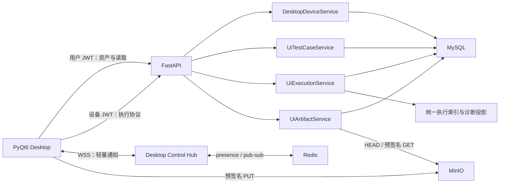
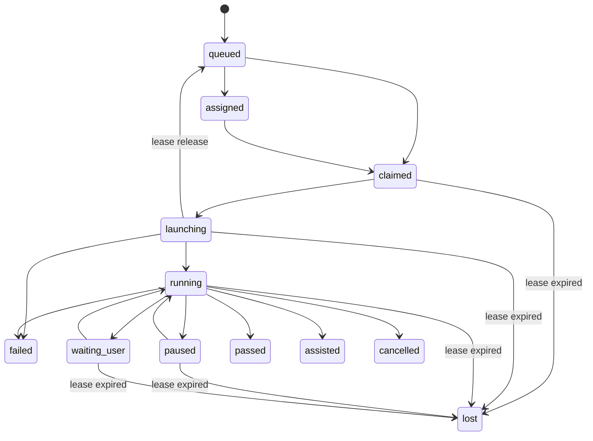

# TestAuto Desktop 后端接口开发计划

> 状态：代码闭环已完成（阶段 A–F 已落地；真实 Redis/MinIO 多进程部署联调仍是发布门禁）
>
> 最近核验：2026-07-17
>
> 后端基线：`3.0.540-self-test-full-mega-flow`
>
> 当前 Alembic head：`0050_ui_execution_patch_requests`
>
> 客户端基线：`C:\Users\Administrator\PycharmProjects\PythonProject5`，`0.3.0-dev` PyQt6 + QProcess Playwright Worker + REST/WSS Adapter

## 1. 计划目的

本计划把已经完成的 TestAuto Desktop PyQt6 UI Mock 接入真实 TestAuto 后端，形成以下闭环：

1. 用户登录平台并注册当前桌面设备。
2. 用户在 Desktop 管理 UI 用例及不可变版本。
3. 平台创建 UI 执行并返回 `202 + execution_id`。
4. 在线且已绑定项目的 Desktop 通过 WSS 收到轻量通知，使用设备鉴权 `/ui-executions/available` 恢复可领取队列，再通过 REST 原子领取任务。
5. 平台可在暂停或等待人工时请求当前运行修补，Desktop 按 lease 执行、续租、批量补传事件、应用修补和上传产物。
6. 后端强制校验状态迁移与 `assisted` 规则，并把 UI 执行接入统一执行记录、诊断和执行中心。

本文档同时描述当前实现和发布门禁。设备注册、独立凭据、项目绑定、runtime policy、heartbeat、WSS Control、
UI 用例/不可变版本、`202` 执行创建、设备 `/available` 队列恢复、claim/lease、事件上报、平台 `202 patch-requests`、Desktop 运行修补、commands、complete、SSE、本地运行导入、产物上传/读取/删除与统一执行投影均已实现。尚未完成的是依赖真实 Redis、MinIO 和多 Uvicorn worker 的部署环境集成验收。

## 2. 已核对的客户端事实

客户端当前已完成可运行 UI、QProcess JSON Lines Worker、本地可见 Playwright 浏览器执行，以及 Platform REST/WSS Adapter、
SQLite WAL/Outbox、DPAPI 设备凭据、设备 `/available`、queue/claim/lease/event/complete 和预签名产物上传。Profile 与部分诊断采集仍是后续本地能力。

已实现页面和后端需求映射如下：

| 客户端区域 | 当前 Mock 数据 | 后端责任 | 本地责任 |
| --- | --- | --- | --- |
| 顶部项目/环境 | 固定项目、固定环境 | 复用项目与环境列表接口 | 保存最近选择 |
| 平台在线状态 | 本地开关 | 提供认证、兼容策略和可用接口 | 根据 HTTPS/WSS 实际连接计算 |
| 浏览器环境 | Chromium Mock | 只接收设备能力摘要 | 安装、健康检查、进程和 Profile 管理 |
| 执行队列 | 4 条固定任务 | 用户管理列表、设备可领取列表、筛选、统计、领取、取消和详情 | 当前任务实时状态与本地 Outbox |
| 当前运行 | Mock 状态机 | 保存权威运行、步骤、事件和终态 | Worker 控制、进度展示和安全暂停 |
| 本地缓存 | 固定 156 MB | 不提供本地文件 CRUD | SQLite、日志、事件与产物缓存 |
| 设备健康 | 固定版本/能力 | 兼容策略、注册、绑定、心跳和在线投影 | 采集真实版本、浏览器和负载 |
| 用例工作台 | dataclass + Mock 步骤 | 用例、版本、DSL 校验和执行创建 | 编辑、定位器选取和本地草稿 |
| 诊断面板 | Console/Network/截图/Trace/下载/Audit | 事件、审计、产物元数据与下载授权 | 采集、脱敏、预览和上传 |
| 浏览器管理 | 固定浏览器/Profile | 不保存本机路径和 Profile 内容 | 全部浏览器/Profile 生命周期 |
| 设备连接 | Mock 注册和接单开关 | 设备身份、项目绑定、接单策略和撤销 | 安全保存设备凭据 |
| 设置 | 固定表单 | 只提供服务端兼容和项目运行策略 | 代理、目录、并发、日志和缓存配置 |
| 全局搜索 | 三条固定结果 | 用例、执行、设备的有界聚合搜索 | 输入、跳转和最近搜索 |

### 2.1 不应建设的后端接口

以下能力属于 Desktop 本机，后端不建设对应 CRUD：

- 安装、修复或启动 Playwright Chromium、Chrome、Edge。
- 返回或修改浏览器可执行文件绝对路径。
- 创建、锁定、删除或上传受管 Profile 目录。
- 返回本地缓存、日志目录和 QSettings 布局内容。
- 直接控制 Playwright Worker 或读取 Desktop IPC。
- 打开用户本机的截图、Trace 或下载文件。

后端只接收这些能力的脱敏摘要，用于兼容判断和任务分配。

## 3. 当前后端可复用能力与缺口

### 3.1 可直接复用

| 能力 | 当前实现 | Desktop 用法 |
| --- | --- | --- |
| 用户认证 | `/auth/login`、`/auth/refresh` | 用户登录、用例管理和查看权限 |
| 项目与成员权限 | `PermissionService`、`ProjectPermission` | 所有 UI 资产继续按项目隔离 |
| 项目/环境 | `/projects`、`/environment-configs` | 顶部项目和环境选择 |
| 统一响应 | `{code,message,data}` | Desktop REST Adapter 统一解析 |
| 统一错误 | 400/401/403/404/409/422/503 | 状态冲突、租约丢失和依赖异常 |
| 统一执行索引 | `execution_record_index` | 增加 `execution_type=ui` 投影 |
| 步骤诊断 | `execution_step_diagnostics` | 投影 UI 步骤最终诊断 |
| 执行产物元数据 | `execution_payload_artifacts` | 保存 MinIO UI 产物元数据 |
| 对象存储 | `ObjectStorageService` | 扩展预签名 PUT、HEAD 校验和下载 |
| SSE 模式 | 场景运行持久化事件 + Last-Event-ID | 复用事件顺序、重放和心跳设计 |
| 非阻塞执行契约 | `202 + execution id` | 创建 UI 执行后立即返回 |

### 3.2 必须补齐

- 当前 `ExecutionType` 只允许 `http/websocket/scenario/flow`。
- `ExecutionRecordRepository` 使用四类执行的硬编码 `UNION ALL`，没有 UI 执行源。
- 统一执行游标解码也只允许四种类型。
- 当前执行中心 Worker 是根据进程内线程池数量派生的展示，不代表真实 Desktop 设备。
- 当前 JWT 只有用户 access/refresh token，没有可独立撤销的设备凭据。
- 当前 `REDIS_URL` 只有配置占位，项目没有 Redis 客户端依赖和 Desktop presence/pub-sub。
- 当前对象存储只支持后端上传和预签名 GET，没有 Desktop 直传、HEAD 验证和上传会话。
- 当前执行 payload 读取器只支持 `storage_backend=database`，不能读取或授权 MinIO 产物。
- 当前环境敏感变量虽然读取时遮罩，但数据库模型仍保存普通文本，不适合直接下发 Desktop。
- 当前没有 UI DSL、设备、用例版本、lease、事件幂等、运行时修补或命令确认模型。

## 4. 已冻结的后端设计决策

### 4.1 用户身份与设备身份分离

- 用户 access token：创建/编辑 UI 用例、创建执行、查看执行、签发设备注册和下发控制命令。
- 设备 access token：心跳、WSS、领取、续租、事件、修补、产物和完成；不能管理用例或项目成员。
- 设备 refresh credential：注册时只回显一次，Desktop 保存到 Windows Credential Manager/DPAPI；后端只存哈希并支持独立撤销和轮换。
- 账号禁用、设备撤销、项目解绑或权限丢失后，新的领取和续租必须失败。

### 4.2 内部主键与客户端展示 ID 分离

- 新表继续使用 MySQL `BIGINT` 内部主键，兼容现有统一执行索引和查询代码。
- 对外增加不可猜测的 `public_id`，例如 `dev_...`、`ui_case_...`、`ui_exec_...`。
- Desktop DTO 中的 `device_id/case_id/execution_id` 使用 `public_id`。
- `execution_record_index.execution_id` 继续保存 `ui_executions.id` 数字主键，不能把现有公共字段整体改成字符串。
- 统一执行展示身份继续为 `ui:{numeric_id}`；UI 专用接口同时返回 `public_id`。

### 4.3 WSS 只做通知，不做权威写入

- WSS 推送 `execution.available`、`command.available` 及版本化 `control.*` 消息。
- WSS 不传完整 DSL、不传密钥、不直接完成任务，也不替代 REST claim。
- 断线后不依赖内存消息补齐事实；Desktop 重新查询队列、命令和 lease。
- MySQL 保存资产、运行、事件和命令，Redis 只保存短期 presence 和跨进程 pub/sub。

### 4.4 执行状态与产物交付状态分离

客户端 Mock 队列中的 `upload_failed` 不能进入 UI 执行状态机：

```text
execution_status:
queued / assigned / claimed / launching / running / paused /
waiting_user / passed / assisted / failed / cancelled / lost

delivery_status:
pending / uploading / complete / failed
```

界面可把 `delivery_status=failed` 显示为“上传失败”，但执行真实终态仍可能是 `passed`、`assisted` 或 `failed`。

### 4.5 人工介入由后端强制

- `retry`、`skip`、`runtime_patch` 或人工操作事件一旦被接受，`assisted=true` 不可回退。
- `complete(status=passed)` 时如存在人工介入，后端拒绝为 409，或统一规范为 `assisted`；第一版选择返回 409，要求 Desktop 修正提交。
- 只有从不可变快照干净执行且没有人工介入的运行可以 `passed`。

### 4.6 第一版密钥仅使用本地引用

- 用例版本只保存 `${secret.*}` 引用，不保存 UI 账号密钥明文。
- claim 快照只返回 `required_secret_refs`，不返回实际值。
- Desktop 从 Windows 安全存储解析；缺少引用时进入 `waiting_user/secret_unavailable`。
- 第一版不把当前环境变量表中的敏感值下发设备。
- 平台密钥密封下发必须等待“服务端加密存储 + 设备公钥加密 + 一次性短租约”专项设计，不混入本次 MVP。

### 4.7 协议规范

- REST 字段统一使用 `snake_case`，与 Desktop Python 模型一致。
- REST 继续使用 `{code,message,data}` 成功 envelope 和统一错误 envelope。
- lease、WSS 和幂等计算使用服务端时间；Desktop 不以本机时钟决定所有权。
- Desktop 新接口的协议时间字段使用 UTC RFC 3339 字符串，由专用 serializer 生成，避免修改全局旧接口时间格式。
- 所有写接口必须有明确的重复请求语义。

## 5. 目标架构



## 6. 目标 REST/WSS 接口

所有路径位于 `/api/v1`。表中“用户”表示用户 access token，“设备”表示设备 access token。

### 6.1 复用接口

| 方法 | 路径 | 身份 | Desktop 用途 |
| --- | --- | --- | --- |
| `POST` | `/auth/login` | 匿名 | 登录平台 |
| `POST` | `/auth/refresh` | 用户 refresh | 刷新用户登录 |
| `GET` | `/projects` | 用户 | 项目选择 |
| `GET` | `/environment-configs?project_id={id}` | 用户 | 环境选择 |

### 6.2 运行兼容与工作台

| 优先级 | 方法 | 路径 | 身份 | 用途 |
| --- | --- | --- | --- | --- |
| P0 | `GET` | `/desktop/runtime-policy` | 用户或设备 | 最低 Desktop、IPC、DSL、Playwright/浏览器兼容范围、心跳和 lease 策略 |
| P1 | `GET` | `/desktop/workbench` | 用户 `report:view` | 队列统计、最近执行、待人工任务、最近审计和当前设备服务端投影 |
| P2 | `GET` | `/desktop/search` | 用户，按资源权限过滤 | 有界搜索 UI 用例、UI 执行和当前用户可见设备 |

`/desktop/workbench` 只聚合首屏需要的小字段，禁止读取完整 DSL、事件正文或产物内容。

### 6.3 设备与项目绑定

| 优先级 | 方法 | 路径 | 身份 | 用途 |
| --- | --- | --- | --- | --- |
| P0 | `POST` | `/desktop/devices/register` | 用户 | 幂等注册安装实例，返回设备凭据一次 |
| P0 | `POST` | `/desktop/devices/token/refresh` | 设备 refresh | 轮换设备 access/refresh 凭据 |
| P0 | `GET` | `/desktop/devices` | 用户 | 查询本人设备或项目可用设备 |
| P0 | `GET` | `/desktop/devices/{device_id}` | 用户 | 查询设备详情、能力和绑定 |
| P0 | `PATCH` | `/desktop/devices/{device_id}` | 用户 | 修改名称、全局接单和并发上限 |
| P0 | `PUT` | `/desktop/devices/{device_id}/projects/{project_id}` | 用户 | 启用/停用项目绑定与项目接单 |
| P0 | `POST` | `/desktop/devices/{device_id}/heartbeat` | 设备 | 上报能力、负载、活动运行和本地待上传计数 |
| P0 | `DELETE` | `/desktop/devices/{device_id}` | 用户 | 撤销设备、凭据、绑定和活动连接 |
| P0 | `WS` | `/desktop/devices/{device_id}/control` | 设备 | 任务、命令和策略变化通知 |

注册请求使用随机 `installation_id`，不采集硬件序列号。相同用户和 `installation_id` 的重试返回同一设备，但只有首次注册或显式凭据轮换可以得到新的 refresh credential。

### 6.4 UI 用例与版本

| 优先级 | 方法 | 路径 | 权限 | 用途 |
| --- | --- | --- | --- | --- |
| P0 | `POST` | `/ui-test-cases/validate` | `case:manage` | 校验未保存 `ui-case-v1` |
| P0 | `GET` | `/ui-test-cases?project_id={id}` | `case:view` | 分页、搜索、状态和环境筛选 |
| P0 | `POST` | `/ui-test-cases?project_id={id}` | `case:manage` | 创建用例和 v1 |
| P0 | `GET` | `/ui-test-cases/{case_id}` | `case:view` | 当前版本和元数据详情 |
| P0 | `PATCH` | `/ui-test-cases/{case_id}` | `case:manage` | 修改名称、描述、状态和默认环境 |
| P0 | `DELETE` | `/ui-test-cases/{case_id}` | `case:manage` | 软删除用例，不删除历史运行 |
| P0 | `GET` | `/ui-test-cases/{case_id}/versions` | `case:view` | 查询版本历史 |
| P0 | `POST` | `/ui-test-cases/{case_id}/versions` | `case:manage` | 基于 `base_version` 创建不可变新版本 |
| P0 | `GET` | `/ui-test-cases/{case_id}/versions/{version}` | `case:view` | 获取指定版本和 DSL |
| P0 | `POST` | `/ui-test-cases/{case_id}/execute` | `test:execute` | 创建 queued UI 执行，返回 202 |

定位器的真实 DOM 唯一性由 Desktop Worker 验证，后端 `/validate` 只负责 DSL、安全和引用完整性。

### 6.5 UI 执行、lease 与事件

| 优先级 | 方法 | 路径 | 身份/权限 | 用途 |
| --- | --- | --- | --- | --- |
| P0 | `GET` | `/ui-executions` | 用户 `report:view` | 队列列表、筛选和 facets |
| P0 | `GET` | `/ui-executions/{execution_id}` | 用户 `report:view` | 运行摘要、步骤、lease 和交付状态 |
| P0 | `POST` | `/ui-executions/{execution_id}/claim` | 设备 | 原子领取并取得不可变快照 |
| P0 | `POST` | `/ui-executions/{execution_id}/lease/renew` | 设备 | 续租并校准服务端状态和命令游标 |
| P0 | `POST` | `/ui-executions/{execution_id}/lease/release` | 设备 | 启动失败前主动释放可重分配任务 |
| P0 | `POST` | `/ui-executions/{execution_id}/events/batch` | 设备 | 幂等批量写入运行/步骤/审计事件 |
| P0 | `POST` | `/ui-executions/{execution_id}/patches` | 设备 | 保存脱敏运行时修补并锁定 assisted |
| P0 | `POST` | `/ui-executions/{execution_id}/complete` | 设备 | 幂等提交终态和汇总 |
| P1 | `GET` | `/ui-executions/{execution_id}/events` | 用户 `report:view` | 按服务端序号增量读取事件 |
| P1 | `GET` | `/ui-executions/{execution_id}/events/stream` | 用户 `report:view` | Web 平台 SSE 查看实时运行 |
| P1 | `POST` | `/ui-executions/{execution_id}/commands` | 用户 `test:execute` | 下发 pause/resume/cancel 命令 |
| P1 | `POST` | `/ui-executions/{execution_id}/commands/{command_id}/ack` | 设备 | 确认命令已执行、拒绝或过期 |
| P2 | `POST` | `/ui-executions/import-local-run` | 用户 `test:execute` | 导入已完成的 Desktop 本地调试运行 |

列表响应必须分别返回：

- `status`
- `delivery_status`
- `attention_reason`
- `current_step/total_steps`
- `assigned_device`
- `source`
- `created_at/updated_at`

队列顶部四张统计卡从同一次列表查询的 `facets` 获取，避免客户端额外发四次 count 请求。

### 6.6 产物

| 优先级 | 方法 | 路径 | 身份/权限 | 用途 |
| --- | --- | --- | --- | --- |
| P0 | `POST` | `/ui-executions/{execution_id}/artifacts/presign` | 设备 + 有效 lease | 创建上传会话和预签名 PUT |
| P0 | `POST` | `/ui-executions/{execution_id}/artifacts/finalize` | 设备 + 有效 lease | HEAD 校验后写统一产物元数据 |
| P1 | `GET` | `/ui-executions/{execution_id}/artifacts` | 用户 `report:view` | 查询截图、Trace、视频、日志和下载 |
| P1 | `GET` | `/ui-executions/{execution_id}/artifacts/{artifact_ref}/url` | 用户 `report:view` | 获取短时预签名 GET |
| P1 | `DELETE` | `/ui-executions/{execution_id}/artifacts/{artifact_ref}` | 项目管理权限 | 删除 MinIO 对象和元数据 |

预签名接口返回必须携带：`artifact_ref/upload_id/url/method/required_headers/expires_at/max_size_bytes`。Desktop 发送 `Content-Type` 和 `x-amz-meta-sha256`；finalize 时后端通过 HEAD 校验对象大小、类型和哈希元数据。新的 UI `artifact_ref` 使用不含 `/` 的 URL-safe 不透明 ID，例如 `ui_art_01J...`，避免把当前数据库 artifact URI 直接放入路径参数。

### 6.7 稳定业务错误码

HTTP 状态码继续表达错误类别，`data.error` 提供 Desktop 可稳定映射的机器码：

| HTTP | `data.error` | 场景 |
| --- | --- | --- |
| 401 | `device_credential_invalid` | 设备 token 无效、过期或类型错误 |
| 403 | `device_project_not_bound` | 设备未绑定当前项目 |
| 409 | `device_not_accepting_jobs` | 设备停止接单或并发已满 |
| 409 | `runtime_incompatible` | Desktop、IPC、DSL 或浏览器能力不兼容 |
| 409 | `case_version_conflict` | `base_version` 已不是当前版本 |
| 409 | `execution_claim_conflict` | 任务已被其他设备领取或状态变化 |
| 409 | `lease_expired` | lease 已失效，不能继续写入 |
| 409 | `lease_version_conflict` | 客户端使用旧 lease version |
| 409 | `event_sequence_conflict` | 同序号或事件 ID 携带不同内容 |
| 409 | `assisted_status_required` | 存在人工介入却提交 `passed` |
| 409 | `artifact_metadata_mismatch` | MinIO 对象与预登记大小、类型或 SHA 不一致 |
| 413 | `desktop_payload_too_large` | DSL、事件批次或产物超过配置上限 |

## 7. 核心请求与响应契约

### 7.1 创建执行

```http
POST /api/v1/ui-test-cases/ui_case_01J.../execute?project_id=12
Authorization: Bearer <user_access_token>
Content-Type: application/json
```

```json
{
  "client_request_id": "desktop-20260716-0001",
  "version": 4,
  "environment_id": 3,
  "requested_device_id": "dev_01J...",
  "source": "platform_task",
  "runtime_options": {
    "trace": "retain-on-failure",
    "screenshot": "only-on-failure"
  }
}
```

响应状态 `202`：

```json
{
  "code": 0,
  "message": "UI execution accepted",
  "data": {
    "execution_id": "ui_exec_01J...",
    "status": "queued",
    "delivery_status": "pending",
    "created_at": "2026-07-16T02:30:00Z"
  }
}
```

`client_request_id` 在“项目 + 用户”范围唯一；重复请求返回原执行，不创建第二条任务。

### 7.2 原子 claim

```json
{
  "device_id": "dev_01J...",
  "expected_status": "queued",
  "supported_dsl_versions": ["ui-case-v1"],
  "supported_ipc_versions": ["desktop-ipc-v1"]
}
```

成功响应：

```json
{
  "execution_id": "ui_exec_01J...",
  "internal_execution_id": 501,
  "status": "claimed",
  "lease": {
    "lease_id": "lease_01J...",
    "version": 1,
    "expires_at": "2026-07-16T02:31:00Z",
    "renew_after_seconds": 20
  },
  "snapshot": {
    "case_id": "ui_case_01J...",
    "version": 4,
    "schema_version": "ui-case-v1",
    "checksum": "sha256:...",
    "dsl": {},
    "environment": {
      "id": 3,
      "name": "测试环境",
      "base_url": "https://test.example.com"
    },
    "required_secret_refs": ["login_username", "login_password"],
    "runtime_policy": {}
  }
}
```

claim 必须使用条件 UPDATE 或行锁保证只有一个设备成功。设备不在线、停止接单、未绑定项目、能力不兼容或任务已被领取时返回 409，并给出稳定 `data.error`。

### 7.3 事件批量补传

```json
{
  "lease_id": "lease_01J...",
  "lease_version": 1,
  "events": [
    {
      "client_event_id": "evt_01J...",
      "client_sequence": 17,
      "event_type": "step.finished",
      "occurred_at": "2026-07-16T02:30:31Z",
      "step_id": "step_004",
      "payload": {
        "status": "passed",
        "duration_ms": 420
      }
    }
  ]
}
```

响应返回 `accepted_through_sequence`、`accepted_count`、`duplicate_count`、`server_execution_status` 和 `lease_expires_at`。同一 `client_event_id` 或 `client_sequence` 的相同重试成功去重；内容冲突返回 409。

### 7.4 complete

```json
{
  "lease_id": "lease_01J...",
  "lease_version": 1,
  "final_client_sequence": 42,
  "status": "assisted",
  "summary": {
    "total_steps": 5,
    "passed_steps": 4,
    "failed_steps": 0,
    "skipped_steps": 1,
    "duration_ms": 18240,
    "assisted": true
  },
  "primary_error": null
}
```

完成事务必须同时：

1. 校验设备、lease、事件序号和合法终态。
2. 固化 `finished_at/duration/assisted`。
3. 更新 UI 步骤投影。
4. upsert `execution_record_index(execution_type=ui)`。
5. upsert `execution_step_diagnostics`。
6. 把 delivery 状态与执行终态分开保存。
7. 发布运行已完成通知。

重复 complete 使用相同终态和摘要时返回已有结果；冲突终态返回 409。

## 8. WSS 控制协议

### 8.1 连接

```text
wss://{host}/api/v1/desktop/devices/{device_id}/control
Authorization: Bearer <device_access_token>
```

连接时校验：token 类型、credential 未撤销、设备 ID 匹配、设备有效、用户有效。WebSocket 内不保持 SQLAlchemy Session；需要数据库校验时使用短生命周期 Session 并隔离同步 I/O。

### 8.2 消息 envelope

```json
{
  "schema_version": "desktop-control-v1",
  "message_id": "msg_01J...",
  "server_sequence": 104,
  "type": "execution.available",
  "sent_at": "2026-07-16T02:30:00Z",
  "payload": {
    "execution_id": "ui_exec_01J...",
    "project_id": 12,
    "priority": "P1"
  }
}
```

规则：

- `connection.ready` 必须包含服务端时间、心跳周期、兼容结果和 `resync_required`。
- `execution.available` 只表示可能有任务，Desktop 随后调用列表/claim。
- `command.available` 只包含 `command_id/execution_id/type`，具体状态通过 REST 校准。
- WSS 应用层 ping/pong 与 REST heartbeat 分开；ping 只保活，不更新权威设备能力。
- 单帧和发送队列有上限；慢客户端断开后依靠 REST resync，不无限积压内存。
- 多进程 Uvicorn 通过 Redis pub/sub 投递，不能使用单进程全局字典作为唯一通道。

## 9. 数据模型与迁移计划

为降低单次 migration 风险，当前 `0045` 后拆分四个顺序 revision。实施前如 head 已变化，必须重新链接，不能产生并行 head。

### 9.1 `0046_desktop_devices`

#### `desktop_devices`

核心字段：

- `id BIGINT`、`public_id VARCHAR(64) UNIQUE`
- `owner_id FK users.id`
- `installation_id_hash CHAR(64)`，与 `owner_id` 联合唯一
- `name VARCHAR(128)`
- `registration_status active/revoked`
- `accepting_jobs BOOLEAN`
- `concurrency_limit INTEGER`
- `desktop_version/os_name/os_version/architecture`
- `supported_protocols_json/capabilities_json`
- `device_public_key`，可空，为后续密钥密封预留
- `last_heartbeat_at/registered_at/revoked_at/created_at/updated_at`

索引：`owner + status + updated_at`、`last_heartbeat_at`、`public_id`。

#### `desktop_device_credentials`

- `credential_id VARCHAR(64) UNIQUE`
- `device_id FK`
- `refresh_secret_hash CHAR(64)`
- `expires_at/last_used_at/revoked_at/created_at`
- 不保存可回显 token。

#### `desktop_device_project_bindings`

- `device_id/project_id` 联合唯一
- `enabled/accepting_jobs/concurrency_limit`
- `created_by_id/created_at/updated_at`
- 索引 `project_id + enabled + accepting_jobs + device_id`

设备是用户拥有的安装实例；项目绑定控制它可以从哪些项目接单，避免用户加入新项目后设备自动接收任务。

### 9.2 `0047_ui_test_cases`

#### `ui_test_cases`

- 数字主键和 `public_id`
- `project_id/default_environment_id`
- `name/description/status/tags_json`
- `current_version_id`
- `created_by_id/is_deleted/created_at/updated_at`
- 索引 `project + deleted + updated + id`、`project + status + updated`

#### `ui_test_case_versions`

- `ui_test_case_id/version_number` 联合唯一
- `schema_version=ui-case-v1`
- `dsl_json`、`checksum_sha256`
- `based_on_version_id/change_summary/created_by_id/created_at`
- 版本不可更新或删除；只允许追加。

### 9.3 `0048_ui_execution_runtime`

#### `ui_executions`

核心字段：

- `id/public_id/project_id/environment_id`
- `ui_test_case_id/ui_test_case_version_id`
- `trigger_user_id/trigger_type/source/client_request_id`
- `requested_device_id/assigned_device_id`
- `status/delivery_status/attention_reason`
- `case_snapshot_json/runtime_policy_json/required_secret_refs_json`
- `lease_id/lease_version/lease_expires_at/claimed_at/last_renewed_at`
- `current_step/total_steps/passed_steps/failed_steps/skipped_steps`
- `assisted/duration_ms/error_category/error_message`
- `last_client_sequence/started_at/finished_at/created_at/updated_at`

唯一约束和索引：

- `public_id`
- `project_id + trigger_user_id + client_request_id`
- `project + environment + status + created_at + id`
- `assigned_device + status + updated_at`
- `status + lease_expires_at`
- `case_id + version_id + created_at`

#### `ui_step_executions`

- `ui_execution_id/step_id/attempt` 联合唯一
- `step_index/name/kind/operation/status`
- `started_at/finished_at/duration_ms`
- `error_code/error_message/result_summary_json`

#### `ui_execution_events`

- `project_id/ui_execution_id`
- `client_event_id/client_sequence/event_type/step_id/level`
- `payload_json/occurred_at/received_at`
- 唯一 `execution + client_event_id`
- 唯一 `execution + client_sequence`
- 索引 `execution + sequence`、`project + received_at`

#### `ui_runtime_patches`

- `ui_execution_id/request_command_id/step_id/patch_type/scope`
- `before_json/after_json`，写入前统一脱敏
- `actor_user_id/actor_device_id/reason/created_at`
- `request_command_id` 可空且唯一；平台修补关联 `ui_execution_commands`，Desktop 本地修补保持空值兼容

#### `ui_execution_commands`

- `public_id/ui_execution_id/command_type/status/payload_json`
- `issued_by_id/created_at/delivered_at/acknowledged_at/expires_at`
- 命令状态：`pending/delivered/acknowledged/rejected/expired`

### 9.4 `0049_ui_execution_artifact_delivery`

#### `execution_artifact_upload_sessions`

- `upload_id/artifact_ref` 唯一
- `project_id/ui_execution_id/step_id/section`
- `object_key/content_type/original_filename`
- `expected_size_bytes/expected_sha256`
- `status/expires_at/finalized_at/created_at`

同时为 `execution_payload_artifacts` 增加可空或有默认值的 `metadata_json`，保存文件名、ETag、采集策略和安全分类。完成上传后写入：

- `execution_type=ui`
- `execution_id=ui_executions.id`
- `storage_backend=minio`
- `storage_locator=object_key`
- `content=NULL`
- 实际大小、SHA-256、content type、retention tier

## 10. 状态机与并发规则

### 10.1 合法迁移



### 10.2 claim 与 lease

- claim 只允许设备本人、有效项目绑定、`accepting_jobs=true` 且能力兼容。
- `requested_device_id` 非空时只允许指定设备领取。
- 条件 UPDATE 必须包含当前状态、当前设备和 lease version，失败即 409。
- 续租不会接受客户端自报的新过期时间，全部由服务器计算。
- lease 过期扫描器只处理活动状态，写入 `lease_lost` 事件并转为 `lost`。
- 是否允许 `lost -> queued` 重分配由运行策略明确决定；第一版默认人工重试创建新执行，不复活旧运行。

### 10.3 事件限制

- 单批最多 100 条，批体默认上限 512 KiB，全部配置化。
- 单事件 payload 默认上限 16 KiB。
- Console 和 Network 不能逐条无限写；Desktop 在本地聚合并采样。
- 敏感键和 `${secret.*}` 值在 Desktop 与后端各脱敏一次。
- 事件是 append-only；步骤表和统一诊断是可重建投影。

## 11. 权限矩阵

| 操作 | 权限/身份 |
| --- | --- |
| 查看 UI 用例 | `case:view` |
| 新建、更新、版本化、删除 UI 用例 | `case:manage` |
| 创建 UI 执行、下发运行命令 | `test:execute` |
| 查看执行、事件和产物 | `report:view` |
| 注册/重命名/撤销本人设备 | 当前用户且设备 owner |
| 绑定设备到项目 | 设备 owner + 项目访问权；项目管理员可停用 |
| claim/renew/event/patch/complete | 当前设备 token + 项目绑定 + 有效 lease |
| 删除执行产物 | 项目创建者/管理员，或后续新增明确的产物管理权限 |

第一版不新增 UI 专属权限编码，复用现有 `case:*`、`test:execute` 和 `report:view`，避免成员授权页面同步扩张。若后续需要区分接口用例和 UI 用例，再单独设计兼容迁移。

## 12. DSL 后端校验范围

新增 `ui-case-v1` Pydantic Schema，并与客户端候选集合一致：

- 动作：`navigate/click/dblclick/fill/press/select/check/uncheck/hover/upload/download/screenshot`
- 断言：`visible/hidden/text/value/attribute/count/url/title/screenshot`
- 定位器：`role/label/test_id/text/placeholder/alt/title/css/xpath`
- 步骤超时：1,000–120,000 ms；导航超时：1,000–180,000 ms。
- 第一版每个版本最多 200 步、DSL 序列化后最多 1 MiB，均配置化。
- 拒绝未知字段、未知动作、任意 Python/JavaScript/Shell、绝对本机路径和任意浏览器启动参数。
- `navigate` 的绝对 URL 必须匹配环境 `base_url` 主机或项目白名单。
- `upload` 只能引用文件别名，不能持久化 Desktop 绝对路径。
- secret 只保存名称引用，保存前提取并写入 `required_secret_refs`。

## 13. 统一执行与执行中心改造

### 13.1 必改代码边界

- `app/schemas/execution_record.py`：`ExecutionType` 增加 `ui`。
- `app/repositories/execution_record_repository.py`：列表 union 和详情读取加入 `UiExecution`。
- `app/repositories/execution_diagnostic_repository.py`：游标允许 `ui`。
- `app/services/execution_record_service.py`：UI 摘要和详情序列化。
- `app/services/execution_diagnostic_projection.py`：投影 UI 步骤、错误和产物。
- `app/services/execution_diagnostic_persistence.py`：接受 UI canonical execution。
- `app/services/execution_diagnostic_service.py`：MinIO artifact 元数据/URL 读取分支。
- `app/services/execution_center_service.py`：活动状态增加 claimed/launching/waiting_user，Worker 读取真实 Desktop 设备，不再把线程池 Worker 当 Desktop。
- `app/schemas/execution_center.py`：能力允许 `ui`，必要时增加 `worker_kind=server/desktop`。

### 13.2 投影规则

- `resource_id=ui_test_cases.id`
- `resource_name=用例名称快照`
- `execution_type=ui`
- `execution_id=ui_executions.id`
- `source=platform_task/local_debug/local_import`
- `trigger_type=manual/scheduled/agent/local_import`，与现有统一执行触发语义对齐
- 公共状态保留 `assisted`；`claimed/launching/paused/waiting_user` 在公共列表映射为 `running`，详情保留内部状态。
- `lost` 在公共列表映射为 `failed`，并保留 `failure_category=lease_lost`。

## 14. 目标代码文件

### 14.1 新增

```text
app/models/desktop_device.py
app/models/ui_automation.py
app/schemas/desktop_device.py
app/schemas/ui_test_case.py
app/schemas/ui_execution.py
app/repositories/desktop_device_repository.py
app/repositories/ui_test_case_repository.py
app/repositories/ui_execution_repository.py
app/services/desktop_device_service.py
app/services/desktop_control_service.py
app/services/ui_test_case_service.py
app/services/ui_execution_service.py
app/services/ui_execution_artifact_service.py
app/core/device_security.py
app/api/v1/routers/desktop_devices.py
app/api/v1/routers/ui_test_cases.py
app/api/v1/routers/ui_executions.py
migrations/versions/0046_desktop_devices.py
migrations/versions/0047_ui_test_cases.py
migrations/versions/0048_ui_execution_runtime.py
migrations/versions/0049_ui_execution_artifact_delivery.py
migrations/versions/0050_ui_execution_patch_requests.py
tests/test_desktop_devices.py
tests/test_desktop_control_websocket.py
tests/test_ui_test_cases.py
tests/test_ui_executions.py
tests/test_ui_execution_artifacts.py
tests/test_ui_execution_contract.py
docs/api_desktop_devices.md
docs/api_ui_test_cases.md
docs/api_ui_executions.md
```

### 14.2 修改

```text
requirements.txt                         # 增加受控版本 redis 客户端
app/api/v1/api.py                        # 注册三组路由
app/api/v1/deps.py                       # get_current_device
app/core/config.py                       # token/heartbeat/lease/WSS/产物限制
app/core/security.py                     # 或委派到 device_security
app/core/permissions.py                  # 仅当最终决定新增产物管理权限
app/main.py                              # Control Hub 启停
app/models/__init__.py                   # 导出新模型
app/services/object_storage_service.py   # presigned PUT、HEAD 和 metadata
app/schemas/execution_record.py
app/repositories/execution_record_repository.py
app/repositories/execution_diagnostic_repository.py
app/services/execution_record_service.py
app/services/execution_diagnostic_projection.py
app/services/execution_diagnostic_persistence.py
app/services/execution_diagnostic_service.py
app/services/execution_center_service.py
app/schemas/execution_center.py
docs/api_execution_records.md
docs/api_execution_center.md
docs/api_media.md
docs/technical_architecture.md
docs/development_technical_notes.md
docs/README.md
```

## 15. 分阶段实施与验收

### 阶段 A：契约、Schema 与 migration（已完成）

任务：

1. 固化 REST/WSS envelope、错误码、状态机和 snake_case DTO。
2. 实现 `ui-case-v1` Schema 和安全校验。
3. 建立四个顺序 migration 与 SQLAlchemy 模型。
4. 增加后端权威 JSON fixtures，供 Desktop Adapter 契约测试消费。

验收：

- migration 单 head，MySQL `upgrade head` 成功。
- upgrade/downgrade、唯一约束、索引和外键测试通过。
- DSL 正反例、大小限制和未知字段测试通过。
- 尚未开放生产路由时文档仍明确“计划中”。

### 阶段 B：设备控制面（代码已完成，生产 Redis 多进程验收待完成）

任务：

1. 设备注册、独立凭据、refresh 轮换、撤销和项目绑定。
2. runtime policy、heartbeat 和服务端在线投影。
3. Redis presence/pub-sub 与 WSS Control Hub。
4. 设备列表、详情、重命名和接单开关。

验收：

- 用户 token 不能调用设备执行接口，设备 token 不能管理用例。
- 撤销设备后 REST/WSS 都立即失效。
- 设备未绑定项目时不能看到或领取项目任务。
- WSS 断线重连通过 REST 完成状态校准。
- 多 Uvicorn worker 下通知可跨进程到达。

### 阶段 C：UI 用例与版本（代码与真实 MySQL 已完成）

任务：

1. 用例 CRUD、分页和软删除。
2. 不可变版本、`base_version` 乐观并发和 checksum 幂等。
3. 项目/环境归属校验和域名白名单。
4. 执行创建 `202` 和 `client_request_id` 幂等。

验收：

- 跨项目 case/environment/version 引用一律拒绝。
- 两个客户端基于同一旧版本保存时只有一个成功，另一个 409。
- 删除用例不破坏历史运行快照。
- Desktop 当前 12 个动作、9 个断言和 9 类定位器全部能往返保存。

### 阶段 D：执行、claim、lease 与事件（已完成）

任务：

1. 用户列表/facets/详情、设备 `/available` 可领取队列和 workbench 聚合。
2. 原子 claim、续租、释放和过期扫描。
3. 事件 batch、步骤投影、平台 patch request、Desktop runtime patch 和 commands。
4. complete 幂等、assisted 强制和失败分类。

实现说明：用户列表/facets/详情、设备 `/available` 可领取队列、claim、lease renew/release、过期扫描、事件 batch、步骤诊断投影、平台 patch request、Desktop runtime patch、commands/ack、complete、SSE 事件流和本地运行导入均已开放。平台修补只在 `paused/waiting_user` 创建 `command_type=patch`，Desktop 应用时携带 `command_id`，后端校验 payload 并记录发起用户/执行设备双重审计。claim 响应返回 `last_client_sequence`，Desktop 可从服务端已接受序号继续 Outbox。

2026-07-17 核验：UI runtime 与后端权威 Desktop fixture 定向 `19` 项通过；后端全量 `1063` 项通过（`skipped=3`）。真实 MySQL 已升级到 single head/current `0050_ui_execution_patch_requests`。

验收：

- 两个设备并发 claim 只有一个成功。
- 旧 lease 或错误 device 的事件、修补、上传和 complete 全部 409/403。
- 重复事件不重复写步骤或审计。
- 人工介入后 `passed` 被拒绝，`assisted` 成功。
- 断网补传保持客户端顺序，冲突序号可诊断。
- 50 台设备按配置心跳不会为每次 ping 写 MySQL 热行。

### 阶段 E：产物与统一执行闭环（已完成）

任务：

1. 预签名 PUT、上传会话、HEAD 校验和短时下载 URL。
2. MinIO 产物写入 `execution_payload_artifacts`。
3. 统一执行记录、详情、诊断、指标和执行中心支持 `ui`，并投影真实 Desktop 设备 Worker。
4. 孤儿上传会话和对象清理任务。

验收：

- 伪造 execution、step、大小、类型或 SHA 的 finalize 被拒绝。
- MinIO 与 MySQL 任一失败都不会生成“已完成但不可读”的假元数据。
- Screenshot/Trace/Console/Download 可按项目权限读取。
- `/execution-records?execution_type=ui` 的页码和游标模式均可用。
- 原四类执行的列表、详情、游标和 Agent 诊断回归不变。

### 阶段 F：Desktop Adapter 联调与发布门禁（代码与跨仓库契约已完成，真实部署联调待完成）

任务：

1. 生产主窗口把 `MockPlatformClient` 替换为真实 REST/WSS Adapter。
2. 把队列 `upload_failed` 映射到 `delivery_status=failed`。
3. 接入设备注册、用例版本、设备 `/available` 恢复、queue/claim/lease/event/complete 和 artifact。
4. 建立 FastAPI 与 Desktop 的双端契约回归；真实部署端到端测试作为发布门禁。
5. 同步后端 API 文档、Desktop 实现状态和兼容矩阵。

验收：

- 截图中的工作台、用例工作台、执行队列、设备连接和诊断面板均来自真实接口或明确本地数据。
- UI 中不再显示生产状态为 Mock。
- 平台创建任务后 Desktop 可领取并在可见浏览器执行。
- 暂停、修补、重试、跳过和产物上传都能在后端审计。
- 断网、进程崩溃、租约过期和重复提交有确定结果。

## 16. 测试与验证命令

实施时按阶段增加聚焦测试，最终执行：

```powershell
# 当前设备控制面
.\.venv\Scripts\python.exe -m unittest tests.test_desktop_devices -v

# 后续阶段新增
.\.venv\Scripts\python.exe -m unittest tests.test_ui_test_cases -v
.\.venv\Scripts\python.exe -m unittest tests.test_ui_executions -v
.\.venv\Scripts\python.exe -m unittest tests.test_ui_execution_artifacts -v
.\.venv\Scripts\python.exe -m unittest tests.test_ui_execution_contract -v
.\.venv\Scripts\python.exe -m unittest discover -s tests -p "test_*.py" -v
.\.venv\Scripts\alembic.exe upgrade head
.\.venv\Scripts\alembic.exe current
```

还必须完成：

- 真实 MySQL 并发 claim 与 lease 测试，不能只依赖 SQLite。
- Redis 中断、恢复、跨进程 pub/sub 和慢 WSS 客户端测试。
- MinIO 预签名 PUT/HEAD/finalize/孤儿清理集成测试。
- 平台自举式非 Agent 回归，确认新增路由纳入授权和契约覆盖。
- Desktop pytest-qt 与真实 Adapter 契约测试。

## 17. 主要风险与处理

| 风险 | 影响 | 计划处理 |
| --- | --- | --- |
| 用字符串 ID 改造统一执行主键 | 破坏现有四类执行 | 内部 BIGINT、外部 public_id 分离 |
| WSS 只保存在单进程内存 | 多 Worker 丢通知 | Redis pub/sub + REST resync |
| 每次心跳写 MySQL | 设备增多后热写 | Redis TTL presence，MySQL 降频持久化 |
| upload_failed 混入执行状态 | 状态机和报告失真 | 独立 delivery_status |
| 设备凭据继承用户 refresh token | 无法独立撤销 | 独立设备 credential 与 token type |
| 平台下发环境 secret 明文 | 凭据泄漏 | MVP 仅下发 secret 引用、本地安全存储 |
| 事件批量无限增长 | DB、内存和 WSS 压力 | 批量/单条/保留限制和采样 |
| MinIO finalize 只信任客户端 | 伪造产物元数据 | HEAD 校验大小、类型和 SHA metadata |
| complete 信任客户端 passed | 人工介入被掩盖 | 服务端 assisted 不可逆规则 |
| 单次大 migration 难回滚 | 上线风险 | 0046–0049 分阶段迁移 |
| UI 专属接口复制项目权限 | 越权和维护漂移 | 复用 PermissionService 和现有权限码 |

## 18. 完成定义

后端接口工作只有同时满足以下条件才能标记完成：

- [x] 设备、用例、执行、事件、产物接口均有正式 `api_*.md`。
- [x] migration 单 head，真实 MySQL upgrade 与约束验证通过。
- [x] 用户身份、设备身份、项目绑定和 lease 四层授权均有反向测试。
- [x] claim、event、complete、version、artifact 均具备幂等或冲突语义。
- [x] `assisted`、`lost` 和 `delivery_status` 在后端与 Desktop 一致。
- [x] `execution_type=ui` 接入统一执行记录、详情、诊断和执行中心。
- [ ] WSS 可跨进程，断线依靠 REST 校准，不依赖内存历史。
- [x] Desktop 不需要任何入站端口。
- [x] 原有 HTTP/WebSocket/场景/Flow 和 Agent 全量回归通过。
- [x] 后端技术架构、开发计划、API 文档和 Desktop 实现状态同步更新。

## 19. 建议的第一实施批次

第一批后端只做设备所需契约与阶段 B，不同时展开全部 UI 执行代码：

1. `0046_desktop_devices` 和设备模型。
2. 设备独立 token、注册、刷新、列表、更新、绑定、撤销。
3. runtime policy、heartbeat、Redis presence 和 WSS `connection.ready`。
4. Desktop 真实 `PlatformClient` 完成登录、注册、在线、设备详情和接单开关（客户端仓库待接入）。

这一批完成后，截图中的“平台在线、设备可接单、设备连接、设备健康”可以先脱离 Mock；随后再按阶段 C、D、E 接入用例和运行闭环。这样每一批都有可见的客户端验收点，也不会在设备身份尚未稳定前建设不可验证的 claim/lease。

### 19.1 2026-07-16 实现记录

- [x] `0046_desktop_devices`、SQLAlchemy 模型和单 head 已完成。
- [x] 用户管理身份与独立设备身份已分离，refresh secret 仅保存哈希并原子轮换。
- [x] 注册/重新注册、刷新、列表、详情、更新、项目绑定、heartbeat 和撤销 REST 已实现。
- [x] Redis TTL presence、跨进程 pub/sub Control Hub 和 `control.ready/ping/pong/resync` 已实现。
- [x] 用户 token/设备 token 反向边界、所有权、项目 opt-in、撤销、刷新轮换和 WSS 基础协议已有聚焦回归。
- [x] 真实 MySQL 已升级到 `0046`，Desktop 专项 `13` 项和完整仓库 `1025` 项通过（`skipped=3`）。
- [x] `0047_ui_test_cases`：白名单 DSL、双形态归一化、CRUD、软删除、不可变版本、checksum 幂等和 `base_version` 冲突已实现。
- [x] `0048_ui_execution_runtime`：运行身份及 step/event/patch/command 基础表已完成，`202` 创建、快照、执行幂等和指定设备通知已实现。
- [x] queued `execution_type=ui` 已接入现有统一执行页码/cursor 列表和详情；环境 secret value 不进入运行快照。
- [x] 真实 MySQL 已升级并确认 single head/current 为 `0048_ui_execution_runtime`，7 张新增表、外键与核心索引已核验。
- [x] UI 专项 `14` 项和 Desktop/统一执行/诊断/物理删除聚焦回归 `57` 项通过；完整仓库 `1039` 项通过（`skipped=3`）。
- [ ] 真实 Redis 多 Uvicorn worker fan-out 与故障恢复集成验收。
- [x] PyQt6 Desktop 真实 `PlatformClient` 已接入生产主窗口，设备、队列和运行链路不再依赖平台 Mock。
- [x] 阶段 D–F 的 claim/lease、事件、终态、产物和双端契约闭环已完成。
- [x] `0049_ui_execution_artifact_delivery`、SSE、本地运行导入、产物清理和完整 UI 执行投影已实现。
- [x] `0050_ui_execution_patch_requests`、平台用户修补请求、Desktop 命令投递/确认和 applied patch 关联审计已实现。
- [x] 2026-07-17 后端全量 `1063` 项通过（`skipped=3`），Desktop 含真实浏览器集成 `71 passed`；真实 MySQL single head/current 为 `0050`。
- [ ] 真实 Redis 多 Uvicorn worker、MinIO PUT/HEAD/finalize 与 Windows 安装包端到端发布验收。
