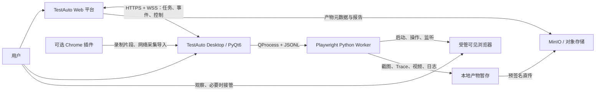
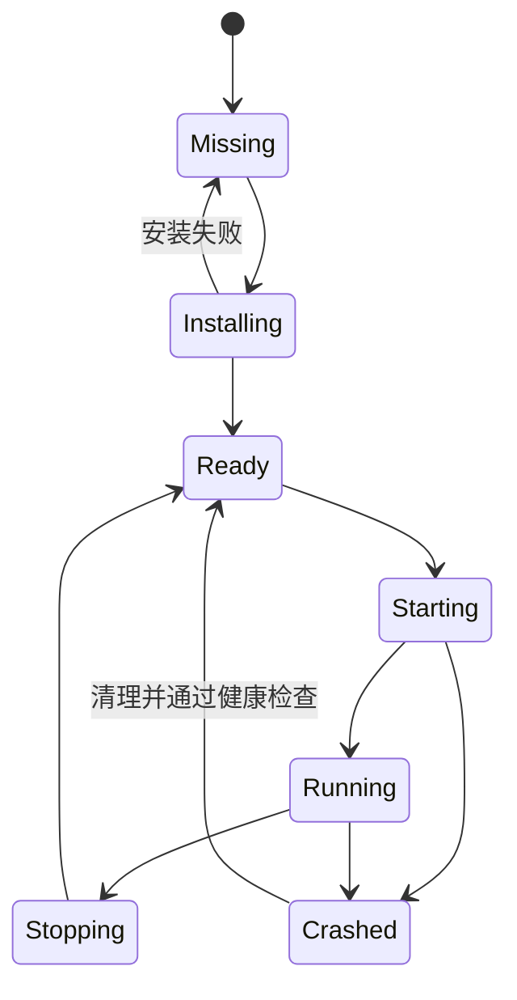
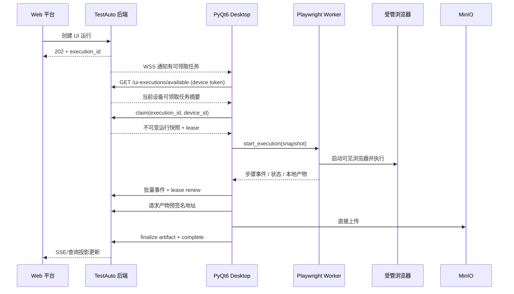
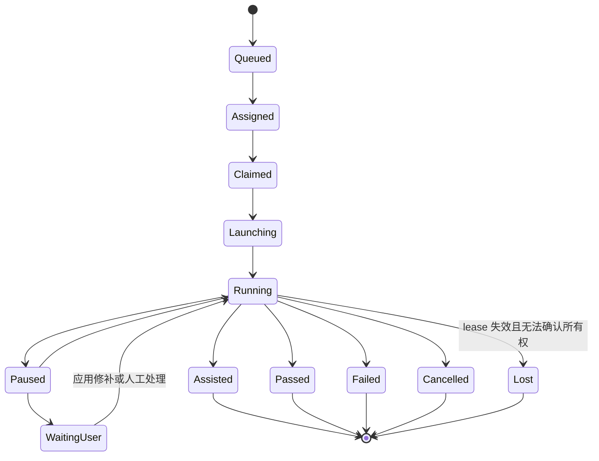

# TestAuto Desktop 开发技术架构

> 状态：实施架构（后端与 PyQt6 平台执行代码闭环已实现，企业部署验收继续进行）
>
> 最近核验：2026-07-17
>
> 目标平台：Windows 10/11 x64
>
> 桌面技术栈：Python、PyQt6、Playwright Python
>
> 平台关系：设备、用例版本、执行、claim/lease、event/command/complete、SSE、本地导入、artifact 和统一投影均已落地；真实 Redis/MinIO 多进程联调是发布门禁。

## 1. 文档目的

TestAuto Desktop 是平台 UI 自动化能力的本地执行端。它运行在用户桌面，负责启动和管理真实浏览器、展示执行过程、允许用户暂停和修正步骤，并把结构化事件与产物回传平台。

本方案解决两个核心问题：

1. 平台服务器无法直接操作用户桌面的真实浏览器。
2. 纯后台 Runner 无法让用户实时观察、接管和修改当前 UI 测试。

最终形态不是“把浏览器嵌入平台”，而是由平台负责任务和资产控制，由 PyQt6 桌面端负责本机浏览器与交互执行。Chrome 插件可作为可选的录制和网络采集入口，但不承担 Playwright 执行。

### 1.1 当前落地状态

后端 migration `0046_desktop_devices` 已实现设备、独立凭据和项目绑定，`0047_ui_test_cases`、
`0048_ui_execution_runtime`、`0049_ui_execution_artifact_delivery` 与 `0050_ui_execution_patch_requests` 已实现 UI 用例、不可变版本、完整执行协议、平台修补请求、产物和统一执行投影；当前正式接口见
[设备控制面 API](api_desktop_devices.md)、[UI 用例 API](api_ui_test_cases.md) 与 [UI 执行 API](api_ui_executions.md)。
Desktop `0.3.0-dev` 已用 QProcess 启动 Playwright Worker 并完成本地可见浏览器执行，同时以真实 Platform Adapter
接入 REST/WSS、DPAPI、SQLite Outbox、claim/lease、事件、命令、终态和预签名产物上传。持久 Profile、完整诊断采集、签名安装升级和部署环境端到端仍按目标契约理解。

## 2. 目标与非目标

### 2.1 目标

- 用户可从平台下发 UI 测试，也可在桌面端本地调试。
- 桌面端启动可见浏览器，用户能实时观察执行。
- 用户可暂停、单步、重试、跳过、修改定位器或输入值后继续。
- 浏览器、用户数据目录和执行进程均由桌面端统一管理。
- 平台保存用例版本、运行身份、事件、报告、审计记录和产物元数据。
- 桌面端断网时能安全暂停或继续已领取任务，并在恢复连接后补传事件和产物。
- 桌面端在线且被用户授权时，可作为无人值守执行设备。
- 第一阶段优先支持 Windows 10/11 x64 和 Chromium 系浏览器。

### 2.2 非目标

- 不使用内嵌 WebView 代替真实测试浏览器。
- 不允许平台服务端远程控制用户日常使用的默认 Chrome 配置目录。
- 第一版不开放任意 Python、JavaScript 或 Shell 代码执行。
- 第一版不同时支持 macOS、Linux 和移动端浏览器。
- Chrome 插件不直接承载 Playwright，也不是执行链路的必需组件。
- 人工介入后的运行不能伪装成无人干预的正常通过。

## 3. 总体架构结论

### 3.1 核心选型

| 层次 | 选型 | 责任 |
| --- | --- | --- |
| 桌面 UI | PyQt6 Widgets | 设备连接、用例编辑、运行控制、日志、步骤和产物展示 |
| GUI 网络 | `QNetworkAccessManager`、`QWebSocket` | HTTPS 请求、WSS 控制通道、心跳和事件传输 |
| 执行隔离 | `QProcess` | 启停 Playwright Worker、收发 JSON Lines、监控崩溃 |
| 浏览器执行 | Playwright Python Async API | 浏览器生命周期、页面动作、断言、录制、Trace 和截图 |
| 本地状态 | SQLite（WAL） | 配置、检查点、上传队列、受管 Profile 元数据 |
| 模型校验 | Pydantic | 用例 DSL、平台契约和进程消息校验 |
| 密钥存储 | `SecretStore` 抽象，Windows Credential Manager/DPAPI 实现 | 设备令牌、刷新令牌和敏感配置 |
| Windows 打包 | PyInstaller `onedir` 优先 | 应用目录、Qt 插件和 Worker 统一发布 |

### 3.2 系统边界



### 3.3 权责边界

| 能力 | 平台后端 | PyQt6 主进程 | Playwright Worker | 浏览器插件 |
| --- | --- | --- | --- | --- |
| 用户、项目和权限 | 权威 | 消费 | 不持有 | 消费最小授权 |
| 用例及版本 | 权威 | 编辑、缓存 | 只读运行快照 | 可生成候选步骤 |
| 任务调度和运行身份 | 权威 | 领取、续租、控制 | 执行单个运行 | 不负责 |
| 浏览器/Profile 管理 | 不直接操作 | 编排、锁定、健康检查 | 创建 Context、执行 | 不负责 |
| 实时交互 | 下发控制并记审计 | 展示和确认 | 暂停、单步、热修补 | 可辅助选取元素 |
| 事件和产物 | 持久化、汇总、报告 | 缓存、上传 | 生成 | 可提供网络记录 |
| 密钥 | 加密保存业务密钥或引用 | 从安全存储按需取用 | 仅获得当前步骤所需值 | 默认不可读取 |

## 4. 为什么采用双进程

PyQt6 主进程与 Playwright Worker 必须隔离，不在 GUI 线程中直接运行浏览器自动化。

主要原因：

- Playwright 的异步事件循环、浏览器事件和长时间步骤不能阻塞 Qt 事件循环。
- Worker 崩溃、浏览器崩溃或强制停止时不应带走桌面窗口。
- 可对 Worker 设置明确的启动、超时、取消和资源回收策略。
- 后续可以按运行创建临时 Worker，降低状态串扰和凭据残留。
- JSONL 协议便于契约测试、重放和独立排查。

### 4.1 进程结构

```text
testauto-desktop.exe                  # PyQt6 主进程
└─ testauto-playwright-worker.exe     # 独立 Worker，可按运行或按受管浏览器启动
   └─ chromium / chrome / msedge      # 仅管理由 Desktop 启动的浏览器进程树
```

第一版建议“一次活动运行对应一个 Worker”。如果后续需要单机并发，再通过资源配额把并行度扩展到多个 Worker；不能在首版默认无限并行。

### 4.2 QProcess 通道规则

- `stdin/stdout` 使用一行一个 JSON 对象的 JSON Lines 协议。
- Worker 的 `stdout` 只能输出协议消息，普通日志必须写入 `stderr` 或日志文件。
- 主进程监听 `started`、`readyReadStandardOutput`、`readyReadStandardError`、`errorOccurred` 和 `finished`。
- 每条消息必须先经过 Schema 校验，再交给状态机；未知版本或未知消息类型直接拒绝。
- 大文件不通过标准输出传递，只传本地路径、大小、哈希和媒体类型。
- 主进程正常退出前先发 `shutdown`，超时后才终止其创建的 Worker 和浏览器进程树。

目标消息封装：

```json
{
  "schema_version": "desktop-ipc-v1",
  "message_id": "01J...",
  "type": "command.execute_step",
  "execution_id": "ui_exec_01J...",
  "sent_at": "2026-07-16T10:00:00+08:00",
  "payload": {
    "step_id": "step_003",
    "action": "click",
    "locator": {"by": "role", "role": "button", "name": "登录"}
  }
}
```

基础消息类型：

| 方向 | 类型 | 用途 |
| --- | --- | --- |
| GUI → Worker | `command.start_execution` | 启动运行并传入不可变快照 |
| GUI → Worker | `command.execute_step` | 单步执行 |
| GUI → Worker | `command.pause/resume/stop` | 控制运行 |
| GUI → Worker | `command.apply_patch` | 应用当前运行的已审计修补 |
| GUI → Worker | `command.pick_locator` | 进入或退出页面选取模式 |
| Worker → GUI | `event.worker_ready` | Worker 初始化完成 |
| Worker → GUI | `event.execution_state` | 运行状态迁移 |
| Worker → GUI | `event.step_started/finished` | 步骤事件 |
| Worker → GUI | `event.locator_candidates` | 返回定位器候选 |
| Worker → GUI | `event.artifact_created` | 新产物可上传 |
| Worker → GUI | `event.browser_state` | 浏览器状态变化 |
| Worker → GUI | `event.error` | 结构化错误 |

## 5. 桌面应用功能设计

### 5.1 主窗口

第一版采用 PyQt6 Widgets 和 `QMainWindow`，不引入 QML。建议区域：

```text
┌──────────────────────────────────────────────────────────────┐
│ 项目 / 环境 / 设备状态 / 浏览器 / 当前账号 / 连接状态        │
├────────────────┬─────────────────────────┬───────────────────┤
│ 用例与步骤树   │ 当前步骤编辑器          │ 运行事件与控制     │
│                │ 定位器 / 输入 / 断言    │ 暂停 单步 重试     │
│                │ 候选定位器和校验结果    │ 跳过 停止 保存修补 │
├────────────────┴─────────────────────────┴───────────────────┤
│ Console / Network / Screenshot / Trace / Download / Audit   │
└──────────────────────────────────────────────────────────────┘

受管浏览器：由 Playwright 启动的独立可见窗口，不嵌入主窗口。
```

建议视图：

- 设备连接页：注册、登录、在线状态、版本和能力展示。
- 浏览器管理页：浏览器版本、安装状态、Profile、锁和健康检查。
- 用例工作台：步骤树、属性编辑器、变量、运行控制和产物。
- 执行队列页：待领取、运行中、需人工处理和上传失败任务。
- 设置页：缓存目录、代理、日志级别、并发上限和自动启动策略。

### 5.2 实时交互原则

- 自动步骤之间设置安全暂停点。
- 用户可请求立即暂停；若浏览器动作正在提交，则等待当前原子动作结束后暂停。
- 暂停后可修改当前步骤的定位器、输入、等待条件和断言。
- “仅本次运行生效”和“保存为新用例版本”必须是两个明确操作。
- 保存用例版本需要平台权限和版本冲突检查。
- 跳过、人工点击、人工填写或运行时修补都必须生成审计事件。
- 发生任何影响结果的人工介入，运行最终状态最多为 `assisted`；要得到 `passed` 必须从干净快照重新运行。

### 5.3 元素选取器

元素选取由 Worker 在受管页面中临时注入高亮层和点击监听器：

1. 用户在桌面端点击“选取元素”。
2. Worker 开启页面选取模式，阻止本次点击触发业务操作。
3. 用户在浏览器中点击目标元素。
4. Worker 按优先级生成多个候选定位器并现场验证唯一性。
5. 桌面端显示候选、匹配数量、稳定性提示和 DOM 摘要。
6. 用户选择候选并应用到当前运行，或保存为新版本。

定位器优先级：

1. `role + accessible name`
2. `label`
3. 项目约定的 `test_id`
4. `placeholder`、稳定文本或标题
5. 稳定 CSS
6. XPath，仅作最后兜底

不持久化整页 DOM。必要时只保留脱敏后的局部元素摘要，用于诊断定位失败。

## 6. 浏览器管理

### 6.1 浏览器来源

| 类型 | 默认策略 | 适用场景 |
| --- | --- | --- |
| Playwright 管理的 Chromium | 默认、优先 | 可重复执行、版本与 Playwright 匹配 |
| 系统 Chrome `channel=chrome` | 可选，运行前健康检查 | 验证真实 Chrome 渠道差异 |
| 系统 Edge `channel=msedge` | 可选，运行前健康检查 | 企业 Edge 兼容验证 |
| CDP 连接既有浏览器 | 仅限诊断或迁移 | 能力保真度较低，不作为主执行路径 |

Playwright 版本与浏览器二进制必须作为兼容单元发布。桌面端使用专属 `PLAYWRIGHT_BROWSERS_PATH`，不能依赖开发机全局缓存。

### 6.2 Profile 策略

- 默认使用 Desktop 创建的非持久临时 Context。
- 需要保留登录态时，使用受管持久 Profile。
- Profile 以“项目 + 环境 + 账号别名”隔离。
- 同一 `user_data_dir` 同时只允许一个浏览器实例，必须有跨进程锁。
- 禁止选择用户日常 Chrome 的默认数据目录。
- Profile 目录不上传平台；同步登录态应使用独立的加密状态方案并由用户显式授权。
- 删除 Profile 前显示其所属项目、环境、账号和最后使用时间。
- 只终止 Desktop 自己启动并记录 PID/父子关系的浏览器进程。

建议目录：

```text
%LOCALAPPDATA%\TestAuto Desktop\
├─ data\desktop.db
├─ profiles\{project_id}\{environment_id}\{profile_id}\
├─ browsers\
├─ artifacts\{execution_id}\
├─ logs\
└─ updates\
```

### 6.3 Browser Manager 状态



健康检查至少验证：浏览器可执行文件、版本兼容、Profile 锁、可写目录、可启动空白页和可正常关闭。

## 7. UI 用例模型

### 7.1 版本化 DSL

第一版定义声明式 `ui-case-v1`，不接受任意代码：

```json
{
  "schema_version": "ui-case-v1",
  "case_id": "ui_case_01J...",
  "version": 4,
  "name": "用户登录",
  "project_id": 12,
  "environment_id": 3,
  "browser": {
    "engine": "chromium",
    "channel": null,
    "headless": false,
    "profile_ref": "ctx_0123456789abcdef"
  },
  "settings": {
    "step_timeout_ms": 10000,
    "navigation_timeout_ms": 30000,
    "trace": "retain-on-failure",
    "screenshot": "only-on-failure"
  },
  "steps": [
    {
      "id": "step_001",
      "type": "action",
      "action": "navigate",
      "url": "${env.base_url}/login"
    },
    {
      "id": "step_002",
      "type": "action",
      "action": "fill",
      "locator": {"by": "label", "value": "用户名"},
      "value": "${secret.login_username}"
    },
    {
      "id": "step_003",
      "type": "action",
      "action": "click",
      "locator": {"by": "role", "role": "button", "name": "登录"}
    },
    {
      "id": "step_004",
      "type": "assertion",
      "assertion": "url",
      "operator": "contains",
      "expected": "/dashboard"
    }
  ]
}
```

### 7.2 首版动作与断言

动作：

- `navigate`
- `click`、`dblclick`
- `fill`、`press`
- `select`
- `check`、`uncheck`
- `hover`
- `upload`
- `download`
- `screenshot`

断言：

- `visible`、`hidden`
- `text`、`value`、`attribute`
- `count`
- `url`、`title`
- `screenshot`，作为后续可选的视觉基线能力

定位器：

- `role`
- `label`
- `test_id`
- `text`
- `placeholder`
- `alt`
- `title`
- `css`
- `xpath`

所有动作依赖 Playwright 的可操作性检查和自动等待。显式固定等待只允许有上限的兼容模式，并在编辑器中提示风险。

### 7.3 变量和密钥

- 变量来源包括环境变量、平台数据集、前序步骤输出和运行参数。
- 替换必须保留布尔、数字、对象和字符串类型，不能全部字符串化。
- `secret.*` 只在执行前按需解析，不能出现在快照明文、IPC 日志、截图名称或事件正文中。
- UI 输入含密钥时，日志只记录字段身份和掩码。
- 运行完成或 Worker 退出时清理内存中的短期密钥引用。

## 8. 运行工作流与状态机

### 8.1 平台下发运行



### 8.2 本地调试运行

本地调试不要求先创建平台运行，但必须使用同一 DSL、Worker 和状态机。用户选择“保存到平台”时：

- 录制生成且尚未绑定平台身份的本地草稿，在用户选择项目后查询项目环境；唯一启用环境或显式默认环境可自动成为 `default_environment_id`，通过平台校验后创建不可变 v1 用例。
- 平台 canonical DSL 以强类型白名单保留 `locator_plan/target_fingerprint/action_episode`、动作结果 URL、分层回放与网络依赖证据；本地环境中的 `localhost/127.0.0.1/::1` 仅按回环主机等价处理。
- 已载入平台身份的用例按 `base_version` 上传为新版本，不覆盖未知的远端最新版。
- 未选择项目、项目无启用环境，或存在多个环境但未设置默认项时，工作台保持平台保存按钮禁用并显示具体原因；项目选择成功后必须重新计算保存资格。
- 上传本地运行时由后端创建正式 `execution_id`，再补交事件和产物。
- 未登录或无权限时仅保留本地草稿，不伪造平台身份。

### 8.3 UI 执行状态



平台公共执行中心可以把内部状态投影到 `queued/running/passed/failed/cancelled`，但详情必须保留 `paused`、`waiting_user`、`assisted` 和 `lost`，避免掩盖人工介入和设备丢失。

### 8.4 领取、续租和断网

- 任务采用设备领取和有时限 lease，避免同一运行被两台设备执行。
- 桌面端周期续租；周期和过期时间由后端配置下发。
- 短时断网时，事件进入本地 Outbox；是否继续浏览器执行由任务策略决定。
- Worker 进入失败、取消或失联终态后，Desktop 关闭该平台任务的受管浏览器，但继续续租直到终态 Outbox 收敛。
- 终态产物上传最多自动尝试 3 次；仍失败时停止自动上传、保留本地文件，并提交真实执行终态。平台以独立的 `delivery_status=failed` 标记交付失败并释放 lease。
- lease 已过期且无法确认所有权时不得继续产生“正式通过”结果，应暂停为 `lost/waiting_user`。
- 重连后先校准运行所有权和服务端事件序号，再批量补传。
- 事件带客户端递增序号和幂等键，后端按运行去重。

## 9. 平台目标契约

本节全部为目标接口，实施时必须单独补充正式 API 文档、OpenAPI Schema、权限规则、migration 和测试。

### 9.1 设备接口

| 方法 | 路径 | 用途 |
| --- | --- | --- |
| `POST` | `/desktop/devices/register` | 用户确认后注册桌面设备并换取设备身份 |
| `POST` | `/desktop/devices/{device_id}/heartbeat` | 上报在线、能力、版本、负载和浏览器状态 |
| `GET` | `/desktop/devices` | 查询当前用户或项目可用设备 |
| `PATCH` | `/desktop/devices/{device_id}` | 修改设备名称、可接任务状态和能力策略 |
| `DELETE` | `/desktop/devices/{device_id}` | 撤销设备及其凭据 |
| `WS` | `/desktop/devices/{device_id}/control` | 任务通知、控制命令和状态校准 |

桌面端只建立出站 HTTPS/WSS 连接，不要求用户开放本机入站端口。

### 9.2 用例与执行接口

| 方法 | 路径 | 用途 |
| --- | --- | --- |
| `GET/POST` | `/ui-test-cases` | 查询或创建 UI 用例 |
| `GET/PATCH` | `/ui-test-cases/{case_id}` | 读取元数据或更新非版本字段 |
| `POST` | `/ui-test-cases/{case_id}/versions` | 基于基线版本保存不可变新版本 |
| `GET` | `/ui-test-cases/{case_id}/versions/{version}` | 获取指定版本 |
| `POST` | `/ui-test-cases/{case_id}/execute` | 创建执行，返回 `202 + execution_id` |
| `POST` | `/ui-executions/{execution_id}/claim` | 设备原子领取任务 |
| `POST` | `/ui-executions/{execution_id}/lease/renew` | 续租并校准控制状态 |
| `POST` | `/ui-executions/{execution_id}/events/batch` | 幂等批量写入步骤与运行事件 |
| `POST` | `/ui-executions/{execution_id}/patches` | 保存运行时修补和人工介入审计 |
| `POST` | `/ui-executions/{execution_id}/complete` | 原子提交终态摘要 |
| `POST` | `/ui-executions/{execution_id}/artifacts/presign` | 获取对象存储上传地址 |
| `POST` | `/ui-executions/{execution_id}/artifacts/finalize` | 登记哈希、大小、媒体类型和存储位置 |

创建执行遵守平台现有的异步约束，普通 API 请求不能等待浏览器运行结束。

### 9.3 目标数据模型

新增领域表建议：

| 表 | 核心内容 |
| --- | --- |
| `desktop_devices` | 用户、设备指纹、名称、版本、能力、在线和最后心跳 |
| `desktop_device_credentials` | 凭据指纹、撤销状态、有效期；不保存可回显明文 |
| `ui_test_cases` | 用例身份、项目、名称、标签、当前版本和状态 |
| `ui_test_case_versions` | 不可变 DSL、版本号、创建者、基线版本和哈希 |
| `ui_executions` | 运行身份、版本快照、设备、lease、内部状态和摘要 |
| `ui_step_executions` | 步骤序号、尝试、时间、结果、错误和输出引用 |
| `ui_execution_events` | 客户端序号、幂等键、事件类型和载荷 |
| `ui_runtime_patches` | 修补前后值、作用域、平台请求命令、发起用户、执行设备、理由和审计时间 |

公共执行投影必须复用现有统一执行基础设施：

- 在 `execution_record_index` 增加 `execution_type = ui` 的投影，而不是建设第二套执行中心。
- 步骤诊断复用或扩展 `execution_step_diagnostics`。
- 截图、Trace、视频、Console 和下载文件复用 `execution_payload_artifacts`，对象内容放 MinIO，数据库只存元数据和必要的小型内容。
- 具体字段和外键以实施时的模型、migration 和查询性能评审为准。

## 10. 桌面端模块设计

### 10.1 建议代码结构

建议把桌面端建设为独立仓库，例如 `C:\Users\Administrator\PycharmProjects\testauto-desktop`：

```text
testauto-desktop/
├─ pyproject.toml
├─ src/testauto_desktop/
│  ├─ main.py
│  ├─ app/                       # 启动、依赖装配、全局状态
│  ├─ ui/                        # PyQt6 views、dialogs、view models
│  ├─ platform/                  # REST、WSS、认证、DTO、重连
│  ├─ execution/                 # 主进程协调器、状态机、Outbox
│  ├─ browser/                   # 安装、Profile、锁和进程清单
│  ├─ persistence/               # SQLite repository 和 migration
│  ├─ security/                  # SecretStore、脱敏、签名校验
│  ├─ artifacts/                 # 本地暂存、哈希、上传、清理
│  └─ worker/
│     ├─ main.py                 # Worker 入口
│     ├─ protocol.py             # JSONL 消息模型
│     ├─ runtime.py              # Playwright 生命周期
│     ├─ interpreter.py          # ui-case-v1 解释器
│     ├─ locators.py             # 定位器构造和选取
│     └─ collectors.py           # Trace、截图、Console 等
├─ tests/
│  ├─ unit/
│  ├─ contract/
│  ├─ integration/
│  ├─ ui/
│  └─ fixtures/webapp/
├─ packaging/
└─ docs/
```

### 10.2 主进程模块责任

- `ApplicationController`：应用生命周期和依赖装配。
- `PlatformClient`：登录、注册、REST、WSS、重试和时钟偏差校准。
- `ExecutionCoordinator`：领取、续租、Worker 命令、事件 Outbox 和终态提交。
- `WorkerSupervisor`：`QProcess` 生命周期、协议解析、崩溃检测和回收。
- `BrowserInventoryService`：浏览器安装、版本兼容和健康检查。
- `ProfileRepository`：受管 Profile 元数据、锁和安全删除。
- `ArtifactUploadService`：哈希、预签名上传、完成确认和过期清理。
- `SecretStore`：平台凭据和运行密钥的操作系统安全存储适配。

### 10.3 Worker 模块责任

- 使用 `playwright.async_api`，在独立进程中维护自己的 asyncio 事件循环。
- 解析已经校验的运行快照，不读取平台数据库。
- 创建 Browser/Context/Page 并安装监听器。
- 执行动作和断言，产出结构化错误分类。
- 管理 Trace、截图、视频、下载、Console 和页面错误。
- 在安全点响应暂停、停止和运行时修补。
- 关闭 Context、Browser 和 Playwright，确保 Profile 解锁。

## 11. 本地持久化

SQLite 使用 WAL 模式，第一版至少包含：

- 设备非敏感元数据。
- 浏览器安装和兼容版本信息。
- 受管 Profile 清单和锁恢复信息。
- 当前执行检查点。
- 待上传事件 Outbox。
- 待上传产物及重试状态。
- 用户设置和 UI 布局。

不进入 SQLite 的内容：

- 设备访问令牌和刷新令牌明文。
- 测试账号密码明文。
- 完整 Cookie/Profile 副本。
- 未脱敏请求头、页面正文或 Console 密钥。

本地 Schema 需要独立 migration 版本。应用升级前创建可恢复备份，migration 失败时保持旧数据并阻止接新任务。

## 12. 产物、日志和可观测性

### 12.1 产物

| 产物 | 默认策略 | 说明 |
| --- | --- | --- |
| 步骤截图 | 失败保留 | 可配置每步保存，需控制存储量 |
| `trace.zip` | 失败保留 | 用于 Playwright Trace Viewer 诊断 |
| 视频 | 默认关闭 | 按项目或运行开启 |
| Console | 结构化保存 | 级别、时间、页面、脱敏消息 |
| Page error | 始终保存 | 包含错误类型和堆栈脱敏摘要 |
| 下载文件 | 按步骤声明 | 校验名称、类型、大小和哈希 |
| 局部 DOM 摘要 | 定位失败时可选 | 只保留目标附近的脱敏片段 |

上传流程：本地落盘 → 计算 SHA-256 → 请求预签名地址 → 直传 MinIO → 后端 finalize → 按保留策略清理本地文件。终态上传连续失败达到 3 次时不再无限阻塞 complete；Desktop 将产物标记为本地保留，后端分别保存执行终态与 `delivery_status=failed`。

### 12.2 日志

- GUI、Worker 和单次运行使用不同日志文件，但共享 `device_id/execution_id/request_id` 关联字段。
- 日志滚动并设置总容量上限。
- 默认不记录页面完整 HTML、Cookie、Authorization、密码和文件正文。
- Worker `stderr` 被主进程采集到诊断日志，不能混入 JSONL 标准输出。
- 用户导出支持包前必须预览内容并二次脱敏。

### 12.3 错误分类

第一版至少区分：

- `browser_installation_error`
- `browser_launch_error`
- `profile_locked`
- `navigation_timeout`
- `locator_not_found`
- `locator_ambiguous`
- `actionability_timeout`
- `assertion_failed`
- `download_error`
- `worker_crashed`
- `platform_disconnected`
- `lease_lost`
- `artifact_upload_failed`
- `user_cancelled`

错误需包含可行动建议、是否可重试、失败步骤和关联产物，不能只返回自由文本。

## 13. 安全设计

### 13.1 设备与通道

- 首次注册要求已登录用户在平台或桌面端完成明确确认。
- 设备凭据可撤销、有过期时间并绑定设备记录。
- 所有平台通信使用 TLS；控制通道使用 WSS。
- 桌面端不开放远程调试端口或本机 HTTP 控制端口。
- 企业部署可增加代理、私有 CA 和证书固定策略。

### 13.2 执行沙箱

- 只解释版本化白名单 DSL。
- 禁止任意脚本、进程启动和任意本地路径访问。
- `navigate` 受项目环境域名白名单约束，跨域跳转要记录并可配置阻断。
- 上传文件只能来自用户确认或平台授权的专属工作目录。
- 下载文件限制单文件和单次运行总大小。
- 浏览器参数采用白名单，不接受用例透传任意命令行参数。

### 13.3 Profile 与隐私

- 受管 Profile 目录采用当前 Windows 用户可访问的 ACL。
- 不连接默认 Chrome Profile；现代 Chrome 对默认数据目录的远程调试限制也使专属目录成为必要边界。
- 截图和视频可能包含个人信息，必须继承项目权限、保留期和删除策略。
- 运行前允许项目配置敏感区域遮罩。
- 插件与 Desktop 分别授权，插件不能自动取得 Desktop 的设备令牌或测试密钥。

### 13.4 审计

以下操作必须进入平台审计或运行事件：

- 设备注册、撤销和能力切换。
- Profile 创建、删除和账号绑定变更。
- 人工暂停、点击、填写、跳过和重试。
- 定位器或输入的运行时修补。
- 保存新用例版本。
- 下载、导出和删除执行产物。

## 14. Chrome 插件的定位

插件保留为可选增强能力：

- 采集用户在普通浏览器中的操作意图，生成候选步骤。
- 复用现有 HTTP/WebSocket 网络采集，关联 UI 步骤与后端请求。
- 将录制会话显式导入 Desktop，由 Desktop 校验并转换为 `ui-case-v1`。
- 在用户主动授权的页面上辅助提取定位信息。

### 14.1 插件与 Desktop 的通信

Windows 首选 Chrome Native Messaging，不为插件开放本机 HTTP/TCP 监听端口：

```text
Chrome Extension
└─ chrome.runtime.connectNative()
   └─ testauto-native-host.exe        # Chrome 启动的最小转发进程
      └─ QLocalSocket / Windows named pipe
         └─ TestAuto Desktop 主进程
```

- 安装器注册 Native Messaging Host manifest 和当前正式插件的精确 `allowed_origins`；禁止通配符扩展来源。
- Native Host 是独立的最小权限进程，不包含 Playwright，也不直接读取 Desktop 密钥。
- Native Host 校验调用来源、消息长度、Schema 和允许的事件类型，只转发录制片段与关联信息。
- Native Messaging 使用带长度前缀的 JSON，不得与 Desktop—Worker 的 JSONL 协议混用。
- Native Host 与 Desktop 之间使用当前 Windows 用户范围的本地管道，并进行会话握手，拒绝其他用户或未知进程。
- Desktop 未运行时，插件应提示用户启动 Desktop；不得自动退化为未鉴权的本机网络服务。

插件不承担以下责任：

- 不加载或运行 Playwright。
- 不管理浏览器进程和受管 Profile。
- 不领取平台执行任务。
- 不决定执行终态。
- 不绕过浏览器扩展权限访问本机密钥。

即使没有安装插件，Desktop 仍能通过 Playwright 的页面监听和元素选取器完成用例创建与执行。

## 15. 打包、安装与升级

### 15.1 打包策略

- 开发阶段使用锁定的 Python 小版本和依赖锁文件。
- Windows 第一版使用 PyInstaller `onedir`，优先保证 Qt 插件、Worker、诊断文件和浏览器依赖可见、可替换。
- 不优先使用 `onefile`：单文件模式启动时需要解压到临时目录，不利于大体积浏览器资产、启动速度和现场排查。
- GUI 和 Worker 可构建为两个入口，共享版本号和 IPC Schema。
- Playwright 浏览器资产放入 Desktop 专属目录，可随安装包分发或由受信安装器按版本下载；不能在首次执行时静默访问未知来源。
- 正式安装包、主程序、Worker 和升级清单均需代码签名。

### 15.2 版本兼容

桌面端启动和领取任务前上报：

- Desktop 版本。
- IPC Schema 版本。
- `ui-case` DSL 版本范围。
- Playwright Python 版本。
- 已安装浏览器及版本。
- 操作系统和架构。

后端根据兼容矩阵决定是否允许领取。强制升级不能中断正在运行的任务；应先停止接单、完成或安全暂停，再升级。

### 15.3 发布通道

- `dev`：开发联调，允许详细日志。
- `beta`：小范围项目试用。
- `stable`：签名生产发布。

第一阶段可以只提供用户确认升级；验证签名、回滚和运行保护后，再考虑静默更新。

## 16. 测试策略

### 16.1 单元测试

- DSL Schema、升级和拒绝未知字段。
- 定位器构造和优先级。
- 运行、设备和浏览器状态机。
- JSONL 半包、粘包、非法消息和版本不兼容。
- Outbox 幂等、顺序和断线重传。
- Profile 锁和崩溃恢复。
- 密钥脱敏和路径白名单。
- 产物哈希、保留和清理。

### 16.2 集成测试

- 使用本地确定性 Web Fixture 验证所有动作和断言。
- PyQt6 主进程通过 `QProcess` 启动真实测试 Worker。
- 模拟 Worker 崩溃、浏览器崩溃、平台断网和租约失效。
- 与 FastAPI 测试服务验证设备、领取、事件、产物和终态契约。
- 验证运行时修补只影响规定作用域。
- 验证人工介入最终只能得到 `assisted`。

### 16.3 UI 和发布测试

- 使用 `pytest-qt` 验证关键窗口、对话框和状态绑定。
- Windows 10/11 打包后冒烟：安装、注册、安装浏览器、运行、上传、卸载。
- 系统 Chrome/Edge 渠道各执行一组兼容用例。
- 低磁盘、中文路径、代理、休眠恢复、锁屏和多显示器场景。
- 安装包签名、升级、回滚和旧数据库 migration。

### 16.4 性能与资源门槛

- GUI 空闲时不得持续占满 CPU。
- 事件批量上传，不能每个 Console 条目单独请求平台。
- 单机并发、视频录制和 Trace 策略必须有可配置上限。
- 浏览器和 Worker 退出后验证无遗留进程、Profile 锁和临时密钥。
- 本地缓存和日志达到上限后按保留规则清理，不得无限增长。

## 17. 分阶段实施计划

### 阶段 0：契约和骨架

范围：

- 建立独立 Desktop 仓库、依赖锁定、代码规范和 CI。
- 固化 `ui-case-v1`、`desktop-ipc-v1` 和状态机。
- 建立 PyQt6 主窗口、QProcess Worker 空协议和 SQLite migration。
- 在后端补正式 API 设计、权限模型和 migration 计划，但暂不开放生产领取。

验收：

- GUI 可启动 Worker、完成握手、执行模拟步骤并安全关闭。
- Schema 有正反向契约测试。
- 文档明确当前实现与目标契约，不出现虚假已实现接口。

### 阶段 1：本地可见浏览器 MVP

范围：

- Playwright Chromium 安装和健康检查。
- 临时 Context、受管持久 Profile 和锁。
- 首批动作、断言、步骤树、日志、截图和 Trace。
- 暂停、继续、单步、重试、停止和元素选取。
- 本地草稿及本地运行报告。

验收：

- 用户可在可见浏览器中完整创建、运行和修复一个登录流程。
- Worker 或浏览器崩溃后 GUI 保持可用并给出结构化诊断。
- 未安装插件也能完成全部 MVP 流程。

### 阶段 2：平台闭环（代码已完成，部署环境验收待完成）

范围：

- 设备注册、WSS 控制通道、设备 `/available` 队列恢复、任务领取和 lease。
- 用例版本、运行快照、事件 Outbox 和断网恢复。
- MinIO 预签名上传及统一执行记录投影。
- 平台 Web 端展示设备、运行状态、步骤和产物。

验收：

- 平台返回 `202 + execution_id` 后，在线 Desktop 可领取并执行。
- Web 端能看到实时状态、人工介入标识和最终产物。
- 重复事件、重复完成和网络重连均保持幂等。
- Desktop 不需要入站端口。

### 阶段 3：录制和插件联动

范围：

- Desktop 页面录制与候选步骤生成。
- Chrome 插件录制/网络会话导入。
- UI 步骤与 HTTP/WebSocket 请求关联。
- 用例版本差异和冲突处理。

验收：

- 录制结果必须经过用户确认和唯一性校验后才能保存。
- 插件缺失、禁用或权限不足不影响执行。
- 导入内容不能绕过 DSL、安全域名和密钥规则。

### 阶段 4：规模化与企业发布

范围：

- 受控单机并发、设备池和调度策略。
- 签名升级、回滚、代理和企业证书支持。
- 多浏览器矩阵、视觉基线和更细粒度数据保留。
- 指标、告警、设备健康和容量治理。

验收：

- 并发有明确资源配额，单个用户运行不会阻塞平台 API。
- 升级不会打断活动运行，失败可以回滚。
- 浏览器、Desktop、DSL 和后端兼容矩阵可被自动验证。

## 18. 首版交付验收清单

- [x] PyQt6 GUI 与 Playwright Worker 进程隔离（客户端 `0.3.0-dev`）。
- [x] 浏览器以 `headless=False` 的独立可见窗口运行（客户端本地调试链路）。
- [ ] 只使用 Desktop 管理的浏览器目录和 Profile。
- [ ] 用户可以暂停、单步、修补、重试和停止。
- [x] 后端会持久化人工介入/运行修补并强制终态为 `assisted`。
- [x] 平台可在 `paused/waiting_user` 发起幂等修补请求，Desktop 应用结果可追溯到原命令且防篡改。
- [x] UI 用例采用版本化白名单 DSL，无任意代码执行（后端阶段 C）。
- [x] 后端平台运行采用 `202 + execution_id`、claim/lease、幂等事件和 complete 异步链路，并已接入 Desktop Adapter。
- [x] Desktop 仅需出站 HTTPS/WSS。
- [x] 事件与产物通过 SQLite Outbox 幂等补传；终态等待本执行的待交付数据清空，或在产物上传达到有界重试上限后以独立交付失败状态提交。
- [ ] 截图、Trace 和日志完成密钥脱敏。
- [ ] Worker/浏览器崩溃不导致 GUI 崩溃。
- [ ] 打包后的 Windows 环境通过安装到卸载的真实冒烟测试。

## 19. 实施前仍需冻结的决策

以下决策不影响总体架构，但必须在阶段 0 结束前冻结：

1. Desktop 独立仓库名称和版本发布责任人。
2. Windows 基线 Python 小版本及完整依赖锁。
3. 安装器选择、签名证书和浏览器资产分发方式。
4. 设备注册是一次性授权码、浏览器登录回调还是平台扫码确认。
5. lease、心跳、离线继续和事件保留的具体时长。
6. 密钥是只从平台按运行注入，还是允许 Desktop 本地保管账号别名。
7. 第一版是否纳入视频和视觉截图断言。
8. 平台端 UI 用例的项目权限、环境域名白名单和产物保留策略。

## 20. 官方技术依据

- [Qt QProcess](https://doc.qt.io/qt-6/qprocess.html)：子进程生命周期、标准输入输出和异步信号。
- [Qt QNetworkAccessManager](https://doc.qt.io/qt-6/qnetworkaccessmanager.html)：与 Qt 事件循环集成的网络访问。
- [Qt WebSockets](https://doc.qt.io/qt-6/qtwebsockets-module.html)：桌面端 WSS 控制通道基础。
- [Playwright Python BrowserType](https://playwright.dev/python/docs/api/class-browsertype)：可见浏览器、持久 Context、浏览器渠道和 CDP 边界。
- [Playwright Python Locators](https://playwright.dev/python/docs/locators)：面向用户的定位器优先级和定位规则。
- [Playwright Auto-waiting](https://playwright.dev/docs/actionability)：动作可操作性检查和自动等待。
- [Playwright Trace Viewer](https://playwright.dev/python/docs/trace-viewer-intro)：Trace 录制和失败诊断。
- [Playwright Browsers](https://playwright.dev/docs/browsers)：Playwright 与浏览器二进制版本配套和安装目录。
- [PyInstaller Operating Mode](https://pyinstaller.org/en/stable/operating-mode.html)：`onedir`、`onefile` 的运行与排查差异。
- [Chrome Remote Debugging Changes](https://developer.chrome.com/blog/remote-debugging-port)：默认 Chrome 数据目录的远程调试限制和专属数据目录要求。
- [Chrome Native Messaging](https://developer.chrome.com/docs/extensions/develop/concepts/native-messaging)：扩展与本机应用的受控标准输入输出通信、来源白名单和 Windows Host 注册方式。

以上链接最后核验于 2026-07-16。实施时应把依赖版本锁定到经过 Windows 打包和端到端验证的组合，而不是自动追随最新版本。
