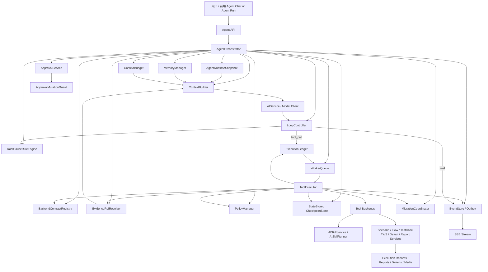
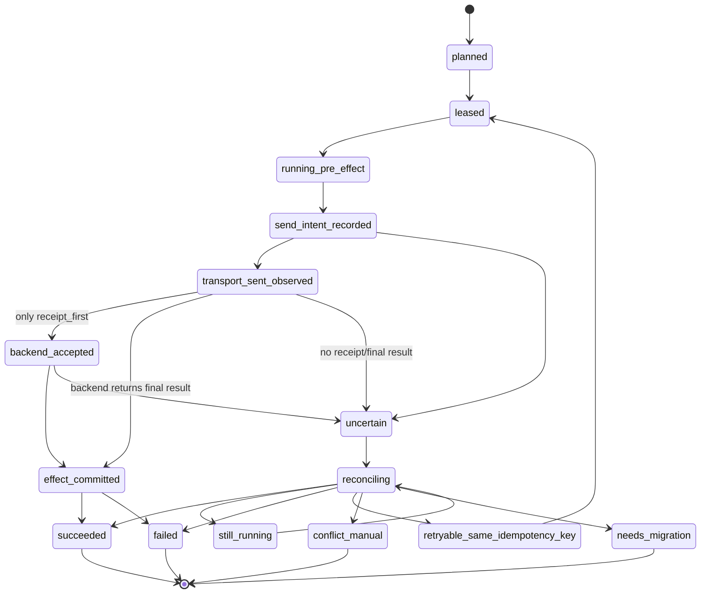
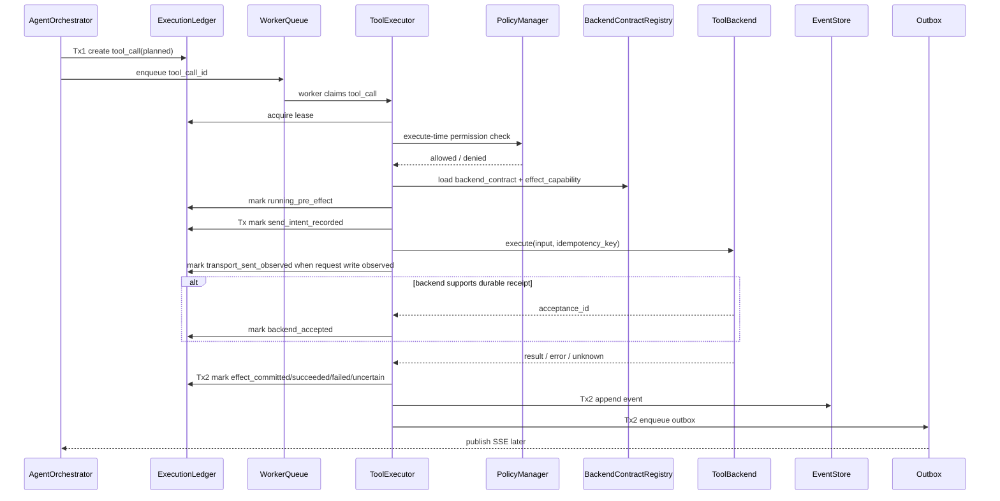

# 为测试平台设计自研 Harness+Loop Agent 架构（四次修正版：组合尺度与治理闭环版）

## 1. 执行摘要

这套系统的目标是建设一个**生产级测试平台 Agent**，而不是建设一个通用聊天助手，也不是为了“替代 LangGraph”而做自研。Agent 的成立标准不是是否使用 LangGraph，而是系统是否具备以下能力：

```text
Plan      能根据目标规划下一步
Reason    能结合上下文、工具结果和失败证据做判断
Act       能调用受控工具执行动作
Observe   能读取工具执行结果和业务反馈
Loop      能基于观察结果继续修正或终止
Memory    能使用短期状态、长期记忆和项目知识
State     能持久化 run、step、tool call、event、checkpoint
Policy    能在工具执行前做权限、审批和风险控制
Recovery  能从中断、超时、未知提交状态中恢复
```

因此，本平台最终产物仍然是 **Agent Runtime**。它不引入 LangGraph，只是底层编排、状态、工具执行、审批、恢复、事件流和记忆系统全部自研。

这套 Agent 应建立在现有平台的 `AIService / AISkillRunner / Skill 包 / Run-Event-SSE / Scenario / Flow / Execution Records / Reports / Project Permissions` 之上。Agent 不直接改数据库、不直接调用模型 HTTP、不直接绕过权限体系。Agent 的职责是理解用户目标、规划动作、选择工具、观察结果、循环纠错、输出可审计结果；真实业务副作用全部通过现有平台 Service 和 Skill 发起。

当前后端对话执行由 `AgentConversationRunner` 承担模型规划和结果回灌层：它在模型调用前用 `normal_plan_v1` 检索项目 Memory，以 `usage_role=conversation_context` 注入非 policy 上下文，写入 `memory.context_injected` 和 `AgentMemoryUsageEvent(active_for_policy=false)`；随后把 ToolRegistry 以受控协议暴露给模型，模型只能输出 `agent_tool_request` JSON 请求。后端解析工具请求后必须先写 `model.tool_request_detected`，再通过 `ExecutionLedgerService.create_tool_call(enqueue=False)` 进入 ToolCall 事实账本，并复用 `ToolExecutor.execute_tool_call` 完成权限、审批、策略和后端 adapter 校验。工具结果通过 `tool.result_observed` 进入下一轮模型上下文，最终自然语言回复由 `model.delta`、`model.completed.content` 和 `run.completed.result.message` 输出给前端，且必须是 GitHub Flavored Markdown；若模型流式内容存在表格换行等格式问题，Runner 在完成前写入 `model.markdown_normalized(replace_content=true)` 并用规范化 Markdown 覆盖最终 summary。该闭环不允许绕过 ExecutionLedger，也不允许把 Memory 或模型工具请求 JSON 当成用户可见回复；高风险动作仍必须依赖 EvidenceRef、审批和工具结果，而不是 conversation Memory。

场景组合是该闭环的首个 query-first 业务 recipe：用户要求创建、生成或组合测试场景时，模型必须先调用 `testcase.query_project_cases` 获取当前项目全量 HTTP/WebSocket 用例，再基于返回的真实 case id 调用 `scenario.compose_draft`。如果模型在没有成功 query 结果的同一 run 内直接请求 `scenario.compose_draft`，Harness 不执行下游 AISkill，而是创建可审计 ToolCall、写入 `tool.failed` / `tool.result_observed` 与 `scenario_compose_requires_case_query`，把失败结果回灌给模型继续规划，直到 query -> compose -> final answer 或达到迭代上限。

审批恢复同样必须走同一事实源：当模型规划出的 ToolCall 需要人工确认时，Run 进入 `needs_human` 并记录 `blocking_tool_call_ids_json`；approve 只负责固定 approval lineage/epoch 和释放 queue，不直接伪造完成结果。`POST /api/v1/agents/runs/{run_id}/resume` 先运行 Checkpoint Freshness Gate，通过后执行已批准的 blocking ToolCall，写入 `tool.result_observed(resumed_after_approval=true)`，清理已成功的 blocking id，并调用 `AgentConversationRunner.complete_after_tool_results` 基于工具输出生成最终回复。resume payload 使用 `executed_tool_call_ids` 告知前端哪些阻断工具已在恢复过程中执行。

本四次修正版在三次修正版的基础上，继续修复 5 个组合尺度问题。这些问题不是单个机制内部不正确，而是多个机制组合、批量运行、长时间等待或渐进式接入时会重新产生的缝隙：

```text
1. Approval lineage 锁不再只定义单次 approve/supersede 的锁顺序，还定义批量过期扫描、后台任务和多 lineage 场景下的短事务、SKIP LOCKED、固定排序和退避策略，避免 lineage 锁变成新热点或死锁源。
2. EvidenceRef 生命周期不再只覆盖 Agent 内部 Repair/Validate，还定义外部平台事件导致的证据失效、ephemeral_latest 的 materialize 流程，以及不引入主动失效订阅时的保守降级语义。
3. RootCauseRuleEngine 不再只给静态 priority 数字，还定义 rule priority band、插入准则、治理流程、测试夹具和缺失规则报警的处理闭环。
4. BackendEffectCapability 不再绑定到 backend_name + backend_contract_version 的粗粒度，而是下沉到 backend_name + backend_operation + backend_contract_version，支持同一服务内不同 operation 渐进式改造。
5. migration block resolve 后不再默认从旧 checkpoint 直接续跑，而是增加 checkpoint freshness gate、long-wait resume policy、evidence revalidation 和必要时 replan 的恢复路径。
```

生产最低安全线调整为：

```text
AgentRuntimeSnapshot
+ BackendExecutionContract
+ BackendEffectCapability
+ ExecutionLedger
+ Multi-stage Effect Submission State with Degradation Modes
+ IdempotentToolBackend / Reconcile Contract
+ EvidenceRef Dependency Lifecycle
+ Idempotency Key
+ Approval Lineage / Epoch / Mutation Guard
+ Execute-time Permission Check
+ EventStore / Outbox
+ Loop Stop Reason + Explicit Root Cause Rule Table
+ Context Decision Build Binding
+ Run/ToolCall Migration Block Coordination
```

本版的核心原则是：

```text
凡是要求下游配合的能力，必须显式标注接入等级，不能假设所有下游一次性改造到位。
凡是影响 replay_policy 的证据，必须区分“本次决策依赖”与“历史审计追溯”。历史 volatile 证据不能永久污染新的已冻结决策。
凡是审批 supersede 与 approve 并发，必须在同一个业务互斥域中完成，不能只靠单表 CAS。
凡是新增诊断能力，都必须给出规则表，不能重新引入听起来合理但不可审计的黑盒函数。
凡是 migration，可以发生在 Run 层或 ToolCall 层，但必须有明确的级联、阻断、恢复与 UI 展示规则。
凡是可能批量扫描或后台修复的锁协议，都必须定义多对象遍历策略，不能只定义单对象事务。
凡是长时间等待后继续执行，都必须先做 freshness gate，不能默认 checkpoint 仍然代表当前世界。
凡是能力分级用于渐进式改造，粒度必须落到 operation 级，而不是粗略绑定到整个 backend。
凡是规则表用数字优先级，必须配套 priority band 与变更治理流程。
```

---

## 2. 基础假设与设计边界

| 假设项 | 采用值 | 说明 |
|---|---|---|
| 关系数据库 | MySQL 8.x + InnoDB | Run、Ledger、Snapshot、Approval、Event、Memory 的事实源 |
| 异步队列 | DB-backed WorkerQueue 优先，Redis / MQ 可选 | 消息队列只做加速，不做事实源 |
| 对象存储 | MinIO / S3 兼容对象存储 | 保存大日志、完整 tool output、原始响应样本 |
| AI Provider | 继续走 `AIService / AISkillService` | Agent 不直接拼接模型 HTTP 请求 |
| 事件输出 | 继续使用 SSE | SSE 只读 EventStore，不作为事实源 |
| 权限底座 | 继续复用项目权限模型 | 管理员 / 项目创建者 / 成员授权链不变 |
| 执行底座 | 复用 Scenario / Flow / TestCase / WS 执行服务 | Agent 只编排，不重写执行器 |
| 框架选择 | 不引入 LangGraph | Harness、Loop、Checkpoint、Ledger、Memory、WorkerQueue 全部自研 |

LangGraph 是一种 graph-based orchestration runtime，不是 Agent 的定义。你的测试平台更适合自研 Loop Runtime，因为测试任务经常不是固定 DAG，而是：

```text
生成草稿 -> 校验 schema -> 执行验证 -> 观察失败 -> 修复局部字段 -> 再验证 -> 人审 -> 保存/执行
```

这个过程的路径由运行时观察结果决定，而不是在任务开始前完全固定为 DAG。

---

## 3. 总体架构



核心原则：

```text
AgentOrchestrator 负责驱动，不直接产生副作用。
ToolExecutor 负责执行，但必须先拿 lease、再做 execute-time 权限校验。
ExecutionLedger 是副作用事实源。
StateStore 是用户可见状态源。
EventStore 是事件事实源。
SSE 只是传输层。
AgentRuntimeSnapshot 是 Agent 侧版本事实源。
BackendExecutionContract 是下游服务侧执行 / 反查 / schema 兼容事实源。
BackendEffectCapability 是每个下游工具真实可恢复能力的声明，决定是否能进入 backend_accepted。
EvidenceRefResolver 负责把证据引用解析成冻结、版本化、当前可变、latest 或外部不可控，并筛选本次策略依赖证据。
ApprovalMutationGuard 负责把 approve、supersede、create replacement tool_call 放进同一个业务互斥域。
RootCauseRuleEngine 只执行显式规则表，不做不可审计的黑盒推断。
MigrationCoordinator 负责 ToolCall needs_migration 与 Run needs_migration 的级联、解除和 UI 状态。
```

本架构刻意分离三类版本与能力：

```text
AgentRuntimeSnapshot 解决“Agent 当时看到了哪些 tool、manifest、schema、policy、prompt”。
BackendExecutionContract 解决“下游当时按哪个 request/output/reconcile schema 接收、保存和解释结果”。
BackendEffectCapability 解决“下游是否支持 durable receipt、idempotency index、legacy reconcile 或只能人工恢复”。
```

运行时能力出口 `GET /api/v1/agents/capabilities` 必须暴露开发计划 4.2 冻结的全部状态枚举，包括 Run、ToolCall、Effect Submission State、BackendEffectCapability、Approval 与 Migration Block。该出口是前端、OpenAPI schema 与运行时服务共享的机器可读枚举契约，后端测试需要从 4.2 文档抽取枚举并与 capabilities 响应保持精确一致。

模型连通诊断出口 `GET /api/v1/agents/model-health` 必须继续复用 `AIService.provider_config()` 与 `AIService.chat_stream()`，不得直接拼接 DeepSeek HTTP，也不得返回 `DEEPSEEK_API_KEY`。默认 `live=false` 只读配置状态；`live=true` 仅 admin 可用，用极小流式探测验证 provider reachable、first_delta_received 和 completed，用于排查 Run 已创建但前端没有 assistant 回复的问题。该接口不写 Agent Run/EventStore，不作为事实源。

对话链路诊断出口 `POST /api/v1/agents/conversation-smoke` 是 admin-only 端到端 smoke。它必须创建真实 Agent Run，复用 `AgentConversationRunner`、`AIService.chat_stream()`、EventStore 和 Run Summary 聚合路径，同步返回 `first_delta_received`、`completed`、`event_types` 与 `run_summary`。它用于证明 provider 已可达后，完整 `POST /runs -> runner -> model.delta -> run.completed -> summary` 链路是否工作；该接口会产生真实审计记录，因此不得暴露给普通用户路径。

Required Agent Conversation smoke payload contract:

```text
fields=project_id,run_id,conversation_id,status,completed,first_delta_received,assistant_visible,assistant_message,error_code,error_message,event_types,latest_event_sequence,run_summary,latency_ms,generated_at
run_summary_fields=run,assistant_message,assistant_visible,completion_source,model_invoked,model,finish_reason,usage,event_count,latest_event_sequence,latest_event_types,tool_call_count,pending_tool_call_count,approval_count,pending_approval_count,migration_block_count,open_migration_block_count,memory_usage_count,blocking_tool_call_ids,terminal,can_cancel,can_resume,updated_at
source=AgentConversationSmokeRead
```

不能用 `runtime_snapshot_id` 替代下游历史 schema 契约，也不能用理想状态的 `backend_accepted` 替代真实下游能力声明。

---

## 4. 核心组件职责

| 组件 | 职责 | 禁止事项 |
|---|---|---|
| AgentOrchestrator | 创建 run、冻结 snapshot、驱动 loop、调度 worker | 不直接执行业务副作用 |
| AgentRuntimeSnapshot | 冻结 tools、skill manifests、schema、adapter、policy、prompt 版本 | 不允许 run 恢复时读最新 manifest |
| BackendContractRegistry | 记录下游 backend 的 execute/reconcile contract version、schema hash、兼容窗口、effect capability | 不把 Agent snapshot 当成下游 schema 或 durable receipt 承诺 |
| ContextBuilder | 组装当前轮模型输入，并记录 context_build_id | 不绕过 ContextBudget |
| ContextBudget | 管理单次 run 内 token 预算、压缩、降级记录 | 不静默丢弃证据 |
| EvidenceRefResolver | 解析 evidence_refs，判断资源可变性、冻结条件、freshness policy，并筛选 active policy refs | 不让历史追溯证据永久污染 replay_policy |
| ToolRegistry | 生成 ToolSpec 候选集合 | 不在历史 run 中动态读取最新 tool 定义 |
| ExecutionLedger | 记录每次 tool call 的幂等键、状态、effect submission state、结果 | 不承担 UI 展示 |
| WorkerQueue | 负责排队、租约、心跳、孤儿扫描 | 不做业务事实源 |
| ToolExecutor | 执行 tool、回写 ledger、写 event | 不跳过 execute-time 权限校验 |
| PolicyManager | plan / approval / execute 三阶段校验 | 不信任模型自己的风险判断 |
| ApprovalService | 管理人审、过期、撤销、supersede、CAS approve、approval lineage | 不允许审批过期或已 superseded input |
| ApprovalMutationGuard | 以 approval_lineage_id / resource_scope_hash 为互斥域，串行化 approve 与 replacement 创建 | 不允许“新 tool_call 已创建但旧 approval 未 supersede”的可批准窗口 |
| LoopController | 判断继续、暂停、终止、修复，并记录 stop reason 与 root cause chain | 不只依赖 max_iterations，不只记录单一原因 |
| RootCauseRuleEngine | 根据显式规则表推导 root_cause_primary、causal_chain、mitigation_action | 不使用未定义的 infer_root_cause 黑盒函数 |
| MigrationCoordinator | 维护 ToolCall migration block 与 Run status 联动 | 不让 ToolCall needs_migration 静默卡住 Run |
| MemoryManager | 长短期记忆、RAG、stale 降权 | 不把记忆当硬事实 |
| EventStore / Outbox | 事件持久化、SSE 重放、通知发布 | 不与副作用执行双写耦合 |

新增组件的理由：

```text
EvidenceRefResolver 是 replay_policy 动态升级的基础。如果没有证据生命周期筛选，历史 volatile refs 会导致结果永远不能复用。
BackendContractRegistry 是 reconcile 自动收敛的基础，但必须承认不同下游有不同接入能力，不能假设 durable receipt 一步到位。
ApprovalMutationGuard 是审批并发正确性的基础。CAS 只能保护单条 approval 状态，不能天然保护“替换 tool_call + 废弃旧审批”的跨表业务原子性。
RootCauseRuleEngine 是诊断可审计性的基础。新增因果归因时必须像 EvidenceRef 一样显式规则化。
MigrationCoordinator 是恢复可见性的基础。任一 blocking ToolCall 进入 needs_migration 时，Run 必须进入可感知的阻断状态。
```

---

## 5. AgentRuntimeSnapshot：合并快照，消除版本漂移

上一版中 `tool_registry_snapshot_id` 和 `manifest_snapshot_bundle_id` 是两个独立快照，存在不一致风险。本修正版合并为一个快照概念：

```text
AgentRuntimeSnapshot
= Tool Registry
+ Skill Manifest Bundle
+ Schema Hashes
+ Runtime Adapter Versions
+ Prompt Bundle Hashes
+ Policy Version
```

run 创建时只绑定一个 `runtime_snapshot_id`。历史 run 恢复、审批、重试、reconcile 全部使用该 snapshot。

```sql
CREATE TABLE ai_agent_runtime_snapshots (
  id BIGINT PRIMARY KEY AUTO_INCREMENT,
  snapshot_id VARCHAR(64) NOT NULL UNIQUE,

  project_id BIGINT NOT NULL,
  created_by BIGINT NOT NULL,

  runtime_hash CHAR(64) NOT NULL,
  tool_registry_hash CHAR(64) NOT NULL,
  manifest_bundle_hash CHAR(64) NOT NULL,
  prompt_bundle_hash CHAR(64) NULL,
  policy_version_hash CHAR(64) NULL,

  tools_json JSON NOT NULL,
  manifests_json JSON NOT NULL,
  adapters_json JSON NULL,
  policies_json JSON NULL,

  created_at DATETIME NOT NULL,
  INDEX idx_agent_runtime_snapshot_project (project_id, created_at)
);
```

`ai_agent_runs` 不再保存两个快照字段，但必须能展示 migration 阻断来源：

```sql
CREATE TABLE ai_agent_runs (
  id BIGINT PRIMARY KEY AUTO_INCREMENT,
  run_id VARCHAR(64) NOT NULL UNIQUE,

  project_id BIGINT NOT NULL,
  user_id BIGINT NOT NULL,
  conversation_id VARCHAR(64) NULL,

  intent VARCHAR(128) NOT NULL,
  status VARCHAR(32) NOT NULL,
  -- queued/running/paused/completed/failed/cancelled/needs_migration/migration_blocked

  current_iteration INT NOT NULL DEFAULT 0,
  current_step_index INT NOT NULL DEFAULT 0,
  max_iterations INT NOT NULL DEFAULT 3,

  runtime_snapshot_id VARCHAR(64) NOT NULL,
  last_checkpoint_id BIGINT NULL,

  migration_block_count INT NOT NULL DEFAULT 0,
  blocking_tool_call_ids_json JSON NULL,
  migration_reason_primary VARCHAR(128) NULL,
  migration_blocked_at DATETIME NULL,

  started_at DATETIME NULL,
  completed_at DATETIME NULL,
  error_code VARCHAR(64) NULL,
  error_message VARCHAR(512) NULL,

  created_at DATETIME NOT NULL,
  updated_at DATETIME NOT NULL,

  INDEX idx_agent_runs_project_user (project_id, user_id, created_at),
  INDEX idx_agent_runs_status (status, updated_at)
);
```

规则：

| 场景 | 处理 |
|---|---|
| 新 run 创建 | 生成新的 AgentRuntimeSnapshot 或复用同 hash snapshot |
| 历史 run 恢复 | 永远使用 run.runtime_snapshot_id |
| Skill patch/minor 兼容升级 | 不影响历史 run |
| Skill major 不兼容升级 | 历史 pending run 标记 `needs_migration` |
| Adapter 不支持旧 snapshot | 阻断恢复，创建 run-level migration block |
| Approval 期间 snapshot 变化 | 不影响旧审批，但旧 tool_call 仍按旧 snapshot 执行；如果 input 被替换，则审批失效 |

### 5.1 BackendExecutionContract 与 BackendEffectCapability

`AgentRuntimeSnapshot` 只冻结 Agent 侧语义，不等价于下游业务服务的历史 schema 或 durable receipt 承诺。

因此每个产生副作用的 `ToolCall` 必须保存下游契约字段：

```sql
ALTER TABLE ai_agent_tool_calls
ADD COLUMN backend_name VARCHAR(128) NULL,
ADD COLUMN backend_operation VARCHAR(128) NULL,
ADD COLUMN backend_contract_version VARCHAR(64) NULL,
ADD COLUMN backend_request_schema_hash CHAR(64) NULL,
ADD COLUMN backend_output_schema_hash CHAR(64) NULL,
ADD COLUMN reconcile_contract_version VARCHAR(64) NULL,
ADD COLUMN result_adapter_version VARCHAR(64) NULL,
ADD COLUMN backend_effect_capability VARCHAR(64) NULL;
-- receipt_first / idempotency_index_only / legacy_reconcile_only / legacy_no_receipt
```

BackendContractRegistry 需要记录：

```sql
CREATE TABLE ai_agent_backend_contracts (
  id BIGINT PRIMARY KEY AUTO_INCREMENT,
  backend_name VARCHAR(128) NOT NULL,
  backend_operation VARCHAR(128) NOT NULL,
  backend_contract_version VARCHAR(64) NOT NULL,
  request_schema_hash CHAR(64) NOT NULL,
  output_schema_hash CHAR(64) NOT NULL,
  reconcile_contract_version VARCHAR(64) NOT NULL,
  effect_capability VARCHAR(64) NOT NULL,
  -- receipt_first/idempotency_index_only/legacy_reconcile_only/legacy_no_receipt
  supports_durable_receipt BOOLEAN NOT NULL DEFAULT FALSE,
  supports_idempotency_lookup BOOLEAN NOT NULL DEFAULT FALSE,
  supports_legacy_reconcile BOOLEAN NOT NULL DEFAULT FALSE,
  minimum_retention_hours INT NOT NULL DEFAULT 168,
  compatibility_until DATETIME NULL,
  status VARCHAR(32) NOT NULL DEFAULT 'active',
  rollout_stage VARCHAR(32) NOT NULL DEFAULT 'active',
  -- experimental / active / deprecated / blocked

  created_at DATETIME NOT NULL,
  UNIQUE KEY uk_backend_operation_contract (backend_name, backend_operation, backend_contract_version),
  INDEX idx_backend_operation_capability (backend_name, backend_operation, effect_capability)
);
```

能力分级必须绑定到 operation 级别，而不是只绑定到 backend 级别。同一个 `ScenarioService` 可以同时存在：

```text
backend_name = scenario-service, backend_operation = execute_saved_scenario, effect_capability = receipt_first
backend_name = scenario-service, backend_operation = create_draft_scenario, effect_capability = idempotency_index_only
backend_name = scenario-service, backend_operation = import_legacy_case, effect_capability = legacy_reconcile_only
```

禁止为了表达 operation 差异而发明多个虚拟 backend_name，例如 `scenario-service-execute`、`scenario-service-draft`。backend_name 表示部署/服务边界，backend_operation 表示能力与契约边界。

能力分级：

| capability | 下游需要改造 | 可进入 `backend_accepted` | not_found 语义 | 自动恢复能力 |
|---|---:|---:|---|---|
| `receipt_first` | 是，必须先写 durable receipt | 是 | receipt 已存在后 not_found 属于 P0 契约异常 | 最强 |
| `idempotency_index_only` | 中等，至少按 idempotency_key 建索引 | 否 | 只能说明业务结果未查到，需按策略 backoff/retry | 中等 |
| `legacy_reconcile_only` | 低，适配已有业务查询接口 | 否 | 可信度依赖 legacy 查询覆盖率 | 有限 |
| `legacy_no_receipt` | 无 | 否 | 不能证明请求未到达或未提交 | 低，通常转人工或 require_reapproval |

接入规则：

```text
receipt_first 是目标能力，不是所有工具接入 Agent 的前置条件。
没有 durable receipt 的工具不能使用 backend_accepted 状态，也不能套用 backend_accepted 的恢复语义。
对于 legacy_no_receipt 的 business_create/business_update/external_effect/destructive 工具，不允许声称“自动恢复可收敛”；只能使用 never_replay、manual_intervention 或 require_reapproval。
同一 backend 的不同 operation 可以处于不同 effect_capability。恢复策略必须读取 tool_call.backend_operation 对应的 contract，不允许按 backend_name 一刀切。
```

能力解析规则：

```python
def resolve_backend_contract(tool_spec, tool_input):
    backend_name = tool_spec.backend_name
    backend_operation = tool_spec.operation
    version = tool_spec.backend_contract_version
    contract = backend_contract_registry.get(
        backend_name=backend_name,
        backend_operation=backend_operation,
        backend_contract_version=version,
    )
    if contract is None:
        raise ContractError("backend_operation_contract_not_registered")
    return contract
```

渐进式改造规则：

| 场景 | 建模方式 | 恢复影响 |
|---|---|---|
| 同一服务内高风险执行已改 durable receipt | 只把该 operation 标成 `receipt_first` | 可使用 `backend_accepted` |
| 同一服务内低风险草稿创建只支持幂等索引 | 该 operation 标成 `idempotency_index_only` | 不能进入 `backend_accepted`，但可有限自动恢复 |
| 同一服务内 legacy operation 无索引 | 该 operation 标成 `legacy_no_receipt` | 高风险动作 require_reapproval 或人工 |
| operation 能力升级 | 新增同 backend_operation 的 contract_version | 历史 tool_call 仍按旧 contract 恢复 |


### 5.2 Run 与 ToolCall 的 migration 联动

Run 级 `needs_migration` 与 ToolCall 级 `needs_migration` 是不同维度，必须通过 migration block 表联动。

```sql
CREATE TABLE ai_agent_migration_blocks (
  id BIGINT PRIMARY KEY AUTO_INCREMENT,
  run_id VARCHAR(64) NOT NULL,
  tool_call_id BIGINT NULL,

  block_scope VARCHAR(32) NOT NULL,
  -- run / tool_call / backend_contract / runtime_snapshot

  block_reason VARCHAR(128) NOT NULL,
  required_migration_type VARCHAR(64) NOT NULL,
  -- runtime_snapshot_adapter / backend_contract_adapter / manual_reconcile / data_backfill

  old_runtime_snapshot_id VARCHAR(64) NULL,
  old_backend_contract_version VARCHAR(64) NULL,
  unsupported_schema_hash CHAR(64) NULL,

  status VARCHAR(32) NOT NULL DEFAULT 'open',
  -- open/resolved/waived

  created_at DATETIME NOT NULL,
  resolved_at DATETIME NULL,

  INDEX idx_migration_run (run_id, status),
  INDEX idx_migration_tool (tool_call_id, status)
);
```

联动规则：

| 触发点 | ToolCall 状态 | Run 状态 | 用户/监控可见性 |
|---|---|---|---|
| runtime snapshot 不兼容 | 无特定 tool_call | `needs_migration` | Run 列表显示 runtime migration block |
| 单个 ToolCall backend schema 不兼容 | `needs_migration` | `migration_blocked` 或 `needs_migration` | Run 详情显示 blocking tool_call |
| 多个 ToolCall 均已完成，仅一个阻断 resume | 阻断项为 `needs_migration` | `migration_blocked` | 展示已完成进度与阻断步骤 |
| block resolved | 恢复原状态或进入 reconciling | 若无 open blocks，Run 恢复 paused/running/resumable | 记录 migration.resolved 事件 |

Run 状态选择：

```text
如果 migration 来源是 run-level runtime snapshot adapter 不兼容，Run.status = needs_migration。
如果 migration 来源是一个或多个 tool_call 的 backend contract 不兼容，Run.status = migration_blocked。
如果所有 open migration blocks 解决，Run 按 checkpoint 和 ledger 恢复到 paused/running/resumable。
```

---

## 6. ToolSpec：静态默认策略 + EvidenceRef 驱动的动态策略

`replay_policy` 不能只作为 Tool 的静态属性。一个工具的副作用风险会随输入和证据来源变化。例如 `scenario-composer.compose` 在只生成草稿时可以复用结果；但如果读取了“最近一次执行样本”且没有冻结证据版本，就必须重新验证；如果开启 `execute_candidates=true`，则属于外部副作用，不能自动重放。

因此 ToolSpec 保存默认策略，ToolCall 保存最终解析策略。

```python
from dataclasses import dataclass
from typing import Optional, List, Dict, Any

@dataclass
class ToolSpec:
    name: str
    version: str
    category: str                  # skill / domain_service / query / action
    skill_id: Optional[str]
    operation: Optional[str]

    input_schema: Dict[str, Any]
    output_schema: Optional[Dict[str, Any]]

    side_effect_class_default: str
    replay_policy_default: str

    required_permissions: List[str]
    requires_approval_default: bool
    approval_scope: str

    runtime_snapshot_id: str
    manifest_hash: str
    schema_hash: str
    runtime_adapter_version: str
```

### 6.1 EvidenceRef 类型系统

`evidence_refs` 不允许只是任意字符串数组。每个引用都必须携带资源类型、冻结条件、可变性分类、freshness policy 和本次决策角色。

```python
@dataclass
class EvidenceRef:
    ref_type: str
    ref_id: str
    version_id: Optional[str]
    content_hash: Optional[str]
    snapshot_id: Optional[str]
    captured_at: str

    mutability_class: str
    # immutable / versioned / mutable_current / ephemeral_latest / external_uncontrolled

    freshness_policy: str
    # none / revalidate_on_resume / revalidate_before_side_effect

    dependency_role: str
    # decision_dependency / validation_evidence / audit_background / trace_only / superseded

    active_for_policy: bool
    superseded_by_ref: Optional[str]

    required_for_high_risk: bool
    authority: str
    # system_record / project_config / user_input / memory / external
```

证据可变性分类表：

| ref_type | 冻结条件 | 默认 mutability_class | replay 影响 |
|---|---|---|---|
| `execution_record` | `record_id + output_hash` | `immutable` | 可复用 |
| `ai_skill_run` | `skill_run_id + output_hash + manifest_hash` | `immutable` | 可复用 |
| `report` | `report_id + report_version_id/content_hash` | `versioned` | 有版本可复用，引用 current 时重验 |
| `scenario` | `scenario_version_id + definition_hash` | `versioned` | 引用 current 时重验 |
| `flow` | `flow_version_id + definition_hash` | `versioned` | 引用 current 时重验 |
| `testcase` | `testcase_snapshot_id + content_hash` | `versioned` | 引用 current 时重验 |
| `environment` | `environment_snapshot_hash` | `mutable_current` | 默认重验 |
| `project_permission` | 不作为冻结证据 | `mutable_current` | execute-time 重新检查 |
| `latest_execution_sample` | 解析为具体 `execution_record_id + output_hash` 后才冻结 | `ephemeral_latest` | 默认重验 |
| `skill_manifest` | `runtime_snapshot_id + manifest_hash` | `immutable` | run 内可复用 |
| `memory` | `memory_id + memory_version + last_validated_at + confidence + source_type` | `mutable_current` | 必须先包装成 Memory EvidenceRef；默认只作候选经验，只有被本次 tool input/action 直接依赖时才进入 active policy refs；高风险动作不得只依赖 memory |
| `external_doc` | `url + fetched_at + content_hash` | `external_uncontrolled` | 默认重验或降权 |

证据角色分类表：

| dependency_role | 是否进入 replay_policy 判断 | 用途 |
|---|---:|---|
| `decision_dependency` | 是 | 本次 tool input 或动作选择直接依赖 |
| `policy_dependency` | 是 | Memory 直接影响本次 tool input、修复路径或动作选择 |
| `validation_evidence` | 是 | 用于证明本次结果有效，例如最新 dry-run 成功记录 |
| `audit_background` | 否 | 解释为什么曾经做过某次修复，不影响当前副作用判断 |
| `trace_only` | 否 | 链路追溯、日志展示、用户说明 |
| `superseded` | 否 | 已被更新证据替代，只保留审计 |

Required EvidenceRef authoring contract:

```text
mutability_classes=immutable,versioned,mutable_current,ephemeral_latest,external_uncontrolled
frozen_mutability_classes=immutable,versioned
volatile_mutability_classes=mutable_current,ephemeral_latest,external_uncontrolled
active_policy_dependency_roles=decision_dependency,validation_evidence,policy_dependency
audit_dependency_roles=audit_background,trace_only,superseded
dependency_roles=decision_dependency,validation_evidence,policy_dependency,audit_background,trace_only,superseded
freshness_policies=none,revalidate_on_resume,revalidate_before_side_effect
default_mutability_class=mutable_current
default_dependency_role=audit_background
policy_filter=active_for_policy=true;dependency_role=in_active_policy_dependency_roles;superseded_by_ref=null
```

EvidenceRef 编写规范必须和 `EvidenceRefResolver` 保持一致：缺省 ref 只能作为 `audit_background`，不能自动进入策略；参与 replay_policy 的证据必须 `active_for_policy=true`、`dependency_role` 属于 `decision_dependency / validation_evidence / policy_dependency`，且没有 `superseded_by_ref`；`audit_background / trace_only / superseded` 只能进入审计与诊断，不得污染 replay policy。


Memory 与 EvidenceRef 的关系是强约束：MemoryManager 检索出的每一条候选记忆，都必须转换为 `ref_type=memory` 的 EvidenceRef，再进入 ContextBuilder。禁止把 memory 文本绕过 EvidenceRef 生命周期管理直接塞进 prompt。

ContextBuilder 通过 `memory_ids_used` 审计本次上下文显式使用了哪些 Memory。只要 `memory_ids_used` 非空，就必须在 `evidence_refs` 中提供对应 `ref_type=memory` 且 `ref_id` 匹配的 EvidenceRef；否则拒绝构建，写入 `memory.bypassed_evidence_ref` 事件，并由 `memory_bypassed_evidence_ref_total` 触发 P0 告警。

```python
def memory_to_evidence_ref(memory, usage_role: str) -> EvidenceRef:
    return EvidenceRef(
        ref_type="memory",
        ref_id=str(memory.id),
        version_id=str(memory.memory_version),
        content_hash=memory.content_hash,
        snapshot_id=None,
        captured_at=now_iso(),
        mutability_class="mutable_current",
        freshness_policy="revalidate_before_side_effect",
        dependency_role=usage_role,  # trace_only / policy_dependency
        active_for_policy=(usage_role == "policy_dependency"),
        superseded_by_ref=None,
        required_for_high_risk=False,
        authority=f"memory:{memory.source_type}",
    )
```

规则：

```text
1. Memory 默认不是硬事实，只能作为 candidate experience。
2. Memory 如果只是给模型提供背景经验，dependency_role=trace_only，active_for_policy=false。
3. Memory 如果直接影响本次 tool input、修复路径或动作选择，必须标记为 policy_dependency，active_for_policy=true。
4. high_risk / business_create / business_update / destructive / external_effect 动作不得只依赖 memory；必须至少有一个 system_record / project_config / execution_record / document_imported 的冻结或可重验证据支撑。
5. ToolPolicyResolver 必须把 active memory evidence 视为 mutable_current；resume 前必须 revalidate 或降权。
```

### 6.2 EvidenceRef 生命周期与筛选规则

volatile 优先规则只对**本次策略活跃证据集合**生效，不能让历史追溯证据永久污染新决策。

```python
def select_policy_evidence_refs(all_refs: list[EvidenceRef]) -> list[EvidenceRef]:
    return [
        ref for ref in all_refs
        if ref.active_for_policy
        and ref.dependency_role in {"decision_dependency", "validation_evidence", "policy_dependency"}
        and ref.dependency_role != "superseded"
        and ref.superseded_by_ref is None
    ]
```

每次 Repair / Critic / Validate 之后，必须刷新 evidence role：

| 场景 | 旧证据处理 | 新证据处理 |
|---|---|---|
| latest sample 被解析为具体 execution_record | 旧 `latest_execution_sample` 标为 `superseded` 或 `audit_background` | 新 `execution_record + output_hash` 标为 `validation_evidence` |
| Repair 只需要解释历史失败 | 历史失败样本标为 `audit_background` | 当前 patch 依赖的失败 fingerprint 标为 `decision_dependency` |
| 新 dry-run 成功 | 旧失败证据不再 active_for_policy | 成功 execution_record 成为 active validation evidence |
| 用户修改 input | 与旧 input 绑定的证据标为 `superseded` | 新 input 证据重新解析 |
| resume | 只加载 active policy refs 做 replay 决策 | audit refs 只用于诊断和 UI |
| 外部平台资源发生变化 | 受影响的 `mutable_current/ephemeral_latest` 标记为 `stale_external` | 重新 materialize 或 revalidate |

#### 6.2.1 外部变化与主动失效

证据陈旧化不一定由 Agent 自己的 Repair 触发，也可能来自平台外部活动，例如其他用户重新执行测试、修改环境变量、更新场景定义、删除报告或变更项目权限。因此 EvidenceRef 必须支持两种失效路径：

```text
Agent 内部失效：Repair / Critic / Validate / user edit 触发 evidence role 刷新。
平台外部失效：Scenario / Flow / TestCase / Environment / Execution / Report / Permission 事件触发 evidence stale 标记。
```

新增事件订阅表：

```sql
CREATE TABLE ai_agent_evidence_watches (
  id BIGINT PRIMARY KEY AUTO_INCREMENT,
  run_id VARCHAR(64) NOT NULL,
  tool_call_id BIGINT NULL,
  evidence_ref_id VARCHAR(128) NOT NULL,
  ref_type VARCHAR(64) NOT NULL,
  ref_id VARCHAR(128) NOT NULL,
  watched_version_id VARCHAR(128) NULL,
  watched_content_hash CHAR(64) NULL,
  watch_status VARCHAR(32) NOT NULL DEFAULT 'active',
  -- active/stale/resolved/expired
  stale_reason VARCHAR(128) NULL,
  stale_event_id VARCHAR(128) NULL,
  created_at DATETIME NOT NULL,
  stale_at DATETIME NULL,
  INDEX idx_evidence_watch_ref (ref_type, ref_id, watch_status),
  INDEX idx_evidence_watch_run (run_id, watch_status)
);
```

平台事件处理规则：

| 平台事件 | 受影响 evidence | 动作 |
|---|---|---|
| `execution.completed` | `latest_execution_sample` | 如果 ref 表示 latest，则标记 stale；下一次 resume 前 materialize 最新 execution_record |
| `scenario.updated` | `scenario/current` | 标记 stale；重新解析 scenario_version/hash |
| `environment.updated` | `environment/current` | 标记 stale；高风险动作前必须 revalidate |
| `report.deleted/updated` | `report/current` | 标记 stale；已有 content_hash 的历史 report 不受影响 |
| `permission.changed` | `project_permission` | 不走 evidence 复用，execute-time check 重新判断 |

如果短期不接入平台事件订阅，系统仍然安全：`ephemeral_latest/mutable_current` 会持续要求 revalidation，不会错误复用。但这会降低自动化率。因此外部失效订阅属于 P1 自动化率优化，而不是 P0 安全前置条件。

#### 6.2.2 ephemeral_latest materialize 流程

`latest_execution_sample` 不应长期以 `ephemeral_latest` 参与策略判断。只要进入高风险动作或 resume，必须尝试将它 materialize 为具体冻结证据：

```python
def materialize_latest_evidence(ref):
    if ref.ref_type != "latest_execution_sample":
        return ref

    record = execution_service.find_latest_matching_record(
        project_id=ref.project_id,
        scope=ref.scope,
        captured_before=now(),
    )
    if record is None:
        return ref.mark_stale("latest_record_not_found")

    return EvidenceRef(
        ref_type="execution_record",
        ref_id=record.id,
        version_id=record.version_id,
        content_hash=record.output_hash,
        captured_at=record.completed_at,
        mutability_class="immutable",
        freshness_policy="none",
        dependency_role="validation_evidence",
        active_for_policy=True,
        superseded_by_ref=None,
        required_for_high_risk=ref.required_for_high_risk,
        authority="system_record",
    )
```

复用策略：

```text
如果 ephemeral_latest 已成功 materialize 为 execution_record + output_hash，则历史 latest ref 变为 audit_background/superseded，不再污染 replay_policy。
如果无法 materialize，保持 require_revalidation。
如果外部事件表明 latest 范围内已有更新记录，则必须重新 materialize，不允许使用旧 materialized ref 代表 latest。
```

### 6.3 动态策略解析规则

核心规则：**在 active policy refs 中，volatile 优先于 frozen**。只要活跃证据集合中存在一个 `mutable_current / ephemeral_latest / external_uncontrolled`，就不能因为另一个证据带 hash 而把策略降回 `reuse_result`。

```python
def evidence_requires_revalidation(policy_refs: list[EvidenceRef]) -> bool:
    volatile_classes = {"mutable_current", "ephemeral_latest", "external_uncontrolled"}
    return any(ref.mutability_class in volatile_classes for ref in policy_refs)


def evidence_fully_frozen(policy_refs: list[EvidenceRef]) -> bool:
    if not policy_refs:
        return True
    return all(
        ref.mutability_class in {"immutable", "versioned"}
        and (ref.content_hash or ref.version_id or ref.snapshot_id)
        for ref in policy_refs
    )


def resolve_tool_policy(tool_spec: ToolSpec, tool_input: dict, all_evidence_refs: list[EvidenceRef]) -> dict:
    side_effect = tool_spec.side_effect_class_default
    replay = tool_spec.replay_policy_default
    approval = tool_spec.requires_approval_default
    reasons = []

    policy_refs = select_policy_evidence_refs(all_evidence_refs)

    if tool_input.get("execute_candidates") is True:
        side_effect = "external_effect"
        replay = "never_replay"
        approval = True
        reasons.append("execute_candidates may call target system")

    if tool_input.get("self_validate") is True:
        side_effect = "execution_record"
        replay = "reuse_result"
        reasons.append("self_validate creates execution records")

    if evidence_requires_revalidation(policy_refs):
        replay = "require_revalidation"
        reasons.append("active policy evidence depends on volatile/latest/external evidence")
    elif evidence_fully_frozen(policy_refs):
        replay = "reuse_result"
        reasons.append("active policy evidence refs are frozen by version/hash/snapshot")
    else:
        replay = "require_revalidation"
        reasons.append("active policy evidence refs are not fully frozen")

    return {
        "resolved_side_effect_class": side_effect,
        "resolved_replay_policy": replay,
        "resolved_requires_approval": approval,
        "policy_reason_json": reasons,
        "policy_evidence_refs_json": [ref.ref_id for ref in policy_refs],
    }
```

数据库建议补充：

```sql
ALTER TABLE ai_agent_tool_calls
ADD COLUMN evidence_refs_json JSON NULL,
ADD COLUMN policy_evidence_refs_json JSON NULL,
ADD COLUMN audit_evidence_refs_json JSON NULL,
ADD COLUMN evidence_mutability_summary_json JSON NULL;
```

这样可以同时满足：

```text
审计链路保留全部 evidence_refs。
replay_policy 只看 policy_evidence_refs。
历史 volatile latest evidence 不会让已经验证成功、证据已冻结的新 tool_call 永远 require_revalidation。
```

---

## 7. ExecutionLedger：完整 ToolCall 状态机与多阶段副作用提交状态

上一版只用 `effect_boundary_crossed=true/false` 区分是否跨越副作用边界，这仍然太粗。它会把两类不同情况混在一起：

```text
A. 本地已经写 effect_boundary_crossed=true，但请求还没真正发给下游，Worker 崩溃。
B. 请求已经发给下游，下游可能已经提交副作用，但 Worker 没收到响应，Worker 崩溃。
```

A 本质上可以用同一个 idempotency_key 安全重试；B 必须先 reconcile。为了避免把 A 误升级为人工介入，本版把副作用边界升级为多阶段状态，并增加下游能力降级模式。

```text
Effect Submission State = ToolExecutor 对“副作用提交进展”的可审计观察状态
```

状态机：



状态语义：

| 状态 / 字段 | 含义 | 是否可盲重试 | 备注 |
|---|---|---:|---|
| `running_pre_effect` | Worker 已开始执行，但还未进入下游调用准备阶段 | 是 | 未进入下游调用窗口 |
| `send_intent_recorded` | 本地已记录“准备调用下游”的意图，但未观察到请求已写出 | 否，需先 reconcile；not_found 可安全重试 | 适用于所有能力等级 |
| `transport_sent_observed` | 客户端观察到请求已提交到传输层，但下游是否持久化未知 | 否 | 无 durable receipt 时通常停在这里或进入 uncertain |
| `backend_accepted` | 下游已持久化接收记录，返回 acceptance_id | 否 | 仅 `receipt_first` 工具允许进入 |
| `effect_committed` | 下游确认副作用已提交或已有可反查业务结果 | 否 | 可以直接复用或 reconcile 成功 |
| `unknown` / `uncertain` | Worker 无法判断当前提交进展 | 否，必须 reconcile | 按 capability 决定恢复强度 |

修正后的 `ai_agent_tool_calls`：

```sql
CREATE TABLE ai_agent_tool_calls (
  id BIGINT PRIMARY KEY AUTO_INCREMENT,
  run_id VARCHAR(64) NOT NULL,
  step_index INT NOT NULL,
  attempt_index INT NOT NULL DEFAULT 1,

  runtime_snapshot_id VARCHAR(64) NOT NULL,
  tool_name VARCHAR(128) NOT NULL,
  tool_version VARCHAR(64) NOT NULL,
  schema_hash CHAR(64) NOT NULL,
  manifest_hash CHAR(64) NOT NULL,

  backend_name VARCHAR(128) NULL,
  backend_operation VARCHAR(128) NULL,
  backend_contract_version VARCHAR(64) NULL,
  backend_request_schema_hash CHAR(64) NULL,
  backend_output_schema_hash CHAR(64) NULL,
  reconcile_contract_version VARCHAR(64) NULL,
  result_adapter_version VARCHAR(64) NULL,
  backend_effect_capability VARCHAR(64) NULL,

  idempotency_scope VARCHAR(128) NOT NULL,
  idempotency_key VARCHAR(128) NOT NULL,

  base_side_effect_class VARCHAR(64) NOT NULL,
  resolved_side_effect_class VARCHAR(64) NOT NULL,
  base_replay_policy VARCHAR(64) NOT NULL,
  resolved_replay_policy VARCHAR(64) NOT NULL,
  policy_reason_json JSON NULL,
  evidence_refs_json JSON NULL,
  policy_evidence_refs_json JSON NULL,
  audit_evidence_refs_json JSON NULL,
  evidence_mutability_summary_json JSON NULL,

  status VARCHAR(32) NOT NULL,
  execution_phase VARCHAR(64) NULL,

  effect_boundary_crossed BOOLEAN NOT NULL DEFAULT FALSE,
  effect_submission_state VARCHAR(32) NULL,
  downstream_send_intent_at DATETIME NULL,
  downstream_request_observed_sent_at DATETIME NULL,
  downstream_acceptance_id VARCHAR(128) NULL,
  downstream_acceptance_at DATETIME NULL,
  downstream_effect_committed_at DATETIME NULL,

  input_hash CHAR(64) NOT NULL,
  input_json_redacted JSON NOT NULL,

  output_hash CHAR(64) NULL,
  output_json_redacted JSON NULL,
  raw_output_object_key VARCHAR(512) NULL,

  permission_snapshot_json JSON NOT NULL,
  required_permissions_json JSON NOT NULL,

  approval_required BOOLEAN NOT NULL DEFAULT FALSE,
  approval_scope_hash CHAR(64) NULL,
  approval_lineage_id VARCHAR(128) NULL,
  approval_epoch INT NOT NULL DEFAULT 1,

  lease_owner VARCHAR(128) NULL,
  lease_expires_at DATETIME NULL,
  last_heartbeat_at DATETIME NULL,
  orphan_detected_at DATETIME NULL,
  recovery_decision VARCHAR(64) NULL,

  external_resource_type VARCHAR(64) NULL,
  external_resource_id VARCHAR(128) NULL,

  started_at DATETIME NULL,
  completed_at DATETIME NULL,
  error_code VARCHAR(64) NULL,
  error_message VARCHAR(512) NULL,

  created_at DATETIME NOT NULL,
  updated_at DATETIME NOT NULL,

  UNIQUE KEY uk_agent_tool_idem (idempotency_scope, idempotency_key),
  UNIQUE KEY uk_agent_tool_step (run_id, step_index, attempt_index),
  INDEX idx_agent_tool_status (status, lease_expires_at),
  INDEX idx_agent_tool_run (run_id, step_index),
  INDEX idx_agent_tool_approval_lineage (approval_lineage_id, approval_epoch)
);
```

恢复扫描规则：

| 当前状态 | lease 超时后处理 |
|---|---|
| `planned` | 重新入队 |
| `leased` | 释放 lease，重新入队 |
| `running_pre_effect` | 标记 `failed_retryable` 或重新入队 |
| `send_intent_recorded` | 进入 reconcile；若 not_found 且没有 transport 发送证据，可 `retryable_same_idempotency_key` |
| `transport_sent_observed` | 进入 reconcile；不得盲重试 |
| `backend_accepted` | 进入 reconcile；如果 not_found，视为下游 receipt 契约异常 |
| `effect_committed` | 复用或 reconcile 成功，不重放副作用 |
| `uncertain` | 进入 Reconcile Worker |
| `needs_migration` | 由 MigrationCoordinator 阻断 run，并等待 adapter/backfill/manual |
| `succeeded` | 不处理 |
| `failed` | 按 retry policy |
| `pending_approval` | 等审批或审批过期扫描 |

能力降级下的恢复限制：

| capability | 允许状态路径 | business_create/update 的自动恢复策略 |
|---|---|---|
| `receipt_first` | 可进入 `backend_accepted` | reconcile 可自动收敛，receipt 后 not_found 告警 |
| `idempotency_index_only` | 跳过 `backend_accepted` | 可通过 idempotency lookup 收敛；not_found 需 backoff 后才 safe retry |
| `legacy_reconcile_only` | 跳过 `backend_accepted` | 只在 legacy 查询覆盖资源时自动恢复，否则转人工 |
| `legacy_no_receipt` | 只能到 `transport_sent_observed/uncertain` | 不允许声称自动恢复；默认 manual_intervention 或 require_reapproval |

恢复伪代码：

```python
def recover_tool_call(call):
    if not lease_expired(call):
        return "ignore"

    if call.status in {"planned", "leased"}:
        return requeue(call)

    if call.status == "running_pre_effect":
        return mark_failed_retryable_or_requeue(call)

    if call.effect_submission_state == "send_intent_recorded":
        return schedule_reconcile(call)

    if call.effect_submission_state in {"transport_sent_observed", "backend_accepted", "unknown"}:
        return mark_uncertain_and_schedule_reconcile(call)

    if call.status == "uncertain":
        return schedule_reconcile(call)

    if call.status == "needs_migration":
        return migration_coordinator.block_run_if_needed(call)

    return "ignore"
```

---

## 8. Reconcile Contract：让 uncertain 能自动收敛

`uncertain` 不是失败，也不是可重试。它表示：

```text
ToolExecutor 不知道下游副作用是否已经提交成功。
```

如果下游服务不能通过 `idempotency_key` 或等价业务索引反查结果，那么 `uncertain` 永远无法自动收敛。为此，所有会产生副作用、且要接入 Agent 自动恢复链路的工具，必须声明 `BackendEffectCapability`，并实现对应等级的 reconcile 能力。

### 8.1 Agent 侧接口

```python
class IdempotentToolBackend:
    async def execute(
        self,
        input_json: dict,
        idempotency_key: str,
        agent_tool_call_id: int,
        runtime_snapshot_id: str,
        backend_contract_version: str,
        request_schema_hash: str,
    ) -> "ToolResult":
        ...

    async def reconcile(
        self,
        idempotency_key: str,
        agent_tool_call_id: int,
        backend_contract_version: str,
        reconcile_contract_version: str,
    ) -> "ReconcileResult":
        ...
```

注意：`runtime_snapshot_id` 是 Agent 侧语义，不是下游历史 schema 的唯一解释依据。下游必须使用 `backend_contract_version / reconcile_contract_version / output_schema_hash` 解释历史结果。

Required backend adapter contract defaults:

```text
reconcile_contract_version=reconcile-v1
result_adapter_version=v1
compatibility_status=active
owner_team=test-platform
unsafe_side_effect_requires_backend_contract=true
seed_contracts_from_tool_registry=true
```

Backend Adapter SDK 的 ToolSpec 是 operation 级 backend contract 的唯一代码事实源：每个接入 Agent 的 ToolSpec 必须携带 `BackendContractSpec`，request/output schema hash 必须分别来自 ToolSpec input/output schema；运行时启动或创建 snapshot 前通过 `AgentRuntimeService.ensure_backend_contracts()` seed `ai_agent_backend_contracts`，Release Gate `tool_matrix` 必须展示同一 backend contract 的 name、operation、version、effect capability 与 compatibility status。

### 8.2 ReconcileResult 标准 envelope

```json
{
  "found": true,
  "status": "succeeded | running | failed | not_found | conflict | unsupported_schema_version",
  "schema_support": "supported | unsupported | adapter_required",
  "backend_contract_version": "scenario-exec-v3",
  "output_schema_version": "scenario-output-v2",
  "external_resource_type": "scenario_execution",
  "external_resource_id": "12345",
  "acceptance_id": "acc-123",
  "canonical_summary_json": {},
  "raw_output_object_key": "obj://...",
  "error_code": null,
  "error_message": null
}
```

Required Reconcile contract:

```text
eligible_tool_call_statuses=uncertain,reconciling
result_statuses=succeeded,running,failed,not_found,conflict,unsupported_schema_version
schema_support_values=supported,unsupported,adapter_required
success_result_statuses=succeeded
backoff_result_statuses=running,not_found
terminal_failure_result_statuses=failed
direct_manual_result_statuses=conflict
state_dependent_result_statuses=not_found
migration_result_statuses=unsupported_schema_version
backoff_effect_states=transport_sent_observed
backoff_capabilities=receipt_first,idempotency_index_only
result_envelope_fields=found,status,schema_support,backend_contract_version,output_schema_version,external_resource_type,external_resource_id,acceptance_id,canonical_summary_json,raw_output_object_key,error_code,error_message
summary_fields=run_id,processed,skipped_backoff,reconciled,still_uncertain,needs_migration,manual_intervention,tool_call_ids,skipped_backoff_tool_calls
skipped_backoff_fields=tool_call_id,next_retry_at,attempt_seq,result_status
```

### 8.3 下游能力分级契约

`durable receipt` 是最高等级工具的目标能力，不是所有下游接入的默认假设。报告不能假设 Scenario/Flow/TestCase 等服务都能立即改造“先写收据、再执行”的业务顺序。

能力等级如下：

| capability | 下游必须提供 | Agent 可用状态 | 适合工具 | 不支持时限制 |
|---|---|---|---|---|
| `receipt_first` | 在业务副作用前写 durable receipt，并返回 acceptance_id | `backend_accepted` | 高价值 business_create/update、external_effect | 无 |
| `idempotency_index_only` | 业务执行记录按 idempotency_key 唯一索引，可反查 | 无 `backend_accepted`，可 reconcile | Scenario/Flow/TestCase 执行记录 | not_found 需要 backoff，不能立即等同安全 |
| `legacy_reconcile_only` | 通过已有业务字段或外部资源 id 做近似查询 | 无 `backend_accepted` | 短期适配旧服务 | 自动恢复能力需标注 limited |
| `legacy_no_receipt` | 无可用 receipt，也无可靠 idempotency lookup | 无 | 暂不适合自动恢复的副作用工具 | `never_replay + manual_intervention` 或 `require_reapproval` |

强制规则：

```text
只有 supports_durable_receipt=true 的 backend，ToolCall 才允许写入 backend_accepted。
没有 durable receipt 时，状态机必须跳过 backend_accepted，直接从 transport_sent_observed 进入 effect_committed 或 uncertain。
legacy_no_receipt 的 business_create/business_update/external_effect/destructive 工具，不得在文档或监控中声称 uncertain 可自动收敛。
```

### 8.4 不同工具类型的 reconcile 要求

| 工具类型 | 最低 capability | 不满足时处理 |
|---|---|---|
| `read_only` | 无 | 可直接重放 |
| `deterministic_compute` | 无 | 可直接重放 |
| `draft_only` | 建议 `legacy_reconcile_only` | 可重放或复用 |
| `execution_record` | `idempotency_index_only` | 不满足则 uncertain 后转人工 |
| `business_create` | `idempotency_index_only`，推荐 `receipt_first` | 不满足则禁止自动恢复 |
| `business_update` | `idempotency_index_only`，推荐 `receipt_first` | 不满足则 require_reapproval |
| `destructive` | `receipt_first` | 不满足则禁止自动恢复 |
| `external_effect` | `receipt_first` 或强外部幂等接口 | 不满足则 never_replay + manual_intervention |

建议各业务模块补充内部接口：

| 模块 | 最低内部接口 | 推荐增强 |
|---|---|---|
| Scenario execute | `find_scenario_run_by_idempotency_key(project_id, key)` | `create_agent_receipt_before_execute(...)` |
| Flow execute | `find_flow_execution_by_idempotency_key(project_id, key)` | `create_agent_receipt_before_execute(...)` |
| AI Skill Run | `find_ai_skill_run_by_idempotency_key(project_id, key)` | skill run receipt |
| TestCase execute | `find_case_execution_by_idempotency_key(project_id, key)` | case execution receipt |
| WebSocket execute | `find_ws_execution_by_idempotency_key(project_id, key)` | ws execution receipt |
| Defect create | `find_defect_by_agent_idempotency_key(project_id, key)` | defect create receipt |
| Browser capture | `find_capture_batch_by_client_entry_id_or_agent_key(project_id, key)` | capture batch receipt |

### 8.5 不同 not_found 的恢复语义

`not_found` 不能一刀切。它必须结合 `effect_submission_state` 与 `backend_effect_capability` 解释。

| effect_submission_state | capability | reconcile not_found 处理 |
|---|---|---|
| `send_intent_recorded` | 任意 | 请求可能没发出；可 safe retry same idempotency_key |
| `transport_sent_observed` | `receipt_first` | 需要短暂 backoff 后再 reconcile；仍 not_found 可 safe retry 或 backend incident，取决于是否有 transport ack |
| `transport_sent_observed` | `idempotency_index_only` | backoff 多轮；超过窗口后按工具类型转 manual/reapproval，不直接认为安全 |
| `transport_sent_observed` | `legacy_reconcile_only` | legacy 查询不可靠；高风险工具转 manual |
| `transport_sent_observed` | `legacy_no_receipt` | 不可自动判定；转 manual 或 require_reapproval |
| `backend_accepted` | `receipt_first` | P0：下游 durable receipt 契约破坏或索引丢失 |
| `effect_committed` | 任意 | P0：业务结果一致性异常 |

Reconcile Worker：

```python
async def reconcile_tool_call(call):
    backend = backend_router.get(call.tool_name)
    capability = call.backend_effect_capability

    if not backend.supports_reconcile:
        if call.resolved_side_effect_class in {"read_only", "deterministic_compute", "draft_only"}:
            return mark_retryable(call)
        return mark_manual_intervention(call, "backend_reconcile_not_supported")

    result = await backend.reconcile(
        idempotency_key=call.idempotency_key,
        agent_tool_call_id=call.id,
        backend_contract_version=call.backend_contract_version,
        reconcile_contract_version=call.reconcile_contract_version,
    )

    if result.status == "unsupported_schema_version":
        return migration_coordinator.create_tool_call_block(
            call.id,
            reason="backend_contract_migration_required",
            required_migration_type="backend_contract_adapter",
        )

    if result.status == "succeeded":
        return ledger.mark_succeeded_from_reconcile(call.id, result)

    if result.status == "running":
        return ledger.mark_still_running(call.id)

    if result.status == "not_found":
        return handle_not_found_by_state_and_capability(call, capability)

    if result.status == "conflict":
        return ledger.mark_manual_intervention(call.id, "idempotency_conflict")

    if result.status == "failed":
        return ledger.mark_failed_from_reconcile(call.id, result)
```

WorkerQueue 执行入口还必须防止 `uncertain/reconciling` ToolCall 被误调度为普通执行；命中时不调用后端工具，队列项失败，ToolCall 保持 uncertain，并输出 `tool_call_uncertain_reconcile_required`，强制先走 ReconcileWorker。

`handle_not_found_by_state_and_capability` 必须是显式规则函数，不能把所有 business_create 的 `not_found` 都转成人工，也不能把所有 `not_found` 都当成安全重试。

---

## 9. 事务边界与 Outbox

执行顺序必须固定，但不能再把 `effect_boundary_crossed=true` 当作唯一边界。正确顺序是：先记录本地发送意图，再发起下游调用；如果下游能力为 `receipt_first` 且返回 durable receipt，则记录 `backend_accepted`；如果下游确认业务结果，则记录 `effect_committed`。对于不支持 durable receipt 的工具，状态机会显式跳过 `backend_accepted`。



事务边界：

| 动作 | 是否本地事务 | 说明 |
|---|---:|---|
| 创建 tool_call + enqueue | 是 | 同库事务或 Outbox Queue 事务 |
| acquire lease | 是 | 防多 worker 执行 |
| mark send_intent_recorded | 是 | 本地事实，表示准备进入不可盲重试区 |
| 调用下游 | 否 | 下游能力由 BackendEffectCapability 决定 |
| mark backend_accepted | 是 | 仅下游返回 durable receipt 后可写 |
| mark effect_committed/succeeded/failed/uncertain | 是 | 与 EventStore / Outbox 同事务 |
| publish SSE | 否 | 异步发布，不作为事实源 |

关键约束：

```text
如果 backend_effect_capability != receipt_first，ToolExecutor 不得写 backend_accepted。
如果没有 backend_accepted，恢复逻辑不能使用“receipt 已存在”的判断分支。
如果后端已返回成功但 tool.effect_committed / tool.completed 写入 EventStore 失败，ToolExecutor 必须保留 effect_committed 输出哈希，将 tool_call 标记为 uncertain，并进入 reconcile_required_after_eventstore_failure，禁止把已发生副作用误写成普通 failed。
EventStore / Outbox 同事务持久化失败必须回滚当前事实写入并返回 `event_outbox_write_failed`，避免调用方只看到原始数据库异常；Outbox 发布阶段失败仍由 publisher 重试/死信处理，不影响已持久化 EventStore 事实。
SSE 失败不影响 tool 结果。事实在 EventStore，Outbox 负责异步发布。
```

---

## 10. Checkpoint 与 Resume

Checkpoint 只保存恢复 loop 所需的运行态摘要，不用于判断副作用是否重放。副作用判断只看 ExecutionLedger。

```sql
CREATE TABLE ai_agent_checkpoints (
  id BIGINT PRIMARY KEY AUTO_INCREMENT,
  run_id VARCHAR(64) NOT NULL,
  checkpoint_seq INT NOT NULL,

  runtime_snapshot_id VARCHAR(64) NOT NULL,
  iteration INT NOT NULL,
  current_step_index INT NOT NULL,

  active_plan_summary_json JSON NULL,
  active_draft_summary_json JSON NULL,
  last_failure_summary_json JSON NULL,
  recent_tool_call_ids_json JSON NULL,
  pending_approval_tool_call_ids_json JSON NULL,
  open_migration_block_ids_json JSON NULL,
  evidence_freshness_token_json JSON NULL,
  checkpoint_valid_until DATETIME NULL,
  resume_policy VARCHAR(32) NOT NULL DEFAULT 'continue_if_fresh',
  -- continue_if_fresh / revalidate_then_continue / replan_after_long_wait

  context_compaction_object_key VARCHAR(512) NULL,
  created_at DATETIME NOT NULL,

  UNIQUE KEY uk_agent_checkpoint_seq (run_id, checkpoint_seq)
);
```

Resume 规则：

| Ledger 状态 | 处理 |
|---|---|
| `succeeded + reuse_result` | 复用 output |
| `succeeded + never_replay` | 复用 output，不重放 |
| `succeeded + require_reapproval` | 重新审批 |
| `succeeded + replay_allowed` | 默认仍优先复用，必要时可重放 |
| `uncertain` | 必须先 reconcile |
| `failed + read_only/deterministic_compute` | 可重试 |
| `failed + business_create/business_update/external_effect/destructive` | 转人工或重新审批 |
| `running_pre_effect` 且 lease 超时 | 可重排 |
| `send_intent_recorded` 且 lease 超时 | reconcile；not_found 可 same-key safe retry |
| `transport_sent_observed` 且 lease 超时 | reconcile；不得盲重试 |
| `backend_accepted` 且 lease 超时 | reconcile；not_found 为下游契约异常 |
| `needs_migration` | 创建或复用 migration block，Run 进入 `migration_blocked/needs_migration` |

### 10.1 长时间等待后的 Checkpoint Freshness Gate

Checkpoint 只冻结 Agent 内部运行摘要，不冻结外部世界。审批等待、migration block、人工处理、adapter 开发都可能持续数小时或数天；恢复时不能假设 `active_plan_summary_json`、`active_draft_summary_json` 和 evidence refs 仍然新鲜。

新增恢复前 freshness gate：

| 等待来源 | 默认 TTL | 超过 TTL 后动作 |
|---|---:|---|
| 普通 Worker lease 中断 | 15 分钟 | ledger recover/reconcile，不必重跑 plan |
| pending approval | 24 小时 | 重新检查权限、resource_scope、active evidence |
| migration block | 4 小时 | 必须 revalidate evidence；必要时 replan |
| backend contract migration | 1 小时 | resolve 后先 reconcile，再评估是否继续 |
| 用户手动暂停 | 24 小时 | revalidate_then_continue |

Freshness gate 输出：

```text
fresh -> 可从 checkpoint 继续。
stale_but_revalidatable -> 先 materialize/revalidate evidence，再继续。
stale_requires_replan -> 废弃 active plan，重新进入 Plan。
stale_requires_human -> 外部资源缺失或权限变化，转人工。
```

Memory freshness 属于 active evidence freshness 的一部分。Freshness Gate 必须读取最新 ContextBuild 的 `policy_refs`，识别 `ref_type=memory` 且 `active_for_policy=true` 的 EvidenceRef，再回查对应 `ProjectMemory`；只要任一 active policy Memory 已进入 `needs_revalidation` 或 `stale_score>=0.8`，恢复结果必须视为可重验陈旧证据，当前实现返回 `result=evidence_stale`、`action=fetch_evidence_and_rebuild_context`、`reason=active_memory_needs_revalidation`，并把命中的 memory id 暴露为 `active_memory_needs_revalidation_ids`。这条规则避免 Memory 已被 EvidenceWatch 或反馈降权后，旧 checkpoint 仍绕过 Memory 生命周期直接 resume。

Runtime snapshot compatibility 是 Freshness Gate 的第一层恢复语义。Checkpoint 保存的是创建时的 `runtime_snapshot_id`，resume 时必须确认该 snapshot 仍存在，且与 run 当前 `runtime_snapshot_id` 一致；如果 run 已被迁移到另一个 runtime snapshot，或 checkpoint 引用的 snapshot 不存在，当前实现返回 `result=too_old`、`action=replan_from_latest_safe_state`，`reason` 分别为 `runtime_snapshot_mismatch` 或 `runtime_snapshot_missing`。这避免旧 checkpoint 用过期 tool registry、manifest bundle 或 policy hash 解释新的运行态。
当 resume 因该类 stale checkpoint 暂停 Run 时，`AgentRun.error_code` 与 `run.paused` 事件必须使用冻结错误码 `checkpoint_stale_replan_required`，而不是只暴露内部 action `replan_from_latest_safe_state`。

Required runtime snapshot freshness contract:

```text
freshness_fields=checkpoint_runtime_snapshot_id,run_runtime_snapshot_id,runtime_snapshot_compatible
result=too_old
action=replan_from_latest_safe_state
reasons=runtime_snapshot_missing,runtime_snapshot_mismatch
paused_error_code=checkpoint_stale_replan_required
```

Permission freshness 用于把恢复前权限重验前移到 resume gate。Freshness Gate 在传入 `current_user` 时，会检查恢复后仍可能继续调度或执行的 ToolCall（`planned/approved/executable/failed_retryable/uncertain/reconciling`），逐项重验 `required_permissions_json`；只要当前操作者缺少任一权限，当前实现返回 `result=permission_stale`、`action=refresh_permissions_or_manual_review`、`reason=required_permission_revoked`，并输出 `revoked_required_permissions`。这不会取代 execute-time 权限校验，而是避免长时间等待后先恢复运行、再由 executor 才发现权限已被撤销。

Required permission freshness contract:

```text
tool_statuses=approved,executable,failed_retryable,planned,reconciling,uncertain
freshness_fields=revoked_required_permission_count,revoked_required_permissions
detail_fields=tool_call_id,tool_name,permission,status
result=permission_stale
action=refresh_permissions_or_manual_review
reason=required_permission_revoked
```

Pending approval freshness 必须把“仍在等待审批”和“审批本身已经陈旧”区分开。Freshness Gate 会读取 run 内 pending approval，输出 `pending_approval_details`，并分别统计 `expired_pending_approval_count` 与 `stale_pending_approval_count`；过期 approval 返回 `reason=pending_approval_expired`，input hash、runtime snapshot、resource scope、lineage 或 epoch 与当前 ToolCall 不一致时返回 `reason=pending_approval_stale`。这与 approve 接口的不可变校验保持一致，让恢复入口可以直接引导 expire/supersede，而不是只暴露一个模糊的 pending count。

Required pending approval freshness contract:

```text
freshness_fields=pending_approval_count,expired_pending_approval_count,stale_pending_approval_count,pending_approval_details
detail_fields=approval_id,tool_call_id,approval_lineage_id,approval_epoch,expires_at,stale_reasons
reasons=pending_approval_expired,pending_approval_stale,pending_approval_after_wait
stale_reasons=expired,tool_call_missing,immutable_mismatch,pending_after_wait
result=approval_stale
action=supersede_or_refresh_approval
```

Environment freshness 是 stale evidence 的特殊恢复路径。Freshness Gate 会把 `ref_type=environment` 或 `stale_reason=environment.updated` 的 stale watch 从普通 evidence stale 中分离，返回 `result=environment_changed`、`action=revalidate_before_side_effect`、`reason=environment_updated`，并暴露 `environment_changed_count` 与 `stale_evidence_watch_details`。这样环境更新不会被误归入需要重建上下文的通用 evidence stale，而是进入副作用前环境重验流程。

Active evidence freshness 还必须主动处理未冻结的 latest 证据与外部不可控证据。Freshness Gate 会读取最新 ContextBuild 的 `policy_refs`；只要仍存在 `ref_type=latest_execution_sample` 或 `mutability_class=ephemeral_latest` 的 active policy ref，当前实现返回 `result=evidence_stale`、`action=materialize_latest_evidence`、`reason=ephemeral_latest_requires_materialization`，并输出 `active_evidence_revalidation_details`。这把 6.2.2 的 materialize_latest_evidence 流程前移到 resume gate，避免未冻结 latest 样本在长时间等待后被旧 checkpoint 直接复用。对于 `freshness_policy=revalidate_on_resume`、`mutability_class=external_uncontrolled` 或 `ref_type=external_doc` 的 active policy ref，Freshness Gate 返回 `result=evidence_stale`、`action=fetch_evidence_and_rebuild_context`、`reason=active_evidence_requires_revalidation`，在 resume 前强制重新获取证据并重建上下文，避免外部文档或平台资源变化绕过 replay policy。

Required evidence freshness contract:

```text
environment_fields=environment_changed_count,stale_evidence_watch_details
environment_detail_fields=evidence_ref_id,ref_type,ref_id,stale_reason
environment_result=environment_changed
environment_action=revalidate_before_side_effect
environment_reason=environment_updated
active_evidence_fields=active_evidence_revalidation_count,active_evidence_revalidation_details
active_evidence_detail_fields=evidence_ref_id,ref_type,ref_id,mutability_class,freshness_policy
active_evidence_result=evidence_stale
active_evidence_actions=materialize_latest_evidence,fetch_evidence_and_rebuild_context
active_evidence_reasons=ephemeral_latest_requires_materialization,active_evidence_requires_revalidation
```

恢复策略伪代码：

```python
def evaluate_checkpoint_freshness(run, checkpoint):
    age = now() - checkpoint.created_at
    token_result = evidence_service.check_freshness_tokens(
        checkpoint.evidence_freshness_token_json
    )

    if token_result.has_deleted_required_resource:
        return "stale_requires_human"

    if token_result.has_changed_required_evidence:
        return "stale_but_revalidatable"

    if age > ttl_for_wait_reason(run.last_wait_reason):
        if run.last_wait_reason in {"migration_blocked", "backend_contract_migration"}:
            return "stale_requires_replan"
        return "stale_but_revalidatable"

    return "fresh"
```

Migration block resolve 后的恢复规则：

```text
resolve 只表示阻断原因已处理，不表示旧 checkpoint 仍可直接续跑。
Run 解除 migration_blocked 后，必须先执行 checkpoint freshness gate。
如果 gate=fresh，继续从 checkpoint resume。
如果 gate=stale_but_revalidatable，先刷新 active evidence，再重新计算 resolved_replay_policy。
如果 gate=stale_requires_replan，保留历史审计，但丢弃 active_plan_summary，从 Plan 阶段重新规划。
如果 gate=stale_requires_human，Run 保持 paused/manual_intervention。
```

Run 恢复流程：

```python
def resume_run(run_id):
    run = load_run(run_id)
    open_blocks = migration_coordinator.list_open_blocks(run_id)
    if open_blocks:
        return mark_run_migration_blocked(run, open_blocks)

    checkpoint = load_latest_checkpoint(run_id)
    freshness = evaluate_checkpoint_freshness(run, checkpoint)
    if freshness == "stale_requires_human":
        return mark_run_manual_intervention(run, "checkpoint_stale_required_resource_missing")
    if freshness == "stale_requires_replan":
        return replan_from_current_world(run, checkpoint)
    if freshness == "stale_but_revalidatable":
        checkpoint = revalidate_checkpoint_evidence(run, checkpoint)

    calls = ledger.load_recent_calls(checkpoint.recent_tool_call_ids)
    for call in calls:
        if call.status == "needs_migration":
            migration_coordinator.create_or_reuse_tool_call_block(call)
            return mark_run_migration_blocked(run, [call.id])
        recover_or_reuse(call)

    return continue_loop_from_checkpoint(checkpoint)
```

UI 规则：

```text
Run 列表页必须能显示 migration_blocked/needs_migration，不允许显示为普通 running。
Run 详情页必须列出 blocking tool_call、原因、旧 contract/schema、建议处理动作。
已经 succeeded 的 tool_call 保持成功，不因同 run 内另一个 tool_call needs_migration 而回滚。
```

---

## 11. Approval：不可变输入、主动失效与业务级并发控制

Approval 绑定的是不可变 `tool_call.input_hash + runtime_snapshot_id + resource_scope_hash + approval_lineage_id + approval_epoch`。

如果 Repair、上下文变化或用户修改导致 tool input 变化，不允许原地更新旧 tool_call。必须在同一个事务里：锁住审批 lineage，创建新 tool_call，废弃旧审批，提升 epoch。

```text
旧 tool_call.status = obsolete
旧 approval.status = superseded
新 tool_call.status = planned / pending_approval
新 approval.status = pending
approval_epoch = old_epoch + 1
```

新增事件：

```text
approval.created
approval.revoked
approval.superseded
approval.expired
approval.approved
approval.rejected
approval.approve_conflict
approval.lineage_locked
```

Approval 表：

```sql
CREATE TABLE ai_agent_approvals (
  id BIGINT PRIMARY KEY AUTO_INCREMENT,
  run_id VARCHAR(64) NOT NULL,
  tool_call_id BIGINT NOT NULL,

  approval_lineage_id VARCHAR(128) NOT NULL,
  approval_epoch INT NOT NULL,

  approver_id BIGINT NULL,
  approval_status VARCHAR(32) NOT NULL,
  -- pending/approved/rejected/expired/revoked/superseded

  approval_scope_hash CHAR(64) NOT NULL,
  input_hash CHAR(64) NOT NULL,
  runtime_snapshot_id VARCHAR(64) NOT NULL,
  resource_scope_hash CHAR(64) NOT NULL,

  superseded_by_tool_call_id BIGINT NULL,
  reason TEXT NULL,

  expires_at DATETIME NOT NULL,
  approved_at DATETIME NULL,
  revoked_at DATETIME NULL,
  created_at DATETIME NOT NULL,
  updated_at DATETIME NOT NULL,

  UNIQUE KEY uk_approval_lineage_epoch (approval_lineage_id, approval_epoch),
  INDEX idx_agent_approval_tool (tool_call_id, approval_status),
  INDEX idx_agent_approval_run (run_id, approval_status),
  INDEX idx_agent_approval_lineage (approval_lineage_id, approval_status)
);
```

审批互斥域表：

```sql
CREATE TABLE ai_agent_approval_lineages (
  id BIGINT PRIMARY KEY AUTO_INCREMENT,
  approval_lineage_id VARCHAR(128) NOT NULL UNIQUE,
  run_id VARCHAR(64) NOT NULL,
  resource_scope_hash CHAR(64) NOT NULL,
  current_tool_call_id BIGINT NULL,
  current_approval_id BIGINT NULL,
  current_epoch INT NOT NULL DEFAULT 1,
  status VARCHAR(32) NOT NULL DEFAULT 'active',
  -- active/completed/cancelled
  updated_at DATETIME NOT NULL,
  created_at DATETIME NOT NULL,
  INDEX idx_lineage_run (run_id, status)
);
```

主动失效条件：

```text
tool input_hash 变化
runtime_snapshot_id 变化
resource_scope_hash 变化
environment_id 变化
项目成员关系变化
审批人权限变化
审批过期
repair 生成 replacement tool_call
```

### 11.1 approve 接口必须锁审批 lineage，并使用条件更新

只锁 `tool_call` 和 `approval` 不够。因为“创建新 tool_call”可能先发生，而旧 approval 尚未 supersede，这会让 approve 在旧状态上 CAS 成功。正确做法是：approve 与 replacement 创建都必须先锁同一条 `ai_agent_approval_lineages`。

```python
def approve_tool_call(tool_call_id, approver_id, expected_input_hash,
                      expected_runtime_snapshot_id, expected_resource_scope_hash,
                      expected_approval_lineage_id, expected_approval_epoch):
    with tx:
        lineage = select_approval_lineage_for_update(expected_approval_lineage_id)

        if lineage.current_tool_call_id != tool_call_id:
            return Conflict("approval_superseded")

        if lineage.current_epoch != expected_approval_epoch:
            return Conflict("approval_epoch_changed")

        call = select_tool_call_for_update(tool_call_id)
        approval = select_current_approval_for_update(lineage.current_approval_id)

        if call.status not in {"pending_approval", "planned"}:
            return Conflict("tool_call_not_approvable")

        if approval.approval_status != "pending":
            return Conflict(f"approval_{approval.approval_status}")

        if approval.expires_at <= now():
            mark_expired(approval)
            return Conflict("approval_expired")

        if approval.input_hash != expected_input_hash:
            return Conflict("approval_input_changed")

        if approval.runtime_snapshot_id != expected_runtime_snapshot_id:
            return Conflict("approval_snapshot_changed")

        if approval.resource_scope_hash != expected_resource_scope_hash:
            return Conflict("approval_scope_changed")

        if not approval_time_permission_check(approver_id, call):
            return Deny("approver_permission_revoked")

        affected = conditional_approve(
            approval_id=approval.id,
            lineage_id=expected_approval_lineage_id,
            epoch=expected_approval_epoch,
            input_hash=expected_input_hash,
            runtime_snapshot_id=expected_runtime_snapshot_id,
            resource_scope_hash=expected_resource_scope_hash,
            approver_id=approver_id,
        )

        if affected != 1:
            return Conflict("approval_stale_or_superseded")

        append_event("approval.approved")
```

数据库条件更新：

```sql
UPDATE ai_agent_approvals
SET approval_status = 'approved',
    approver_id = ?,
    approved_at = NOW(),
    updated_at = NOW()
WHERE id = ?
  AND approval_lineage_id = ?
  AND approval_epoch = ?
  AND approval_status = 'pending'
  AND input_hash = ?
  AND runtime_snapshot_id = ?
  AND resource_scope_hash = ?
  AND expires_at > NOW();
```

### 11.2 创建 replacement tool_call 与 supersede 必须同事务

错误做法：

```text
Tx1 创建新 tool_call
异步任务稍后 supersede 旧 approval
```

这会产生“新 tool_call 已存在，但旧 approval 仍可被批准”的窗口。

正确做法：

```python
def replace_tool_call_after_repair(old_tool_call_id, new_input):
    with tx:
        old_call = select_tool_call_for_update(old_tool_call_id)
        lineage = select_approval_lineage_for_update(old_call.approval_lineage_id)
        old_approval = select_current_approval_for_update(lineage.current_approval_id)

        if old_call.status in {"leased", "running_pre_effect", "send_intent_recorded",
                               "transport_sent_observed", "backend_accepted",
                               "effect_committed", "uncertain"}:
            return Conflict("cannot_supersede_executing_call")

        new_epoch = lineage.current_epoch + 1
        new_call = insert_tool_call(
            input_json=new_input,
            approval_lineage_id=lineage.approval_lineage_id,
            approval_epoch=new_epoch,
            status="pending_approval",
        )
        new_approval = insert_approval(
            tool_call_id=new_call.id,
            approval_lineage_id=lineage.approval_lineage_id,
            approval_epoch=new_epoch,
            status="pending",
        )

        old_call.status = "obsolete"
        if old_approval.approval_status in {"pending", "approved"}:
            old_approval.approval_status = "superseded"
            old_approval.superseded_by_tool_call_id = new_call.id

        lineage.current_epoch = new_epoch
        lineage.current_tool_call_id = new_call.id
        lineage.current_approval_id = new_approval.id

        append_event("approval.superseded")
        append_event("approval.created")
```

锁顺序必须统一：

```text
1. approval_lineage FOR UPDATE
2. old/current tool_call FOR UPDATE
3. old/current approval FOR UPDATE
4. insert new tool_call
5. insert new approval
6. update lineage pointer
```

任何 approve、reject、expire、supersede、replacement 创建，都必须遵守同一锁顺序。这样 CAS 负责单行状态，lineage lock 负责跨表业务互斥。

### 11.3 批量后台任务的 lineage 锁策略

单次 approve/supersede 的锁顺序不能直接推广成“批量任务一次性锁住多个 lineage”。过期扫描、审批清理、孤儿扫描如果在一个长事务里遍历同一个 run 下所有 lineage，会制造新的热点和死锁风险。

批量任务必须遵守以下规则：

```text
1. 禁止一个事务同时锁住多个 approval_lineage。
2. 扫描阶段只读候选 id，不加 FOR UPDATE。
3. 处理阶段按 approval_lineage_id 升序逐个短事务处理。
4. 每个短事务使用 SELECT ... FOR UPDATE SKIP LOCKED 或 NOWAIT。
5. 拿不到锁时跳过，不等待；由下一轮扫描重试。
6. 单个 lineage 事务必须设置短 lock_timeout。
7. 后台任务只能推进 expired/revoked 等可重试状态，不允许在长事务中创建 replacement tool_call。
```

过期扫描伪代码：

```python
def expire_approvals_batch(limit=200):
    candidates = db.query("""
        SELECT approval_lineage_id
        FROM ai_agent_approvals
        WHERE approval_status = 'pending'
          AND expires_at < NOW()
        ORDER BY approval_lineage_id
        LIMIT :limit
    """)

    for lineage_id in candidates:
        try:
            expire_one_lineage_short_tx(lineage_id)
        except LockNotAvailable:
            metrics.increment("approval_lineage_lock_skip_total")
            continue


def expire_one_lineage_short_tx(lineage_id):
    with tx(lock_timeout_ms=200):
        lineage = select_approval_lineage_for_update_skip_locked(lineage_id)
        if lineage is None:
            return "skipped_locked"

        approval = select_current_approval_for_update(lineage.current_approval_id)
        if approval.approval_status == "pending" and approval.expires_at < now():
            approval.approval_status = "expired"
            append_event("approval.expired")
```

后台任务指标：

| 指标 | 含义 |
|---|---|
| `approval_lineage_lock_wait_ms` | approve/supersede/expire 获取 lineage 锁等待时间 |
| `approval_lineage_lock_skip_total` | 批量任务因 SKIP LOCKED 跳过的 lineage 数 |
| `approval_expire_batch_lag_ms` | approval 到期到实际标记 expired 的延迟 |
| `approval_lineage_hotspot_total` | 单个 lineage 高频冲突次数 |

如果某个 run 下 lineage 数量很大，后台任务必须分页处理，不允许按 run 一次性锁全量 lineage。

当前后端实现映射：

```text
ApprovalExpireScanner.audit(project_id)
  -> 只读统计 pending 且 expires_at <= now 的 approval
  -> 输出 due_count、candidate_lineage_count、oldest_due_lag_ms、lineage_hotspot_count、hotspot_lineage_ids、batch_safe

ApprovalExpireScanner.expire_due_summary(project_id, limit)
  -> 处理前后复用 audit 快照
  -> 按 approval_lineage_id / expires_at 固定排序选取候选
  -> 每个 approval_lineage_id 只尝试一次短事务；同一 lineage 内重复 due pending 计入 skipped_duplicate_lineage_count
  -> 逐 lineage 调用 ApprovalMutationGuard.expire_approval，保持幂等与既有 mutation/event 写入路径
  -> mutation log details 记录 lineage_lock_wait_ms；当前无 SKIP LOCKED 跳过时 lineage_lock_skip_total 输出 0
  -> 输出 attempted、expired、skipped、skipped_duplicate_lineage_count、processed_lineage_ids、lineage_lock_wait_ms、lineage_lock_skip_total、due_before/due_after、hotspot 前后变化

GET  /api/v1/agents/approvals/expire-audit
POST /api/v1/agents/approvals/expire
```

Approval expire 批处理接口必须支持 admin 全局治理和 project-scoped 治理两种模式：不带 `project_id` 时仅 admin 可读取或执行全局过期扫描；带 `project_id` 时必须先校验项目访问权限，并只审计或处理该项目关联 approval lineage，避免普通用户跨项目枚举 due backlog 或触发全局 expire。

Dashboard / Alert 使用 `approval_expire_due_total`、`approval_expire_batch_lag_ms`、`approval_lineage_hotspot_total` 发现 due backlog 与同 lineage 多 pending 热点；dashboard metrics catalog 同时要求 `approval_lineage_lock_wait_ms` 与 `approval_lineage_lock_skip_total`，用于观测 approve/supersede/expire 获取 lineage 锁的等待和批量扫描跳过锁数量；`agent_approval_expire_backlog` 与 `agent_approval_expire_batch_lag` 为 P2，`agent_approval_lineage_hotspot` 为 P1，`agent_approval_lineage_lock_wait` 与 `agent_approval_lineage_lock_skip` 为 P2 并指向 `approval_stale` runbook。

### 11.4 Execute-time check 仍然必须保留

即使 approve 接口已经做了 lineage 互斥，Worker 执行前仍然必须调用 `get_valid_approval`：

```python
approval = approval_service.get_valid_approval(
    tool_call_id=call.id,
    input_hash=call.input_hash,
    runtime_snapshot_id=call.runtime_snapshot_id,
    resource_scope_hash=call.resource_scope_hash,
    approval_lineage_id=call.approval_lineage_id,
    approval_epoch=call.approval_epoch,
)
```

approve API 解决“写入 approved 是否正确”，execute-time check 解决“执行时审批是否仍然有效”。两者缺一不可。

---

## 12. 三阶段权限校验

权限校验必须分为三段：

| 阶段 | 目的 | 是否授权执行 |
|---|---|---:|
| Plan-time | 避免模型规划明显越权动作 | 否 |
| Approval-time | 确认审批人当前有权批准 | 否 |
| Execute-time | Worker 真正执行前用最新权限判断 | 是 |

`permission_snapshot` 只用于审计，不作为执行凭证。

```python
async def execute_time_check(call):
    current = await permission_service.check_current(
        user_id=call.user_id,
        project_id=call.project_id,
        permissions=call.required_permissions,
        environment_id=call.environment_id,
        resource_scope=call.resource_scope,
    )

    if not current.allowed:
        return Deny("permission_revoked_before_execution")

    if call.approval_required:
        approval = await approval_service.get_valid_approval(
            tool_call_id=call.id,
            input_hash=call.input_hash,
            runtime_snapshot_id=call.runtime_snapshot_id,
            resource_scope_hash=call.resource_scope_hash,
        )
        if approval is None:
            return PendingApproval()

    return Allow()
```

---

## 13. LoopController：多原因收集、优先级裁决与显式因果归因规则

上一版 `if-elif` 会丢失真实根因。本版继续采用“收集所有命中规则，再按优先级选 action reason”，但不再让一个 `stop_reason_primary` 同时承担控制流原因和诊断根因。

同时，`infer_root_cause(reasons, obs)` 和 `infer_causal_chain(reasons, obs)` 不允许作为黑盒函数存在。因果归因必须由显式 RootCause Rule Table 驱动。

优先级：

```text
1. safety_violation
   - invalid_repair_scope
   - destructive_action_without_approval
   - policy_loop

2. regression
   - repair_regression
   - new_failures_outside_scope

3. no_progress
   - same_failure_no_progress
   - repeated_failure_fingerprint

4. evidence_risk
   - evidence_incomplete_for_high_risk_action
   - context_degraded_heavy

5. resource_limit
   - cost_budget_exceeded
   - context_budget_exhausted

6. max_iterations
```

观察表：

```sql
CREATE TABLE ai_agent_loop_observations (
  id BIGINT PRIMARY KEY AUTO_INCREMENT,
  run_id VARCHAR(64) NOT NULL,
  iteration INT NOT NULL,

  decision_step_index INT NULL,
  decision_context_build_id BIGINT NULL,

  validation_status VARCHAR(32) NOT NULL,
  failure_signature VARCHAR(256) NULL,
  failure_fingerprint CHAR(64) NULL,
  patch_fingerprint CHAR(64) NULL,
  changed_paths_json JSON NULL,

  improved BOOLEAN NOT NULL DEFAULT FALSE,

  stop_action_reason VARCHAR(128) NULL,
  root_cause_primary VARCHAR(128) NULL,
  root_cause_rule_id VARCHAR(64) NULL,
  stop_reasons_all_json JSON NULL,
  causal_chain_json JSON NULL,
  mitigation_action VARCHAR(128) NULL,
  diagnostic_summary TEXT NULL,

  decision_context_degradation_level VARCHAR(32) NULL,
  iteration_context_degradation_max VARCHAR(32) NULL,
  required_evidence_complete_for_decision BOOLEAN NOT NULL DEFAULT TRUE,
  omitted_required_evidence_refs_json JSON NULL,

  memory_contradiction_delta INT NOT NULL DEFAULT 0,
  policy_rejection_count INT NOT NULL DEFAULT 0,
  repeated_failure_count INT NOT NULL DEFAULT 0,

  created_at DATETIME NOT NULL,

  INDEX idx_loop_obs_run (run_id, iteration),
  INDEX idx_loop_obs_fp (run_id, failure_fingerprint),
  INDEX idx_loop_obs_context (decision_context_build_id)
);
```

字段语义：

| 字段 | 含义 |
|---|---|
| `stop_action_reason` | 控制流为什么要停、暂停或转人工 |
| `root_cause_primary` | 系统判断最可能的上游根因 |
| `root_cause_rule_id` | 命中的显式归因规则 id |
| `stop_reasons_all_json` | 所有命中的停止规则 |
| `causal_chain_json` | 因果链，例如 context degraded -> evidence incomplete -> no progress |
| `mitigation_action` | 推荐补救动作，例如 fetch_full_evidence_and_rebuild_context |

### 13.1 RootCause Rule Table

| rule_id | 前置条件 | root_cause_primary | causal_chain | mitigation_action | 优先级 |
|---|---|---|---|---|---:|
| `RC_CONTEXT_OMITTED_HIGH_RISK` | `decision_context_degradation_level=heavy` 且 `required_evidence_complete_for_decision=false` 且存在 `same_failure_no_progress` | `context_degraded_heavy` | `context_degraded_heavy -> required_evidence_omitted -> same_failure_no_progress` | `fetch_full_evidence_and_rebuild_context` | 10 |
| `RC_EVIDENCE_INCOMPLETE` | 存在 `evidence_incomplete_for_high_risk_action` 且 degradation 非 heavy | `evidence_incomplete_for_high_risk_action` | `evidence_incomplete -> unsafe_to_continue` | `fetch_required_evidence` | 20 |
| `RC_MEMORY_CONTRADICTION` | `memory_contradiction_delta > 0` 且 same failure 出现 | `memory_contradiction` | `memory_used -> contradiction_detected -> repair_failed` | `demote_memory_and_replan` | 30 |
| `RC_POLICY_LOOP` | `policy_loop` 命中 | `policy_loop` | `same_action -> policy_rejected -> repeated_attempt` | `change_plan_or_require_human` | 18 |
| `RC_REPAIR_REGRESSION` | `repair_regression` 或 `new_failures_outside_scope` 命中 | `repair_regression` | `patch_applied -> new_failure -> regression` | `rollback_patch_or_human_review` | 65 |
| `RC_NO_PROGRESS_PURE` | `same_failure_no_progress` 且无 context/evidence/memory/policy 信号 | `same_failure_no_progress` | `repair_attempt -> same_failure` | `stop_or_escalate_repair_strategy` | 60 |
| `RC_RESOURCE_LIMIT` | `cost_budget_exceeded` 或 `context_budget_exhausted` 命中 | `resource_limit` | `budget_exhausted -> cannot_continue` | `pause_or_request_budget` | 85 |
| `RC_MAX_ITERATIONS` | 只命中 `max_iterations` | `max_iterations` | `iteration_limit -> stop` | `human_review_or_extend_limit` | 80 |
| `RC_UNKNOWN` | 明确登记为 `accepted_unknown` | `unknown` | `unknown` | `manual_diagnosis` | 900 |
| `RC_RULE_MISSING` | 无规则命中且未登记为 accepted unknown | `root_cause_rule_missing` | `unclassified_reason -> root_cause_rule_missing` | `add_explicit_root_cause_rule` | 999 |

规则要求：

```text
RootCauseRuleEngine 必须按 priority 从小到大匹配。
每次归因必须记录 root_cause_rule_id。
任何新增 root cause 类型，必须先补规则表，再改代码。
不能只新增 infer_xxx 函数名而不定义条件、输入字段、优先级与 fallback。
```

#### 13.1.1 RootCause priority band 与治理流程

RootCause 规则的数字 priority 不能靠维护者猜。优先级必须落入固定 band，并按“是否影响安全、是否影响恢复正确性、是否影响诊断优化”排序。

| priority band | 范围 | 适用 root cause | 插入准则 |
|---|---:|---|---|
| Safety / Policy | 1-19 | 安全越权、审批绕过、策略循环 | 会导致不该执行的动作继续执行 |
| Evidence / Context | 20-39 | 证据缺失、上下文压缩、外部证据陈旧 | 会让模型基于不完整事实决策 |
| Backend / Recovery | 40-59 | backend capability degraded、reconcile contract 缺失、migration block | 会影响副作用恢复与自动化收敛 |
| Repair Quality | 60-79 | repair regression、same failure no progress、memory contradiction | 修复质量或经验污染问题 |
| Resource / Limit | 80-89 | cost、context、iteration budget | 资源或上限触发 |
| Fallback | 900-999 | unknown/manual diagnosis | 无明确规则命中 |

Required RootCause rule authoring contract:

```text
priority_bands=safety:1-19,evidence_context:20-39,recovery:40-59,repair_quality:60-79,resource_limit:80-89,fallback:900-999
default_rules=RC_CONTEXT_OMITTED_HIGH_RISK:safety:10,RC_PERMISSION_REVOKED:safety:15,RC_POLICY_LOOP:safety:18,RC_EVIDENCE_INCOMPLETE:evidence_context:20,RC_MEMORY_CONTRADICTION:evidence_context:30,RC_APPROVAL_PENDING:recovery:40,RC_BACKEND_CAPABILITY_DEGRADED:recovery:45,RC_NO_PROGRESS_PURE:repair_quality:60,RC_REPAIR_REGRESSION:repair_quality:65,RC_MAX_ITERATIONS:resource_limit:80,RC_RESOURCE_LIMIT:resource_limit:85,RC_UNKNOWN:fallback:900,RC_RULE_MISSING:fallback:999
governance_fields=priority_bands,violations,violation_count,governance_pass
new_rule_required_fixtures=3
fallback_rule_id=RC_RULE_MISSING
accepted_unknown_rule_id=RC_UNKNOWN
missing_rule_metric=root_cause_rule_missing_total
```

RootCause Rule 新增规范必须和 `RootCauseRuleEngine.audit_rule_governance()` 保持一致：新增 rule 先选 priority band，再写 rule_id、reason_key、match expression、root_cause_primary、causal_chain、mitigation_action 和至少 3 个测试夹具；无法分类但已接受的原因必须显式命中 `RC_UNKNOWN`，未登记的新 reason 必须落到 `RC_RULE_MISSING` 并触发 `root_cause_rule_missing_total`，不能通过新增黑盒推断函数绕过规则表。

后端实现必须提供 `RootCauseRuleEngine.audit_rule_governance()`，返回 priority band 范围、违规规则列表和 `governance_pass`，并通过管理员只读接口 `GET /api/v1/agents/root-cause-rules/audit` 暴露给运营、CI 和发布门禁使用。默认规则也必须通过该审计：`RC_PERMISSION_REVOKED` 使用 Safety / Policy band 内的 priority=15，`RC_POLICY_LOOP` 使用 Safety / Policy band 内的 priority=18，`RC_EVIDENCE_INCOMPLETE` 使用 Evidence / Context band 内的 priority=20，`RC_MEMORY_CONTRADICTION` 使用 Evidence / Context band 内的 priority=30，`RC_BACKEND_CAPABILITY_DEGRADED` 使用 Backend / Recovery band 内的 priority=45，`RC_NO_PROGRESS_PURE` 使用 Repair Quality band 内的 priority=60，`RC_REPAIR_REGRESSION` 使用 Repair Quality band 内的 priority=65，`RC_MAX_ITERATIONS` 使用 Resource / Limit band 内的 priority=80，`RC_RESOURCE_LIMIT` 使用 Resource / Limit band 内的 priority=85，`RC_UNKNOWN` 使用 Fallback band 内的 priority=900，`RC_RULE_MISSING` 使用 Fallback band 内的 priority=999。任何 priority 超出 band 或未知 band 的规则都必须被审计为 violation，不能只依赖人工 review 发现。

新增规则流程：

```text
1. 先判断它属于哪个 band，不能直接随意填数字。
2. 在同一 band 内，优先级更高的规则必须满足“如果误归因会导致更严重错误优化”的标准。
3. 每条新规则必须提供至少 3 个测试夹具：命中样例、不命中样例、与相邻规则冲突样例。
4. 规则上线前必须跑 root_cause_regression_suite。
5. 生产出现 root_cause_rule_missing_total > 0 时，不允许只关闭报警；必须补规则或明确登记为 accepted_unknown。
```

示例：新增 `RC_BACKEND_CAPABILITY_DEGRADED` 时，因为它影响 uncertain/reconcile 自动收敛，属于 Backend / Recovery band，应放在 40-59，而不是放在普通 no_progress 后面。

```text
rule_id = RC_BACKEND_CAPABILITY_DEGRADED
priority = 45
condition = backend_effect_capability in {legacy_no_receipt, legacy_reconcile_only} and repeated_uncertain_count > 0
root_cause_primary = backend_capability_degraded
mitigation_action = upgrade_backend_operation_contract_or_require_manual_reapproval
```

规则元数据表：

```sql
CREATE TABLE ai_agent_root_cause_rules (
  id BIGINT PRIMARY KEY AUTO_INCREMENT,
  rule_id VARCHAR(128) NOT NULL UNIQUE,
  priority INT NOT NULL,
  priority_band VARCHAR(64) NOT NULL,
  condition_json JSON NOT NULL,
  root_cause_primary VARCHAR(128) NOT NULL,
  mitigation_action VARCHAR(128) NOT NULL,
  status VARCHAR(32) NOT NULL DEFAULT 'active',
  owner VARCHAR(128) NULL,
  test_fixture_object_key VARCHAR(512) NULL,
  created_at DATETIME NOT NULL,
  updated_at DATETIME NOT NULL,
  INDEX idx_root_cause_priority (priority, status)
);
```

### 13.2 Loop 决策伪代码

```python
def decide_loop_action(run_state, obs):
    reasons = []

    if obs.validation_status == "passed":
        return Stop("completed", [])

    if obs.patch_touched_immutable_paths:
        reasons.append(("invalid_repair_scope", "safety_violation"))

    if obs.policy_rejected_same_action_repeatedly:
        reasons.append(("policy_loop", "safety_violation"))

    if obs.new_failures_outside_scope:
        reasons.append(("repair_regression", "regression"))

    if obs.same_failure_as_previous and not obs.improved:
        reasons.append(("same_failure_no_progress", "no_progress"))

    if obs.decision_context_degradation_level == "heavy" \
       and not obs.required_evidence_complete_for_decision \
       and obs.next_action_is_high_risk:
        reasons.append(("evidence_incomplete_for_high_risk_action", "evidence_risk"))
        reasons.append(("context_degraded_heavy", "evidence_risk"))

    if run_state.iteration >= run_state.max_iterations:
        reasons.append(("max_iterations", "max_iterations"))

    if reasons:
        stop_action_reason = choose_by_priority(reasons)
        root = root_cause_rule_engine.resolve(reasons, obs)

        if root.mitigation_action == "fetch_full_evidence_and_rebuild_context" \
           and obs.can_fetch_full_evidence_once:
            return Continue("fetch_full_evidence_and_rebuild_context", reasons,
                            root_cause_primary=root.root_cause_primary,
                            root_cause_rule_id=root.rule_id,
                            causal_chain=root.causal_chain)

        return Stop(stop_action_reason, reasons,
                    root_cause_primary=root.root_cause_primary,
                    root_cause_rule_id=root.rule_id,
                    causal_chain=root.causal_chain,
                    mitigation_action=root.mitigation_action)

    if obs.requires_approval:
        return Pause("pending_approval", [])

    return Continue("repair", [])
```

示例：

```json
{
  "stop_action_reason": "same_failure_no_progress",
  "root_cause_primary": "context_degraded_heavy",
  "root_cause_rule_id": "RC_CONTEXT_OMITTED_HIGH_RISK",
  "stop_reasons_all": [
    "same_failure_no_progress",
    "evidence_incomplete_for_high_risk_action",
    "context_degraded_heavy"
  ],
  "causal_chain": [
    "context_degraded_heavy",
    "required_evidence_omitted",
    "same_failure_no_progress"
  ],
  "mitigation_action": "fetch_full_evidence_and_rebuild_context"
}
```

这样指标上既能看到“控制流是因为无进展停下”，也能看到“上游根因由哪条显式规则判定”。

---

## 14. ContextBudget：压缩会影响决策，必须显式记录并绑定决策

上下文压缩不是单纯省 token。压缩会改变模型看到的证据，进而改变决策。必须把降级作为事件记录下来。

```sql
CREATE TABLE ai_agent_context_builds (
  id BIGINT PRIMARY KEY AUTO_INCREMENT,
  run_id VARCHAR(64) NOT NULL,
  iteration INT NOT NULL,
  step_index INT NOT NULL,
  build_seq INT NOT NULL DEFAULT 1,

  build_purpose VARCHAR(64) NOT NULL,
  -- plan / repair / approval_summary / execute_explanation / final_summary

  model_name VARCHAR(128) NULL,
  token_budget INT NOT NULL,
  estimated_input_tokens INT NOT NULL,

  context_degradation_level VARCHAR(32) NOT NULL, -- none/light/medium/heavy
  compressed_sections_json JSON NULL,
  omitted_evidence_refs_json JSON NULL,
  required_evidence_refs_json JSON NULL,
  required_evidence_complete BOOLEAN NOT NULL DEFAULT TRUE,
  decision_quality_risk VARCHAR(32) NOT NULL DEFAULT 'low',

  prompt_object_key VARCHAR(512) NULL,
  prompt_hash CHAR(64) NULL,

  created_at DATETIME NOT NULL,

  UNIQUE KEY uk_context_build_seq (run_id, iteration, step_index, build_seq),
  INDEX idx_context_build_run (run_id, iteration, step_index)
);
```

分层：

| Tier | 内容 | 处理 |
|---|---|---|
| A | system policy、当前任务、当前计划、当前失败、工具摘要 | 原文保留 |
| B | 最近两轮 tool 结果、当前 draft diff、最新执行证据 | 原文或短摘要 |
| C | 早期 tool 历史、已解决失败、旧检索片段 | 压缩摘要 |
| D | 长日志、完整响应体、历史报告全文、raw output | 只保留引用 |

### 14.1 build 粒度与 observation 粒度对齐

同一个 iteration 内可能有多次 context build，因此 LoopObservation 不能只保存一个含义不明的 `context_degradation_level`。每一次 loop 决策必须显式引用产生该决策的 context build。

规则：

| 场景 | 取值规则 |
|---|---|
| `decision_context_build_id` | 产生本次 repair/stop/action 判断的那次 context build |
| `decision_context_degradation_level` | 只取 decision build 的降级等级 |
| `iteration_context_degradation_max` | 本 iteration 所有 build 的最严重等级，用于监控 |
| `required_evidence_complete_for_decision` | decision build 是否包含高风险动作必需证据 |
| `omitted_required_evidence_refs_json` | 被省略但本应参与判断的证据 |

安全规则：

```text
如果 required_evidence_complete=false，
则不能直接执行 business_create / business_update / destructive / external_effect。
必须先 fetch_full_evidence、重新构建上下文，或转人工确认。
```

事件：

```text
context.degraded
context.evidence_omitted
context.full_evidence_required
context.decision_context_bound
```

LoopController 判断时只能使用 decision build，不允许使用未定义来源的 iteration 级别字段：

```python
if obs.decision_context_degradation_level == "heavy" \
   and not obs.required_evidence_complete_for_decision \
   and obs.next_action_is_high_risk:
    reasons.append(("evidence_incomplete_for_high_risk_action", "evidence_risk"))
```

---

## 15. Memory：记忆是候选经验，必须接入 EvidenceRef 生命周期

Memory 模块的定位是：**帮助 Agent 提供项目经验和历史偏好，但不作为事实源、不作为执行凭证、不绕过 EvidenceRef、Policy、ContextBudget 与 RootCause 体系**。

本节修正以下设计缺口：

```text
1. confidence 的语义和初始值不能是无差别 0.5，必须按 source_type 定义。
2. retrieval_score 权重不能写死为不可治理常数，必须由 retrieval_profile 管理。
3. contradiction_penalty 必须有确定计算规则，不能是黑盒名字。
4. Memory stale / needs_revalidation 必须复用 EvidenceWatch 基础设施，不能另起一套监听系统。
5. Memory 检索结果必须转换为 EvidenceRef，进入 dependency_role / active_for_policy / superseded_by_ref 生命周期。
```

### 15.1 Memory 基本原则

```text
Memory is candidate experience, not source of truth.
```

强制规则：

| 规则 | 说明 |
|---|---|
| 不作为硬事实 | Memory 不能单独证明业务状态、权限状态、环境状态或执行结果 |
| 不绕过 EvidenceRef | 所有被送入 ContextBuilder 的 memory 都必须包装成 `ref_type=memory` 的 EvidenceRef |
| 不绕过 Policy | 如果 memory 直接影响 tool input 或动作选择，必须进入 active policy refs |
| 不作为高风险唯一依据 | business_create / business_update / destructive / external_effect 不得只依赖 memory |
| 可被降权和废弃 | 被执行证据、用户反馈、文档变更或外部事件证明过期时必须降权 |
| 可审计 | 每次 memory 被检索、使用、验证、矛盾、降权都必须可追踪 |

---

### 15.2 confidence 语义与来源初始值

`confidence` 表示“当前系统对这条 memory 内容仍然适用的可信程度”，不是语义相似度，也不是检索排序分数。

| 区间 | 语义 | 默认处理 |
|---:|---|---|
| `0.00 - 0.19` | 基本不可信或已被否定 | 不检索，保留审计 |
| `0.20 - 0.39` | 弱可信，仅可作背景 | 只能 trace/audit，不进入 policy refs |
| `0.40 - 0.59` | 未验证候选经验 | 可给模型提示，但不能驱动高风险动作 |
| `0.60 - 0.79` | 有证据支持的经验 | 可参与普通 Plan/Repair |
| `0.80 - 0.95` | 用户确认或多次验证 | 可优先检索，但仍非硬事实 |
| `> 0.95` | 保留给系统级冻结规则 | 默认不建议自动生成 |

不同来源必须有不同初始置信度：

| source_type | 初始 confidence | authority | 默认创建状态 | allowed_for_high_risk | 说明 |
|---|---:|---|---|---|---|
| `user_confirmed` | `0.85` | `user` | `active` | `true` | 用户明确确认的项目规则或偏好 |
| `execution_learned` | `0.70` | `system_record` | `needs_review` | `true` | 多次执行记录归纳出的经验，必须有关联 execution evidence；验证后才可 active |
| `document_imported` | `0.75` | `document` | `active` | `true` | 从接口文档、测试规范、项目文档导入，必须有 content_hash |
| `agent_summarized` | `0.45` | `agent` | `needs_review` | `false` | Agent 自己总结的经验，默认未验证 |
| `repair_inferred` | `0.40` | `agent` | `needs_review` | `false` | 单次 Repair 推断出的经验，必须后续验证 |
| `external_imported` | `0.55` | `external` | `needs_review` | `false` | 外部系统导入，受 stale 和 source freshness 影响 |

实现要求：

```text
1. ai_project_memories.confidence 不再依赖单一 DEFAULT 0.5000 作为真实初始值。
2. 创建 memory 时必须通过 MemorySourceProfileResolver 写入 source-specific initial_confidence。
3. 如果 source_type 未配置 profile，memory 创建失败或进入 status=needs_review。
4. high-risk 检索必须同时检查 retrieval profile 与 source profile 的 allowed_for_high_risk；不允许 external_imported 或 agent-sourced memory 仅靠手工提高 confidence 进入高风险 policy refs。
5. 默认 source profiles 必须显式声明 `requires_content_hash`，其中 `document_imported=true`，其余内置 source_type 为 `false`；运行时 source_ref hash 校验必须读取 profile，而不是硬编码来源名称。
```

---

### 15.3 Memory 表结构

```sql
CREATE TABLE ai_project_memories (
  id BIGINT PRIMARY KEY AUTO_INCREMENT,
  project_id BIGINT NOT NULL,

  memory_type VARCHAR(64) NOT NULL,
  title VARCHAR(256) NOT NULL,
  content TEXT NOT NULL,
  content_hash CHAR(64) NOT NULL,
  memory_version INT NOT NULL DEFAULT 1,

  source_type VARCHAR(64) NOT NULL,
  source_ref_json JSON NULL,
  authority VARCHAR(64) NOT NULL,

  confidence DECIMAL(5,4) NOT NULL,
  initial_confidence DECIMAL(5,4) NOT NULL,
  confidence_reason_json JSON NULL,

  contradiction_count INT NOT NULL DEFAULT 0,
  recent_contradiction_count INT NOT NULL DEFAULT 0,
  validation_count INT NOT NULL DEFAULT 0,
  recent_validation_count INT NOT NULL DEFAULT 0,
  last_contradicted_at DATETIME NULL,

  stale_score DECIMAL(5,4) NOT NULL DEFAULT 0.0000,
  stale_reason_json JSON NULL,

  status VARCHAR(32) NOT NULL DEFAULT 'active',
  -- active / suspect / needs_revalidation / needs_review / deprecated / rejected

  last_used_at DATETIME NULL,
  last_validated_at DATETIME NULL,
  expires_at DATETIME NULL,

  evidence_refs_json JSON NULL,
  watched_refs_json JSON NULL,

  created_by BIGINT NOT NULL,
  created_at DATETIME NOT NULL,
  updated_at DATETIME NOT NULL,

  INDEX idx_memory_retrieval (project_id, memory_type, status, confidence, stale_score),
  INDEX idx_memory_source (project_id, source_type, status),
  INDEX idx_memory_hash (project_id, content_hash),
  INDEX idx_memory_stale (project_id, status, stale_score, updated_at)
);
```

新增 source profile 表：

```sql
CREATE TABLE ai_agent_memory_source_profiles (
  id BIGINT PRIMARY KEY AUTO_INCREMENT,
  source_type VARCHAR(64) NOT NULL UNIQUE,
  initial_confidence DECIMAL(5,4) NOT NULL,
  authority VARCHAR(64) NOT NULL,
  default_ttl_days INT NULL,
  requires_source_ref BOOLEAN NOT NULL DEFAULT TRUE,
  requires_content_hash BOOLEAN NOT NULL DEFAULT TRUE,
  allowed_for_high_risk BOOLEAN NOT NULL DEFAULT FALSE,
  created_at DATETIME NOT NULL,
  updated_at DATETIME NOT NULL
);
```

---

### 15.4 Memory 检索 Profile 与权重治理

Memory 检索必须分两步：

```text
1. Hard Gate：先过滤掉不允许进入当前决策的 memory。
2. Ranking：再按 profile 计算排序分。
```

Hard Gate：

```python
def memory_hard_gate(memory, task_risk, profile):
    if memory.status not in {"active", "needs_revalidation"}:
        return Reject("memory_status_not_allowed")

    if memory.expires_at and memory.expires_at < now():
        return Reject("memory_expired")

    if task_risk == "high" and memory.stale_reason == "environment.updated":
        return Reject("environment_updated_for_high_risk")

    if memory.confidence < profile.min_confidence:
        return Reject("memory_confidence_too_low")

    if memory.stale_score > profile.max_stale_score:
        return Reject("memory_too_stale")

    if task_risk == "high" and not profile.allow_memory_for_high_risk:
        return Reject("memory_not_allowed_for_high_risk")

    if task_risk == "high" and memory.authority == "agent":
        return Reject("agent_memory_not_allowed_for_high_risk")

    return Allow()
```

权重不得写死在代码中，必须由 retrieval profile 管理：

```sql
CREATE TABLE ai_agent_memory_retrieval_profiles (
  id BIGINT PRIMARY KEY AUTO_INCREMENT,
  profile_name VARCHAR(64) NOT NULL UNIQUE,
  task_scope VARCHAR(64) NOT NULL,
  risk_level VARCHAR(32) NOT NULL,

  min_confidence DECIMAL(5,4) NOT NULL,
  max_stale_score DECIMAL(5,4) NOT NULL,
  allow_memory_for_high_risk BOOLEAN NOT NULL DEFAULT FALSE,

  semantic_weight DECIMAL(5,4) NOT NULL,
  confidence_weight DECIMAL(5,4) NOT NULL,
  recency_weight DECIMAL(5,4) NOT NULL,
  authority_weight DECIMAL(5,4) NOT NULL,
  validation_weight DECIMAL(5,4) NOT NULL,
  stale_weight DECIMAL(5,4) NOT NULL,
  contradiction_weight DECIMAL(5,4) NOT NULL,

  version INT NOT NULL DEFAULT 1,
  status VARCHAR(32) NOT NULL DEFAULT 'active',
  change_reason TEXT NULL,
  created_at DATETIME NOT NULL,
  updated_at DATETIME NOT NULL
);
```

默认 profiles：

| profile | 场景 | min_confidence | max_stale | 权重原则 |
|---|---|---:|---:|---|
| `normal_plan_v1` | 普通 Plan | `0.45` | `0.70` | semantic 稍高，但 confidence 不得低于阈值 |
| `repair_v1` | Repair / Critic | `0.55` | `0.60` | confidence 与 validation 提权，降低陈旧经验干扰 |
| `high_risk_action_v1` | 高风险动作前 | `0.75` | `0.30` | memory 只能辅助，不能作为唯一依据 |
| `audit_explain_v1` | 解释/审计 | `0.20` | `0.90` | 可展示低置信记忆，但不进入 policy refs |

上述 source profile 与 retrieval profile 表格是冻结治理契约，不只是说明性文字。后端测试必须从本节表格抽取 `source_type -> initial_confidence/authority` 和 `profile -> min_confidence/max_stale_score`，并与默认 resolver seed 对齐；每个 retrieval profile 必须保持 active、version=1、非空 `change_reason`，且所有 ranking 权重字段由 profile 显式管理。

计算公式必须引用 profile，而不是常量：

```text
retrieval_score =
    semantic_score      * profile.semantic_weight
  + confidence          * profile.confidence_weight
  + recency_score       * profile.recency_weight
  + authority_score     * profile.authority_weight
  + validation_score    * profile.validation_weight
  - stale_score         * profile.stale_weight
  - contradiction_penalty * profile.contradiction_weight
```

治理规则：

```text
1. 新增或调整 retrieval profile 必须记录 change_reason。
2. 调整权重必须有离线评测集或线上 A/B 指标支持。
3. 高风险 profile 的 min_confidence 与 max_stale_score 不允许被普通业务代码覆盖。
4. semantic_score 不得绕过 hard gate；语义再相似，低 confidence / 高 stale 也不能进入高风险决策。
```

---

### 15.5 contradiction_penalty 明确定义

`contradiction_penalty` 不能是黑盒函数。它必须由 contradiction event 和固定公式计算。

```sql
CREATE TABLE ai_agent_memory_contradiction_events (
  id BIGINT PRIMARY KEY AUTO_INCREMENT,
  memory_id BIGINT NOT NULL,
  run_id VARCHAR(64) NULL,
  tool_call_id BIGINT NULL,
  loop_observation_id BIGINT NULL,

  contradiction_type VARCHAR(64) NOT NULL,
  -- execution_mismatch / user_rejected / document_changed / environment_changed / repeated_failure / policy_rejected

  severity VARCHAR(32) NOT NULL,
  -- low / medium / high / critical

  failure_fingerprint CHAR(64) NULL,
  evidence_ref_json JSON NULL,
  reason TEXT NULL,

  occurred_at DATETIME NOT NULL,
  created_at DATETIME NOT NULL,

  INDEX idx_memory_contradiction (memory_id, occurred_at),
  INDEX idx_memory_contradiction_fp (memory_id, failure_fingerprint)
);
```

Severity multiplier：

| severity | multiplier |
|---|---:|
| `low` | `0.75` |
| `medium` | `1.00` |
| `high` | `1.50` |
| `critical` | `2.00` |

确定性计算：

```python
import math

def compute_contradiction_penalty(memory, profile, now):
    base = math.log1p(memory.contradiction_count) * 0.12
    recent = min(memory.recent_contradiction_count * 0.08, 0.24)
    same_failure = 0.15 if memory.last_failure_repeated else 0.0
    severity = memory.max_recent_severity_multiplier  # 0.75 / 1.0 / 1.5 / 2.0
    validation_offset = min(memory.recent_validation_count * 0.04, 0.16)

    raw = (base + recent + same_failure) * severity - validation_offset
    return clamp(raw, 0.0, profile.max_contradiction_penalty)
```

该公式、Severity multiplier 表和默认上限是冻结契约。后端测试必须从本节抽取 multiplier 与 `profile.max_contradiction_penalty` 默认值，和 `SEVERITY_MULTIPLIER` / `compute_contradiction_penalty` 的实际输出对齐；任何调整都必须同时改文档、默认 profile seed 与公式测试。

默认上限：

```text
normal_plan_v1.max_contradiction_penalty = 0.60
repair_v1.max_contradiction_penalty = 0.75
high_risk_action_v1.max_contradiction_penalty = 1.00
audit_explain_v1.max_contradiction_penalty = 0.40
```

状态联动：

| 条件 | 动作 |
|---|---|
| `contradiction_count >= 1` 且 severity=high | `status=suspect` |
| `critical` contradiction | `status=needs_revalidation` 或 `rejected` |
| 连续关联同一 failure_fingerprint | `status=suspect; stale_score +0.25` |
| 用户明确否定 | `status=rejected` |
| 后续 execution evidence 验证通过 | 降低 recent penalty，但保留历史 contradiction event |

---

### 15.6 Memory 与 EvidenceWatch 联动

Memory 不允许独立实现一套外部变化监听。它必须复用 EvidenceRef / EvidenceWatch 基础设施。

实现方式：

```text
1. memory.evidence_refs_json 保存该 memory 依据了哪些 scenario/testcase/environment/report/manifest/document。
2. MemoryManager 为这些 refs 注册 ai_agent_evidence_watches。
3. 平台事件如 scenario.updated、environment.updated、testcase.updated、manifest.changed 到达后，EvidenceWatch 统一产出 evidence.stale_external。
4. MemoryStalenessWorker 消费 stale event，更新关联 memory 的 stale_score/status。
```

建议增加关联表：

```sql
CREATE TABLE ai_agent_memory_evidence_links (
  id BIGINT PRIMARY KEY AUTO_INCREMENT,
  memory_id BIGINT NOT NULL,
  evidence_ref_type VARCHAR(64) NOT NULL,
  evidence_ref_id VARCHAR(128) NOT NULL,
  evidence_version_id VARCHAR(128) NULL,
  evidence_content_hash CHAR(64) NULL,
  watch_id BIGINT NULL,
  link_role VARCHAR(64) NOT NULL,
  -- source_basis / validation_basis / contradiction_basis
  created_at DATETIME NOT NULL,

  INDEX idx_memory_evidence_link_memory (memory_id),
  INDEX idx_memory_evidence_link_ref (evidence_ref_type, evidence_ref_id)
);
```

EvidenceWatch stale 触发必须记录可审计事件：

```sql
CREATE TABLE ai_agent_memory_staleness_events (
  id BIGINT PRIMARY KEY AUTO_INCREMENT,
  project_id BIGINT NOT NULL,
  memory_id BIGINT NOT NULL,
  evidence_ref_type VARCHAR(64) NOT NULL,
  evidence_ref_id VARCHAR(128) NOT NULL,
  stale_reason VARCHAR(128) NOT NULL,
  previous_stale_score DECIMAL(5,4) NOT NULL,
  new_stale_score DECIMAL(5,4) NOT NULL,
  previous_status VARCHAR(32) NOT NULL,
  new_status VARCHAR(32) NOT NULL,
  created_at DATETIME NOT NULL,

  INDEX idx_memory_staleness_project (project_id, created_at),
  INDEX idx_memory_staleness_memory (memory_id, created_at),
  INDEX idx_memory_staleness_ref (evidence_ref_type, evidence_ref_id)
);
```

外部事件处理表：

| 平台事件 | Memory 动作 |
|---|---|
| `scenario.updated` | 关联 scenario 的 memory `stale_score +0.20`，必要时 `needs_revalidation` |
| `testcase.updated` | 关联 testcase 的 memory `stale_score +0.20` |
| `environment.updated` | 关联 environment 的 memory `stale_score +0.30`，高风险 profile 直接排除 |
| `manifest.changed` | 关联 skill/tool manifest 的 memory `stale_score +0.25`，并进入 `needs_revalidation` |
| `document.updated` | 关联 document 的 memory `stale_score +0.25` |
| `report.updated` | 关联 report 的 memory `stale_score +0.20` |
| `report.deleted` | 关联 report 的 memory `stale_score +0.20` |
| `report.regenerated` | 关联 report 的 memory `stale_score +0.20` |
| `execution_record.created` | 通过 `MemoryFeedbackWorker.process_execution_record_created` 复用 EvidenceLink 验证或反驳关联 memory，生成 validation/contradiction event；若误路由到 MemoryStalenessWorker，则以 `422 memory_event_not_stale_event` 拒绝 |
| `permission.changed` | 不进入 MemoryStalenessWorker；以 `422 memory_event_not_stale_event` 拒绝后交由 execute-time permission check 重新判断 |
| `memory.status_changed` | 不进入 MemoryStalenessWorker；以 `422 memory_event_not_stale_event` 拒绝后只作为审计/检索事实，不递归生成 stale event |

---

### 15.7 Memory 进入 Loop 的唯一合法路径

Memory 检索结果必须经过以下链路：

```text
MemoryManager.retrieve
-> MemoryCandidate[]
-> MemoryEvidenceAdapter.to_evidence_ref
-> ContextBuilder
-> ToolPolicyResolver.select_policy_evidence_refs
-> LoopObservation.memory_usage / memory_contradiction_delta
-> RootCauseRuleEngine
```

`LoopObservation.memory_usage / memory_contradiction_delta` 必须由 `LoopController` 从 decision `ContextBuild.build_metadata_json.policy_refs` 中的 memory refs 自动派生：

- `memory_usage.memory_ids` 记录进入 active policy refs 的 memory id。
- `memory_contradiction_delta` 统计这些 memory 已记录的 contradiction events。
- 调用方显式传入同名字段时可覆盖，但默认不得要求调用方手工补齐，否则 `RC_MEMORY_CONTRADICTION` 会漏判为普通 `same_failure_no_progress`。
- 高风险动作不能只依赖 Memory，也不能用任意非 Memory 引用绕过；执行前必须至少有一个 active policy ref 同时满足受信来源（`system_record` / `project_config` / `execution_record` / `document_imported`）与冻结或可重验证条件（`immutable/versioned` 且带 `content_hash/version_id/snapshot_id`，或 `freshness_policy=revalidate_before_side_effect`）。

MemoryCandidate：

```python
@dataclass
class MemoryCandidate:
    memory_id: int
    memory_version: int
    content: str
    source_type: str
    confidence: float
    stale_score: float
    retrieval_score: float
    retrieval_profile: str
    evidence_ref: EvidenceRef
    allowed_usage: str
    # trace_only / planning_hint / repair_hint / policy_dependency
```

使用记录表：

```sql
CREATE TABLE ai_agent_memory_usage_events (
  id BIGINT PRIMARY KEY AUTO_INCREMENT,
  memory_id BIGINT NOT NULL,
  run_id VARCHAR(64) NOT NULL,
  iteration INT NULL,
  step_index INT NULL,
  tool_call_id BIGINT NULL,
  context_build_id BIGINT NULL,

  retrieval_profile VARCHAR(64) NOT NULL,
  retrieval_score DECIMAL(8,6) NOT NULL,
  usage_role VARCHAR(64) NOT NULL,
  -- trace_only / planning_hint / repair_hint / policy_dependency

  active_for_policy BOOLEAN NOT NULL DEFAULT FALSE,
  caused_tool_input_change BOOLEAN NOT NULL DEFAULT FALSE,
  outcome VARCHAR(64) NULL,
  -- helpful / neutral / contradicted / unknown

  created_at DATETIME NOT NULL,

  INDEX idx_memory_usage_memory (memory_id, created_at),
  INDEX idx_memory_usage_run (run_id, iteration, step_index)
);
```

高风险动作约束：

```python
def validate_memory_usage_for_high_risk(action, active_refs):
    if action.side_effect_class in {"business_create", "business_update", "destructive", "external_effect"}:
        trusted_support = any(
            (
                ref.ref_type in {"system_record", "project_config", "execution_record", "document_imported"}
                or ref.authority in {"system_record", "project_config", "execution_record", "document_imported"}
            )
            and (
                ref.mutability_class in {"immutable", "versioned"}
                and (ref.content_hash or ref.version_id or ref.snapshot_id)
                or ref.freshness_policy == "revalidate_before_side_effect"
            )
            for ref in active_refs
        )
        if not trusted_support:
            return Deny("high_risk_action_cannot_depend_only_on_memory")
        if any(ref.ref_type == "memory" and ref.authority.startswith("memory:agent") for ref in active_refs):
            return RequireRevalidation("agent_memory_used_for_high_risk")
    return Allow()
```

---

### 15.8 自动降权与验证规则

| 触发条件 | 动作 |
|---|---|
| memory 被用于 Plan/Repair 后被 execution evidence 证明错误 | 新增 contradiction event；`contradiction_count +1; confidence -0.15; stale_score +0.25` |
| memory 被用户明确否定 | `status=rejected; confidence=min(confidence,0.10)` |
| 同一 memory 连续导致相同 failure fingerprint | `status=suspect; recent_contradiction_count +1` |
| 关联 scenario/testcase/environment/manifest/document 变化 | 通过 EvidenceWatch 更新 `stale_score` 或 `needs_revalidation` |
| 超过 TTL 未被执行样本验证 | `MemoryMaintenanceWorker.process_expired_ttl` 将 `stale_score +0.10`，超过阈值后 `needs_revalidation` |
| 用户确认正确 | `confidence +0.10`，刷新 `last_validated_at`，新增 validation event |
| 多次 execution evidence 验证正确 | `validation_count +1; confidence +0.05; stale_score -0.10` |

置信度更新必须 clamp：

```python
memory.confidence = clamp(memory.confidence + delta, 0.0, 0.95)
memory.stale_score = clamp(memory.stale_score + delta, 0.0, 1.0)
```

---

### 15.9 Memory 写入边界

MVP 阶段不允许 Agent 无约束自动写长期记忆。写入分级：

| 写入类型 | MVP 是否允许 | 要求 |
|---|---:|---|
| `user_confirmed` | 是 | 用户显式确认 |
| `document_imported` | 是 | 有文档 hash 和 source_ref |
| `execution_learned` | P1 | 至少 2 次一致 execution evidence |
| `agent_summarized` | P1/P2 | 默认 `needs_review` 或低 confidence |
| `repair_inferred` | P2 | 必须后续执行验证，不得直接 active |

`document_imported` 创建或更新 `source_ref_json` 时必须携带文档内容 hash（`content_hash` / `document_hash` / `source_hash`），否则返回 `document_imported_source_hash_required`。

写入 API 必须区分：

```text
GET  /api/v1/agents/memories                # 查询项目 memory
POST /api/v1/agents/memories               # 创建用户确认或文档导入 memory
POST /api/v1/agents/memories/{id}/validate # 用户或系统验证
POST /api/v1/agents/memories/{id}/reject   # 用户否定
PATCH /api/v1/agents/memories/{id}         # 修改会 memory_version +1
POST /api/v1/agents/memories/retrieve      # 按 retrieval_profile 检索并包装 EvidenceRef
GET  /api/v1/agents/memory-source-profiles
GET  /api/v1/agents/memory-retrieval-profiles
GET  /api/v1/agents/memory-usage-events
GET  /api/v1/agents/memory-validation-events # 查询 Memory validation 审计事件
GET  /api/v1/agents/memory-staleness-events # 查询 EvidenceWatch stale 审计事件
POST /api/v1/agents/memory-usage-events/{usage_event_id}/feedback
POST /api/v1/agents/memory-feedback/process
```

`GET /api/v1/agents/memory-usage-events` 的权限边界必须区分全局审计与 run scoped 查询：不带 `run_id` 时仅 admin 可读取最近 usage events；带 `run_id` 时必须先通过 `AgentRuntimeService.get_run(run_id, current_user)` 校验项目访问，再按该 run 过滤返回，不能让普通用户通过全局列表枚举跨项目 Memory 使用轨迹。

Required Memory entity payload contract:

```text
fields=id,project_id,memory_type,title,content,content_hash,memory_version,source_type,source_ref_json,authority,confidence,initial_confidence,confidence_reason_json,contradiction_count,recent_contradiction_count,validation_count,recent_validation_count,stale_score,stale_reason_json,status,evidence_refs_json,watched_refs_json,created_by,created_at,updated_at
source=AgentMemoryRead
```

Required Memory profile catalog payload contract:

```text
source_profile_fields=source_type,initial_confidence,authority,default_ttl_days,requires_source_ref,requires_content_hash,allowed_for_high_risk,status
retrieval_profile_fields=profile_name,task_scope,risk_level,min_confidence,max_stale_score,allow_memory_for_high_risk,semantic_weight,confidence_weight,recency_weight,authority_weight,validation_weight,stale_weight,contradiction_weight,max_contradiction_penalty,version,status,change_reason
source=MemoryProfileCatalogRoutes
```

Required Memory usage event payload contract:

```text
fields=id,memory_id,run_id,iteration,step_index,tool_call_id,context_build_id,retrieval_profile,retrieval_score,usage_role,active_for_policy,caused_tool_input_change,outcome,evidence_ref_json,feedback_state,feedback_processed_at,feedback_result_json,created_at
evidence_ref_fields=evidence_ref_id,ref_type,ref_id,mutability_class,dependency_role,active_for_policy,version_id,content_hash,captured_at,freshness_policy,required_for_high_risk,authority
source=GET /api/v1/agents/memory-usage-events
```

Required Memory staleness event payload contract:

```text
fields=id,project_id,memory_id,evidence_ref_type,evidence_ref_id,stale_reason,previous_stale_score,new_stale_score,previous_status,new_status,created_at
source=GET /api/v1/agents/memory-staleness-events
```

Required Memory validation event payload contract:

```text
fields=id,project_id,memory_id,run_id,tool_call_id,usage_event_id,validation_source,evidence_ref_json,reason,previous_confidence,new_confidence,previous_stale_score,new_stale_score,previous_status,new_status,validation_count,created_at
source=GET /api/v1/agents/memory-validation-events
```

Required Memory retrieval payload contract:

```text
candidate_fields=memory_id,memory_version,title,content,source_type,confidence,stale_score,retrieval_score,retrieval_profile,evidence_ref,allowed_usage
evidence_ref_fields=evidence_ref_id,ref_type,ref_id,mutability_class,dependency_role,active_for_policy,version_id,content_hash,captured_at,freshness_policy,required_for_high_risk,authority
source=MemoryManager.retrieve
```

`POST /api/v1/agents/memory-feedback/process` 是 admin-only 全局后台处理入口，用于消费 pending/retry usage feedback 并驱动 confidence、stale、validation 与 contradiction 更新；普通项目用户不得触发全局 Memory feedback 批处理。

Required Memory feedback process payload contract:

```text
fields=attempted,processed,skipped,contradictions_recorded,validations_recorded,results
result_base_fields=usage_event_id,processed,decision
source=MemoryFeedbackWorker.process_due
```

---

### 15.10 Memory 监控指标

| 指标 | 含义 |
|---|---|
| `memory_retrieved_total` | Memory 被检索次数 |
| `memory_used_active_policy_total` | Memory 进入 active policy refs 次数 |
| `memory_high_risk_blocked_total` | 高风险动作因只依赖 memory 被阻断次数 |
| `memory_contradiction_total` | Memory 被证明矛盾次数 |
| `memory_contradiction_penalty_applied_total` | contradiction penalty 生效次数；带 run 上下文的检索评分写入 `memory.contradiction_penalty_applied` 事件 |
| `memory_needs_revalidation_total` | Memory 因外部变化或 TTL 降权进入 needs_revalidation 次数；P1 告警 `agent_memory_needs_revalidation` 指向 `checkpoint_stale` runbook |
| `memory_evidence_watch_stale_total` | EvidenceWatch 触发 memory stale 次数；按 `ai_agent_memory_staleness_events` 计数 |
| `memory_low_confidence_filtered_total` | 因 confidence 低被 hard gate 过滤次数；带 run 上下文的检索过滤写入 `memory.low_confidence_filtered` 事件 |
| `memory_retrieval_profile_missing_total` | 检索 profile 缺失次数；带 run 上下文的检索失败写入 `memory.retrieval_profile_missing` 事件 |
| `memory_bypassed_evidence_ref_total` | 检测到 memory 绕过 EvidenceRef 的违规次数，必须 P0 报警 |

---

### 15.11 Memory 实施结论

Memory 模块不得作为独立外挂实现。它必须满足：

```text
MemoryManager
-> MemorySourceProfileResolver
-> MemoryRetrievalProfile
-> MemoryEvidenceAdapter
-> EvidenceRefResolver
-> ContextBuilder
-> ToolPolicyResolver
-> LoopObservation
-> RootCauseRuleEngine
-> MemoryFeedbackWorker
```

只有满足以上链路后，Memory 才能进入生产 Agent Loop。否则 Memory 只能用于 UI 展示或人工参考，不能参与自动 Repair、ToolPolicy 或高风险动作决策。

---

## 16. API 设计

```text
GET  /api/v1/agents/capabilities
GET  /api/v1/agents/metrics
GET  /api/v1/agents/model-health
GET  /api/v1/agents/conversations
GET  /api/v1/agents/conversations/{conversation_id}/runs
GET  /api/v1/agents/conversations/{conversation_id}/transcript
GET  /api/v1/agents/conversations/{conversation_id}/export
GET  /api/v1/agents/runs
POST /api/v1/agents/runs
GET  /api/v1/agents/runs/{run_id}
GET  /api/v1/agents/runs/{run_id}/summary
GET  /api/v1/agents/runs/{run_id}/actions
GET  /api/v1/agents/runs/{run_id}/events
POST /api/v1/agents/runs/{run_id}/context-builds
GET  /api/v1/agents/runs/{run_id}/context-builds
POST /api/v1/agents/runs/{run_id}/loop-observations
GET  /api/v1/agents/runs/{run_id}/loop-observations
POST /api/v1/agents/runs/{run_id}/cancel

POST /api/v1/agents/tool-calls/{tool_call_id}/approve
POST /api/v1/agents/tool-calls/{tool_call_id}/reject
GET  /api/v1/agents/tool-calls/{tool_call_id}
GET  /api/v1/agents/runs/{run_id}/approvals
GET  /api/v1/agents/approvals/expire-audit
POST /api/v1/agents/approvals/expire
GET  /api/v1/agents/events/replay-stress-audit

POST /api/v1/agents/runs/{run_id}/resume
POST /api/v1/agents/runs/{run_id}/reconcile
GET  /api/v1/agents/runs/{run_id}/migration-blocks
POST /api/v1/agents/runs/{run_id}/migration-blocks/{block_id}/resolve

GET  /api/v1/agents/runtime-snapshots/{snapshot_id}
GET  /api/v1/agents/backend-contracts/{backend_name}/operations/{backend_operation}

GET  /api/v1/agents/memories
POST /api/v1/agents/memories
PATCH /api/v1/agents/memories/{memory_id}
POST /api/v1/agents/memories/{memory_id}/validate
POST /api/v1/agents/memories/{memory_id}/reject
GET  /api/v1/agents/memory-retrieval-profiles
GET  /api/v1/agents/memory-usage-events
GET  /api/v1/agents/memory-validation-events
GET  /api/v1/agents/memory-staleness-events
GET  /api/v1/agents/runbooks
```

`GET /api/v1/agents/backend-contracts/{backend_name}/operations/{backend_operation}` 是 admin-only 全局 backend operation contract 查询接口；响应包含 schema hash、reconcile contract、result adapter 与 operation 级 effect capability，不能允许普通项目用户枚举跨 backend 的 contract/capability 信息。

`GET /api/v1/agents/runtime-snapshots/{snapshot_id}` 与 `GET /api/v1/agents/tool-calls/{tool_call_id}` 属于 object-scoped 读取接口，必须分别按 snapshot.project_id 与 ToolCall 所属 run.project_id 校验项目访问权限；项目成员和 admin 可读取，项目外用户必须 403，避免冻结运行时快照或执行明细被跨项目枚举。

Required RuntimeSnapshot entity payload contract:

```text
fields=snapshot_id,project_id,created_by,runtime_hash,tool_registry_hash,manifest_bundle_hash,prompt_bundle_hash,policy_version_hash,tools_json,manifests_json,adapters_json,policies_json,created_at
source=AgentRuntimeSnapshotRead
```

Required ToolCall entity payload contract:

```text
fields=tool_call_id,run_id,step_index,attempt_index,runtime_snapshot_id,tool_name,tool_version,schema_hash,manifest_hash,idempotency_scope,idempotency_key,base_side_effect_class,resolved_side_effect_class,base_replay_policy,resolved_replay_policy,policy_reason_json,status,execution_phase,effect_submission_state,input_hash,input_json_redacted,evidence_refs_json,policy_evidence_refs_json,audit_evidence_refs_json,evidence_mutability_summary_json,decision_context_build_id,output_hash,output_json_redacted,required_permissions_json,permission_snapshot_json,approval_required,approval_scope_hash,approval_lineage_id,approval_epoch,approved_approval_id,approved_by,approved_at,backend_name,backend_operation,backend_contract_version,backend_request_schema_hash,backend_output_schema_hash,reconcile_contract_version,result_adapter_version,backend_effect_capability,recovery_decision,error_code,error_message,current_approval,approval_lineage,recent_reconcile_attempts,created_at,updated_at
source=AgentToolCallRead
```

`GET /api/v1/agents/runs/{run_id}/summary`、`GET/POST /api/v1/agents/runs/{run_id}/context-builds`、`GET/POST /api/v1/agents/runs/{run_id}/loop-observations`、`GET /api/v1/agents/runs/{run_id}/approvals`、`GET /api/v1/agents/runs/{run_id}/migration-blocks` 与 `POST /api/v1/agents/runs/{run_id}/migration-blocks/{block_id}/resolve` 属于 run-derived resource API；路由层或服务层必须通过 `AgentRuntimeService.get_run` / `PolicyManager.require_run_access` / `MigrationCoordinator` 等等价路径先校验 run 所属项目访问权限，项目外用户必须 403，避免 Summary、ContextBuild、LoopObservation、Approval 与 MigrationBlock 被跨项目枚举或操作。

Required ContextBuild entity payload contract:

```text
fields=context_build_id,run_id,iteration,step_index,build_seq,build_purpose,model_name,token_budget,estimated_input_tokens,context_degradation_level,compressed_sections_json,omitted_evidence_refs_json,required_evidence_refs_json,required_evidence_complete,decision_quality_risk,prompt_object_key,prompt_hash,build_metadata_json,created_at
source=AgentContextBuildRead
```

Required LoopObservation entity payload contract:

```text
fields=observation_id,run_id,iteration,step_index,decision_context_build_id,decision_context_degradation_level,iteration_context_degradation_max,required_evidence_complete_for_decision,omitted_required_evidence_refs_json,next_action,next_action_is_high_risk,stop_action_reason,stop_reasons_all_json,root_cause_primary,root_cause_rule_id,causal_chain_json,mitigation_action,observation_json,created_at
source=AgentLoopObservationRead
```

Required Agent Run entity payload contract:

```text
fields=run_id,project_id,user_id,conversation_id,intent,status,current_iteration,current_step_index,max_iterations,runtime_snapshot_id,last_checkpoint_id,last_event_sequence,migration_block_count,blocking_tool_call_ids_json,result_json,error_code,error_message,started_at,completed_at,created_at,updated_at
source=AgentRunRead
```

Required Agent Run summary payload contract:

```text
fields=run,assistant_message,assistant_visible,completion_source,model_invoked,model,finish_reason,usage,event_count,latest_event_sequence,latest_event_types,tool_call_count,pending_tool_call_count,approval_count,pending_approval_count,migration_block_count,open_migration_block_count,memory_usage_count,blocking_tool_call_ids,terminal,can_cancel,can_resume,updated_at
source=AgentRunSummaryRead
```

`GET /api/v1/agents/runs/{run_id}/actions` 是 Codex 式右侧操作区的只读聚合接口。它不新增事实源，只读取 Run、ToolCall、Approval、MigrationBlock 等当前状态，输出固定 action 列表：`view_summary`、`stream_events`、`cancel_run`、`review_approvals`、`resume_run`、`reconcile_run`、`resolve_migration`、`open_runbook`。`enabled=false` 时必须给出稳定 `reason`，让前端不用从多个接口反推按钮禁用原因；`primary_action_ids` 按后端优先级输出当前最需要用户关注的操作。

Required Agent Run action state payload contract:

```text
fields=run_summary,actions,primary_action_ids,blocked_reasons,generated_at
action_fields=action_id,label,method,path,enabled,reason,severity,resource_ids,details
action_ids=view_summary,stream_events,cancel_run,review_approvals,resume_run,reconcile_run,resolve_migration,open_runbook
source=AgentRunActionStateRead
```

`GET /api/v1/agents/conversations/{conversation_id}/transcript` 是 conversation-scoped 的只读聚合接口，用于恢复 Codex 式多轮 transcript。它不新增事实源，只读取同项目、同 `conversation_id` 的 `AgentRun`，并按 run 创建时间升序嵌套 `AgentRunSummaryRead`；最新状态、assistant 最终回复、tool/approval/migration/memory 计数仍以 run summary 聚合为准。该接口必须带 `project_id` 并先校验项目访问权限，项目外用户不得通过 conversation_id 枚举跨项目历史。

Required Agent Conversation transcript payload contract:

```text
fields=conversation,turns,generated_at
conversation_fields=conversation_id,project_id,title,run_count,latest_run_id,latest_run_status,created_at,updated_at
turn_fields=run,assistant_message,assistant_visible,completion_source,model_invoked,model,finish_reason,usage,event_count,latest_event_sequence,latest_event_types,tool_call_count,pending_tool_call_count,approval_count,pending_approval_count,migration_block_count,open_migration_block_count,memory_usage_count,blocking_tool_call_ids,terminal,can_cancel,can_resume,updated_at
source=AgentConversationTranscriptRead
```

`GET /api/v1/agents/conversations/{conversation_id}/export` 是 conversation-scoped 的只读导出接口，用于前端下载或调试 Codex 式 conversation。它必须复用 transcript 的项目权限校验和 run 顺序，不新增事实源，只按 run_id 分组读取 `AgentEvent`、`AgentToolCall`、`AgentApproval` 与 `AgentMigrationBlock`；导出数据必须使用 redacted 字段和已脱敏 payload，不能绕过现有敏感信息处理。

Required Agent Conversation export payload contract:

```text
fields=conversation,turns,events_by_run_id,tool_calls_by_run_id,approvals_by_run_id,migration_blocks_by_run_id,export_format,generated_at,derived_from
conversation_fields=conversation_id,project_id,title,run_count,latest_run_id,latest_run_status,created_at,updated_at
turn_fields=run,assistant_message,assistant_visible,completion_source,model_invoked,model,finish_reason,usage,event_count,latest_event_sequence,latest_event_types,tool_call_count,pending_tool_call_count,approval_count,pending_approval_count,migration_block_count,open_migration_block_count,memory_usage_count,blocking_tool_call_ids,terminal,can_cancel,can_resume,updated_at
event_fields=event_seq,event_type,payload_json,created_at
tool_call_fields=tool_call_id,run_id,step_index,attempt_index,runtime_snapshot_id,tool_name,tool_version,schema_hash,manifest_hash,idempotency_scope,idempotency_key,base_side_effect_class,resolved_side_effect_class,base_replay_policy,resolved_replay_policy,policy_reason_json,status,execution_phase,effect_submission_state,input_hash,input_json_redacted,evidence_refs_json,policy_evidence_refs_json,audit_evidence_refs_json,evidence_mutability_summary_json,decision_context_build_id,output_hash,output_json_redacted,required_permissions_json,permission_snapshot_json,approval_required,approval_scope_hash,approval_lineage_id,approval_epoch,approved_approval_id,approved_by,approved_at,backend_name,backend_operation,backend_contract_version,backend_request_schema_hash,backend_output_schema_hash,reconcile_contract_version,result_adapter_version,backend_effect_capability,recovery_decision,error_code,error_message,current_approval,approval_lineage,recent_reconcile_attempts,created_at,updated_at
source=AgentConversationExportRead
```

`GET /api/v1/agents/worker-queue/audit` 与 `GET /api/v1/agents/events/replay-stress-audit` 是操作审计治理接口，必须支持 admin 全局审计与 project-scoped 审计两种模式：不带 `project_id` 时仅 admin 可读取全局结果；带 `project_id` 时必须先校验项目访问权限，并只返回该项目关联 run 的 WorkerQueue 或 replay stress 审计结果。

Required WorkerQueue audit payload contract:

```text
fields=project_id,generated_at,status_counts,total_count,active_count,expired_lease_count,duplicate_active_lease_count,oldest_queued_age_ms,lease_scan_stable,expired_leases,duplicate_active_leases,derived_from
expired_lease_fields=queue_id,run_id,tool_call_id,lease_owner,lease_expires_at,attempt_count,last_error_code
duplicate_active_fields=tool_call_id,queue_ids,statuses,lease_owners
derived_from_fields=queue_table,active_statuses,scope
source=AgentWorkerQueueAuditService.audit
```

`POST /api/v1/agents/outbox/publish` 是 admin-only 全局后台处理入口，用于发布、重试或死信 Agent Outbox 待发布事件；普通项目用户不得手动触发全局 Outbox 发布批处理。

Required Outbox publish payload contract:

```text
fields=attempted,published,failed,dead_letter,pending_remaining,outbox_publish_lag_ms
source=AgentOutboxPublisher.publish_pending
```

所有 Harness 文档中声明的 `/api/v1/agents...` 路径及其 HTTP method 必须能在 FastAPI OpenAPI paths 中找到；测试从开发计划和架构文档抽取 method+path 并与 `create_app().openapi()["paths"]` 对齐，历史 memory `{id}` 占位符归一化为当前 `{memory_id}`，避免文档 API 契约和路由实现分叉。

Approve/Reject API 必须要求前端提交：

```json
{
  "input_hash": "...",
  "runtime_snapshot_id": "...",
  "resource_scope_hash": "...",
  "approval_lineage_id": "...",
  "approval_epoch": 3
}
```

OpenAPI 中 `POST /api/v1/agents/tool-calls/{tool_call_id}/approve` 与 `POST /api/v1/agents/tool-calls/{tool_call_id}/reject` 必须共用 `AgentApprovalDecisionRequest` 请求体，并将上述五个 CAS 字段保持为 required；`reason` 只能作为可选审计说明，不能替代 CAS 校验字段。

Required Approval concurrency contract:

```text
final_statuses=approved,rejected,expired,superseded
approvable_tool_call_statuses=planned,pending_approval
supersede_blocked_tool_call_statuses=leased,running_pre_effect,effect_sent,uncertain,reconciling,succeeded
immutable_fields=input_hash,runtime_snapshot_id,resource_scope_hash,approval_lineage_id,approval_epoch
mutation_types=create,approve,reject,supersede,create_replacement,expire
event_types=approval.created,approval.approved,approval.rejected,approval.superseded,approval.expired,approval.approve_conflict,approval.reject_conflict
conflict_error_codes=approval_stale_or_superseded,approval_epoch_conflict,approval_input_changed,tool_call_not_approvable,cannot_supersede_executing_call
approve_reject_schema_required_fields=input_hash,runtime_snapshot_id,resource_scope_hash,approval_lineage_id,approval_epoch
reason_required=false
replacement_atomic=true
expire_process_one_lineage_per_mutation=true
```

Approval 并发规范必须和 `ApprovalMutationGuard` 保持一致：approve/reject 只能操作当前 lineage epoch 的 pending approval；replacement 必须在同一事务中把旧 approval 标记为 `superseded`、旧 ToolCall 标记为 `obsolete`、创建 replacement ToolCall 与新 pending approval，并递增 `approval_epoch`；过期扫描必须逐 lineage 短事务处理，不能批量长事务锁多个 lineage。

错误码：

| HTTP | code | 含义 |
|---:|---|---|
| 409 | `approval_stale_or_superseded` | 审批已过期、被替代或状态不再是 pending |
| 409 | `approval_epoch_conflict` | repair 已创建 replacement tool_call，前端审批页过期 |
| 409 | `approval_input_changed` | 前端提交的 input_hash 已不是当前审批 input |
| 409 | `tool_call_obsolete` | tool_call 已执行、取消、废弃或不在可审批/可创建后续调用状态 |
| 409 | `run_migration_blocked` | Run 存在 open migration block，不能继续 resume |
| 409 | `checkpoint_stale_replan_required` | checkpoint/runtime snapshot 过旧，必须从最新安全状态重新规划 |
| 403 | `permission_revoked_before_execution` | execute-time 或 resume freshness 发现权限已撤销 |
| 422 | `backend_contract_unsupported` | backend operation contract 缺失或 schema/version 不兼容 |
| 423 | `tool_call_uncertain_reconcile_required` | uncertain/reconciling ToolCall 误入执行队列，必须先 reconcile |
| 424 | `backend_reconcile_not_supported` | 高风险旧后端缺少 receipt/reconcile 能力，不能自动确认副作用 |
| 424 | `backend_capability_too_weak` | operation 级 BackendEffectCapability 弱于高风险动作要求 |
| 422 | `memory_event_not_stale_event` | 非 stale 平台事件误路由到 MemoryStalenessWorker |
| 500 | `event_outbox_write_failed` | EventStore / Outbox 同事务写入失败，主事务已回滚 |

SSE 事件类型扩展：

```text
run.queued
run.started
run.paused
run.completed
run.failed
run.needs_migration
run.migration_blocked
run.migration_resolved

step.started
step.completed
step.failed

model.started
memory.context_injected
memory.context_unavailable
model.delta
model.completed
model.tool_request_invalid
model.tool_request_repaired
model.tool_request_repair_failed

tool.planned
tool.leased
tool.running
tool.send_intent_recorded
tool.transport_sent_observed
tool.backend_accepted
tool.effect_committed
tool.completed
tool.failed
tool.uncertain
tool.reconciled
tool.retryable_same_idempotency_key
tool.needs_migration
tool.obsolete

approval.created
approval.approved
approval.rejected
approval.revoked
approval.superseded
approval.expired
approval.approve_conflict
approval.lineage_locked

context.degraded
context.evidence_omitted
context.full_evidence_required
context.decision_context_bound

loop.stop_reason
loop.root_cause
migration.block_created
migration.block_resolved
heartbeat
```

无工具调用的对话型 Run 通过 `AIService.chat_stream()` 生成模型输出，但模型输出仍必须先写入 EventStore：`memory.context_injected` 表示本轮模型调用前已注入项目 Memory，`model.started` 表示模型调用开始，`model.delta.content` 表示流式增量，`model.completed.content` 表示完整 assistant 文本。普通自然语言的 `model.delta` 必须在模型 stream 仍在进行时实时写入 EventStore/SSE；只有疑似 `agent_tool_request` 的输出需要先缓冲到可判断格式，避免工具请求 JSON 被前端展示为 assistant 文本。SSE 只负责读取这些事件并传输给前端，刷新后的最终文本以 `run.completed.result.message` 校准。`POST /api/v1/agents/runs/{run_id}/cancel` 是外部并发取消信号，`AgentConversationRunner` 必须在模型 stream、工具请求 repair、ToolCall 创建前和 final summary 结束后重新读取 run terminal 状态；一旦 `run.cancelled` 已写入，后续不得再写 `model.completed(final_summary=true)` 或 `run.completed` 覆盖取消结果。

普通 `POST /api/v1/agents/runs` 创建后必须把非 terminal run 交给 `AgentConversationRunner`。MySQL 与文件 SQLite 环境都应提交后台 worker；只有 in-memory SQLite 单元测试库可以跳过后台线程，避免测试库跨线程不可见。生产或本地文件库中如果事件链停在 `run.started` 且只有 heartbeat，就视为 runner 启动链路异常，必须通过 `GET /api/v1/agents/runs/{run_id}/events/snapshot`、`GET /api/v1/agents/model-health` 携带 `live=true`，或 `POST /api/v1/agents/conversation-smoke` 定位。

真实环境排障还必须能从后端仓库运行 `scripts/agent_conversation_e2e_check.py`。该脚本复用普通用户 `create_agent_run` 路径，而不是 admin-only smoke shortcut；它先做 `AgentModelHealthService.check(live=True)`，再在真实数据库上创建普通 run，并通过 `AgentRuntimeService.get_event_snapshot` 轮询 EventStore。成功条件是 `model.started`、至少一个 `model.delta`、`model.completed`、`run.completed` 和 summary `assistant_visible=true` 全部出现。若脚本成功但前端没有显示回复，架构判断应转向前端 SSE 解析、鉴权 header、cursor 或渲染状态，而不是继续怀疑 provider key、MySQL 迁移或 runner 启动。

`AgentRunCreateRequest.auto_complete` 不属于真实模型对话路径，只能用于后端 smoke/debug、EventStore replay 和 Outbox 回归。auto-complete Run 可以写入 `run.completed`，但结果必须显式标记 `completion_source=smoke_auto_complete`、`model_invoked=false`、`assistant_visible=false`，以证明它没有调用模型，也不能被 UI 渲染为 assistant 对话气泡。

模型工具请求格式错误不应直接让 Codex 风格对话断流：`AgentConversationRunner` 发现 `agent_tool_request` JSON 缺字段、类型错误或非法 JSON 时，必须写入 `model.tool_request_invalid`，追加一条修复提示并再次调用模型，`model.started.repair_attempt=true` 标记这次修复调用。修复输出若成为合法工具请求，写入 `model.tool_request_repaired` 后继续 `model.tool_request_detected -> ToolCall`；修复仍不合法时写入 `model.tool_request_repair_failed` 并按模型错误终止 run。

业务 recipe 级工具顺序也由 Harness 校验，而不是只依赖提示词。当前规则是：`scenario.compose_draft` 在同一 run 内必须看到至少一个成功的 `testcase.query_project_cases` ToolCall；缺失时该 compose ToolCall 在执行前失败，`error_code=scenario_compose_requires_case_query`，并通过 `tool.result_observed` 作为模型下一轮输入。该失败属于可恢复的流程纠正信号，前端展示为 ToolCall 错误，最终是否失败仍以 run terminal 状态为准。

---

## 17. 监控与报警

| 指标 | 含义 |
|---|---|
| `tool_call_uncertain_total` | 未知提交状态数量 |
| `tool_call_reconcile_success_total` | reconcile 成功数量 |
| `tool_call_reconcile_manual_total` | reconcile 转人工数量 |
| `reconcile_backoff_active_total` | 当前被 `next_retry_at` backoff 闸门节流的 ToolCall 数量 |
| `tool_call_orphan_recovered_total` | lease 超时后恢复数量 |
| `tool_call_send_intent_orphan_total` | 只记录发送意图后 Worker 崩溃数量 |
| `tool_call_safe_retry_after_send_intent_not_found_total` | send_intent + not_found 后安全重试数量 |
| `tool_call_transport_sent_uncertain_total` | 传输层已观察发送但结果未知数量 |
| `tool_call_backend_accepted_uncertain_total` | 下游已接收但 Worker 失联数量 |
| `backend_effect_capability_receipt_first_total` | receipt_first 工具数量 |
| `backend_effect_capability_legacy_no_receipt_total` | 无 receipt/lookup 的旧工具数量 |
| `tool_call_legacy_no_receipt_manual_total` | legacy_no_receipt 高风险工具转人工数量 |
| `tool_call_backend_contract_unsupported_total` | 下游不支持历史 contract/schema 数量 |
| `tool_call_duplicate_blocked_total` | 幂等键拦截重复执行数量 |
| `permission_revoked_before_execution_total` | execute-time 权限撤销数量 |
| `approval_superseded_total` | 审批内容被新 tool_call 替代数量 |
| `approval_approve_conflict_total` | approve CAS 冲突数量 |
| `approval_epoch_conflict_total` | approve 命中 lineage epoch 变化数量 |
| `approval_replacement_atomic_total` | replacement tool_call + supersede 同事务成功次数 |
| `evidence_volatile_requires_revalidation_total` | 活跃易变证据导致 require_revalidation 数量 |
| `evidence_historical_volatile_excluded_total` | 历史 volatile evidence 被排除出 policy refs 数量 |
| `evidence_mixed_volatile_frozen_total` | active mixed evidence 中 volatile 优先命中数量 |
| `same_failure_no_progress_total` | 相同失败无进展终止数量 |
| `loop_root_cause_context_degraded_total` | 上游根因为上下文压缩的停止数量 |
| `loop_root_cause_unknown_total` | 因果归因 fallback 到 unknown 的数量 |
| `root_cause_rule_missing_total` | 新 reason 未配置 root cause 规则数量 |
| `invalid_repair_scope_total` | 修复越界数量 |
| `context_degraded_total` | 上下文压缩降级数量 |
| `context_full_evidence_required_total` | 高风险动作前证据不完整数量 |
| `context_decision_build_missing_total` | loop observation 缺失 decision_context_build_id 数量 |
| `memory_contradiction_total` | 记忆被证明矛盾数量 |
| `memory_used_active_policy_total` | Memory 进入 active policy refs 次数 |
| `memory_high_risk_blocked_total` | 高风险动作因只依赖 memory 被阻断次数 |
| `memory_needs_revalidation_total` | Memory 因 EvidenceWatch 或 TTL 进入 needs_revalidation 数量 |
| `memory_bypassed_evidence_ref_total` | 检测到 memory 绕过 EvidenceRef 进入 prompt 的违规次数 |
| `runtime_snapshot_migration_block_total` | snapshot 兼容性阻断数量 |
| `backend_contract_migration_block_total` | 下游契约兼容性阻断数量 |
| `run_migration_blocked_total` | Run 因 ToolCall migration block 被级联阻断数量 |
| `outbox_publish_lag_ms` | 事件发布延迟 |
| `event_replay_gap_total` | EventStore event_seq gap run 数量 |
| `event_replay_stress_failed_total` | 项目级 replay stress audit 中不可重放的 run 数量 |
| `event_replay_stress_cursor_window_total` | replay stress audit 覆盖的 Last-Event-ID 游标窗口数量 |
| `event_replay_stress_max_window_events` | 单个游标窗口最大重放事件数 |
| `fault_injection_required_case_total` | 当前生产硬化 required fault cases 数量 |
| `fault_injection_registered_case_total` | 当前已注册 fault injection cases 数量 |
| `fault_injection_missing_required_total` | required fault cases 缺失数量 |
| `fault_injection_coverage_ratio` | required fault cases 注册覆盖率 |
| `worker_queue_expired_lease_total` | WorkerQueue 当前过期 lease 数量 |
| `worker_queue_duplicate_active_lease_total` | 同一 ToolCall 存在多个 active queue 行的数量 |
| `worker_queue_oldest_queued_age_ms` | 当前最老 queued 任务等待时长 |
| `approval_expire_due_total` | 当前已到期但仍 pending 的 approval 数量 |
| `approval_expire_batch_lag_ms` | 最老到期 approval 的过期滞后 |
| `approval_lineage_hotspot_total` | 同一 approval_lineage 下存在多个已到期 pending approval 的热点数量 |

Readiness dashboard 后端聚合接口：

```text
GET /api/v1/agents/metrics
GET /api/v1/agents/dashboard
GET /api/v1/agents/launch-audit
GET /api/v1/agents/backend-completion-audit
GET /api/v1/agents/runbooks
GET /api/v1/agents/model-health
GET /api/v1/agents/release-gates
GET /api/v1/agents/release-gates/promotion
GET /api/v1/agents/alerts
GET /api/v1/agents/worker-queue/audit
GET /api/v1/agents/approvals/expire-audit
POST /api/v1/agents/approvals/expire
GET /api/v1/agents/fault-injections/coverage
GET /api/v1/agents/events/replay-stress-audit
GET /api/v1/agents/runs/{run_id}/runbook
GET /api/v1/agents/runs/{run_id}/events/snapshot
GET /api/v1/agents/runs/{run_id}/events/replay-audit
```

Dashboard 不新增事实源，只聚合现有可审计服务：

```text
AgentMetricsService.snapshot
AgentReleaseGateService.snapshot
AgentReleaseGateService.promotion_assessment
AgentFaultInjectionService.list_cases
AgentFaultInjectionCoverageService.audit
AgentRunbookService.list_runbooks
AgentRunbookService.diagnose_run
AgentAlertService.snapshot
AgentEventReplayAuditService.audit_run
AgentEventReplayAuditService.audit_project
AgentWorkerQueueAuditService.audit
ApprovalExpireScanner.audit
```

Reconcile backoff 闸门规则：

```text
每个 ToolCall 以最新 AgentReconcileAttempt.attempt_seq 为准
latest_attempt.next_retry_at > now 时，本轮 reconcile_run 跳过该 ToolCall
跳过项不调用 BackendReconcileRouter / backend adapter
AgentRunReconcileRead 返回 skipped_backoff 与 skipped_backoff_tool_calls
reconcile_backoff_active_total 统计当前仍在 backoff 窗口内的 uncertain/reconciling ToolCall
```

Event replay audit 规则：

```text
last_event_sequence 必须等于 EventStore 中连续 event_seq 的最大值
event_seq 必须覆盖 1..last_event_sequence
duplicate / missing / unexpected sequences 均视为 replayable=false
after_sequence 对应 SSE Last-Event-ID，返回 replay_event_count 与 first/last replay seq
```

Event replay stress audit 规则：

```text
按 project_id 抽样最近 runs，sample_limit 默认 100
每个 run 生成 cursor_count 个 Last-Event-ID 窗口，默认覆盖 0 / 中间位置 / last_event_sequence-1
任一 cursor window replayable=false 或 replay_cursor_valid=false，计入 failed_run_ids
high_concurrency_replayable 仅在 failed_run_count=0 且 invalid_cursor_count=0 时为 true
event_replay_stress_failed_total > 0 触发 P1 告警
```

Required Agent Event entity payload contract:

```text
fields=event_seq,event_type,payload_json,created_at
source=AgentEventRead
```

Required Agent Run event snapshot payload contract:

```text
fields=run,events,after_sequence,event_count,latest_event_sequence,next_after_sequence,terminal,generated_at
event_fields=event_seq,event_type,payload_json,created_at
source=AgentRunEventSnapshotRead
```

Required Event Replay audit payload contract:

```text
run_fields=run_id,project_id,last_event_sequence,after_sequence,event_count,replay_event_count,first_replay_event_seq,last_replay_event_seq,missing_sequences,duplicate_sequences,unexpected_sequences,replayable,replay_cursor_valid
stress_fields=project_id,generated_at,sample_limit,cursor_count,audited_run_count,cursor_window_count,failed_run_count,failed_run_ids,invalid_cursor_count,total_replay_events,max_replay_window_events,high_concurrency_replayable,run_audits,derived_from
stress_run_fields=run_id,project_id,last_event_sequence,event_count,cursor_audits,replayable
cursor_fields=after_sequence,replay_event_count,first_replay_event_seq,last_replay_event_seq,replayable,replay_cursor_valid
derived_from_fields=runs,events,cursor_policy
source=AgentEventReplayAuditService
```

Fault injection coverage audit 规则：

```text
GET /api/v1/agents/fault-injections 与 GET /api/v1/agents/fault-injections/coverage 是 admin-only 全局生产硬化目录/审计接口
POST /api/v1/agents/fault-injections/run 是 admin-only 生产硬化执行入口，必须指定 project_id，普通项目用户不得触发故障注入执行
required set 覆盖 26 个生产硬化故障注入用例
registered_case_count 来自 AgentFaultInjectionService.list_cases
missing_required_case_ids 非空时 coverage_pass=false
fault_injection_missing_required_total > 0 触发 P1 告警
dashboard 的 fault_injection summary、metrics 与 GET /fault-injections/coverage 必须使用同一审计结果
dashboard 的 fault_injection_catalog_complete check details 必须输出 covered_required_case_ids / missing_required_case_ids / extra_case_ids
```

Required fault injection payload contract:

```text
case_fields=case_id,description,expected
coverage_fields=generated_at,registered_case_count,required_case_count,covered_required_case_ids,missing_required_case_ids,extra_case_ids,coverage_ratio,coverage_pass,derived_from
run_fields=project_id,requested,passed,failed,results
result_fields=case_id,run_id,tool_call_id,passed,observed,evidence
source=AgentFaultInjectionService_and_AgentFaultInjectionCoverageService
```

Required fault injection cases:

```text
send_intent_not_found
transport_sent_not_found
backend_accepted_not_found
effect_committed_reconcile_reuse
tool_succeeded_eventstore_write_failed
outbox_publish_failure
reconcile_conflict
unsupported_schema_version
migration_block_resolve_checkpoint_continue
legacy_no_receipt_high_risk
approval_epoch_conflict
approval_supersede_replacement_atomic
approval_expired_before_approve
checkpoint_stale
context_heavy_evidence_incomplete
loop_observation_decision_context_binding
evidence_historical_volatile_excluded
evidence_mixed_volatile_frozen_requires_revalidation
memory_contradiction
memory_stale_evidence_watch
memory_bypassed_evidence_ref
duplicate_idempotency_key
permission_revoked_before_execution
worker_queue_reconcile_required
root_cause_rule_missing
high_risk_memory_only_blocked
```

WorkerQueue audit 规则：

```text
queued / leased 视为 active queue 状态
leased 且 lease_expires_at <= now 计入 expired_lease_count
同一 tool_call_id 同时存在多个 active queue 行计入 duplicate_active_lease_count
lease_scan_stable 仅在 expired_lease_count=0 且 duplicate_active_lease_count=0 时为 true
```

Approval expire audit 规则：

```text
pending 且 expires_at <= now 计入 approval_expire_due_total
oldest_due_lag_ms 取最早到期 approval 到当前时间的滞后
同一 approval_lineage_id 下 due pending 数量 > 1 计入 lineage_hotspot_count
batch_safe 仅在 lineage_hotspot_count=0 时为 true
```

Required Approval expire payload contract:

```text
audit_fields=project_id,generated_at,due_count,candidate_lineage_count,oldest_due_lag_ms,lineage_hotspot_count,hotspot_lineage_ids,batch_safe,derived_from
process_fields=project_id,generated_at,limit,attempted,expired,skipped,skipped_duplicate_lineage_count,processed_lineage_ids,lineage_lock_wait_ms,lineage_lock_skip_total,due_before,due_after,oldest_due_lag_ms_before,oldest_due_lag_ms_after,lineage_hotspot_count_before,lineage_hotspot_count_after,batch_safe,derived_from
derived_from_fields=approval_table,mutation_log_table,candidate_order,processing_model,scope
source=ApprovalExpireScanner
```

Dashboard readiness 状态：

```text
pass       所有 P0/P1 checks 通过
attention  P0 通过，但存在 P1 live recovery attention
blocked    任一 P0 check 失败
```

当前 checks：

```text
metrics_catalog_complete
release_gate_current_level_clean
fault_injection_catalog_complete
root_cause_rule_governance
runbook_catalog_complete
alert_metric_catalog_complete
live_recovery_attention
monitoring_alerts_clear
release_gate_promotion_assessment
```

Required metrics snapshot payload contract:

```text
fields=project_id,generated_at,metrics,derived_from
derived_from_fields=counters,outbox_publish_lag_ms,scope
metrics_key_source=REQUIRED_DASHBOARD_METRICS
source=AgentMetricsService.snapshot
```

Required readiness dashboard payload contract:

```text
fields=project_id,generated_at,readiness,checks,metrics,release_gate,promotion_assessment,fault_injection,runbooks,root_cause_governance,alerts,alert_summary,derived_from
check_fields=name,status,severity,summary,details
checks=metrics_catalog_complete,release_gate_current_level_clean,fault_injection_catalog_complete,root_cause_rule_governance,runbook_catalog_complete,alert_metric_catalog_complete,live_recovery_attention,monitoring_alerts_clear,release_gate_promotion_assessment
readiness_values=pass,attention,blocked
source=AgentReadinessDashboardService.snapshot
```

Required launch audit payload contract:

```text
fields=project_id,generated_at,ready,status,checks,model_health,dashboard,promotion,derived_from
check_fields=name,status,severity,summary,details
checks=model_provider_configured,normal_conversation_runtime_available,frontend_event_contract_available,dashboard_readiness_not_blocked,backend_repository_delivery_complete,frontend_external_scope_declared,promotion_assessment_available
status_values=pass,attention,blocked
source=AgentLaunchAuditService.audit
```

Required backend completion audit payload contract:

```text
fields=project_id,generated_at,complete,status,checks,backend_scope,launch_audit,runtime_contracts,diagnostics,derived_from
check_fields=name,status,severity,summary,details
checks=model_provider_configured,conversation_runner_streaming,server_side_conversation_history,tool_loop_and_approval_resume,memory_context_injection,frontend_contract_surface,observability_and_release_gate,backend_delivery_docs_synced,live_e2e_diagnostic_available
status_values=pass,attention,blocked
source=AgentBackendCompletionAuditService.audit
```

`GET /api/v1/agents/backend-completion-audit` 是后端仓库范围内 Agent 功能完成度的聚合审计口。带 `project_id` 时按项目权限读取，不带 `project_id` 时仅 admin 可读全局审计。它复用 `AgentLaunchAuditService.audit` 的模型配置、dashboard 与 release gate 输入，并额外固定校验对话流式生成、服务端历史、工具循环、审批恢复、Memory 注入、前端契约面、观测/门禁、文档同步和真实 E2E 诊断路径。该接口不得触发 live provider 调用，不得暴露 `DEEPSEEK_API_KEY`。`complete=true` 只声明后端仓库拥有的 Agent runtime/contract/diagnostic/prototype docs 范围完成；前端实现仍属于外部仓库，生产灰度仍以 release gate 为准。

`GET /api/v1/agents/launch-audit` 是前端联调和上线前准备状态的聚合审计口。带 `project_id` 时按项目权限读取，不带 `project_id` 时仅 admin 可读全局审计。它聚合 `AgentModelHealthService.check(live=false)`、`AgentReadinessDashboardService.snapshot` 与 `AgentReleaseGateService.promotion_assessment`，不得触发 live provider 调用，不得暴露 `DEEPSEEK_API_KEY`。`ready=true` 只表示后端仓库拥有的 Agent 对话链路、前端事件契约、summary/actions/history/export 契约和 dashboard/release gate 输入已经可供前端集成；它不等价于 L3 生产灰度已放开。

`metrics_catalog_complete` 必须输出 `required_metric_keys`、`required_metric_count` 与 `missing_metric_keys`。`required_metric_keys` 覆盖 P0/P1 监控清单中已经由 `AgentMetricsService.snapshot` 计算的所有 recovery/governance 指标，包括 `tool_call_orphan_recovered_total`、`tool_call_send_intent_orphan_total`、`tool_call_safe_retry_after_send_intent_not_found_total`、`tool_call_transport_sent_uncertain_total`、`tool_call_backend_accepted_uncertain_total`、`backend_effect_capability_receipt_first_total`、`backend_effect_capability_legacy_no_receipt_total`、`tool_call_legacy_no_receipt_manual_total`、`tool_call_backend_contract_unsupported_total`、`approval_superseded_total`、`approval_approve_conflict_total`、`context_degraded_total`、`context_decision_build_missing_total`、`runtime_snapshot_migration_block_total`、`backend_contract_migration_block_total`、`run_migration_blocked_total`、`release_gate_violation_count`、`loop_root_cause_context_degraded_total`、`loop_root_cause_unknown_total`、`invalid_repair_scope_total`、`same_failure_no_progress_total`、`memory_contradiction_penalty_applied_total`、`memory_retrieved_total`、`memory_used_active_policy_total`、`memory_retrieval_profile_missing_total`、`memory_low_confidence_filtered_total`、`memory_evidence_watch_stale_total` 与 `backend_capability_degraded_total`，防止 dashboard 只校验部分高优先级指标而漏掉 P1/P2 观测面。

Required dashboard metrics:

```text
approval_approve_conflict_total
approval_epoch_conflict_total
approval_expire_batch_lag_ms
approval_expire_due_total
approval_lineage_hotspot_total
approval_lineage_lock_skip_total
approval_lineage_lock_wait_ms
approval_replacement_atomic_total
approval_superseded_total
backend_capability_degraded_total
backend_contract_migration_block_total
backend_contract_unsupported_total
backend_effect_capability_legacy_no_receipt_total
backend_effect_capability_receipt_first_total
checkpoint_freshness_failed_total
context_decision_build_missing_total
context_degraded_total
context_full_evidence_required_total
event_replay_gap_total
event_replay_stress_cursor_window_total
event_replay_stress_failed_total
event_replay_stress_max_window_events
evidence_historical_volatile_excluded_total
evidence_mixed_volatile_frozen_total
evidence_volatile_requires_revalidation_total
fault_injection_coverage_ratio
fault_injection_missing_required_total
fault_injection_registered_case_total
fault_injection_required_case_total
invalid_repair_scope_total
loop_root_cause_context_degraded_total
loop_root_cause_unknown_total
memory_bypassed_evidence_ref_total
memory_contradiction_penalty_applied_total
memory_contradiction_total
memory_evidence_watch_stale_total
memory_high_risk_blocked_total
memory_low_confidence_filtered_total
memory_needs_revalidation_total
memory_retrieval_profile_missing_total
memory_retrieved_total
memory_used_active_policy_total
migration_block_open_total
outbox_publish_lag_ms
permission_revoked_before_execution_total
reconcile_backoff_active_total
release_gate_violation_count
root_cause_rule_missing_total
run_migration_blocked_total
runtime_snapshot_migration_block_total
same_failure_no_progress_total
tool_call_backend_accepted_uncertain_total
tool_call_backend_contract_unsupported_total
tool_call_duplicate_blocked_total
tool_call_legacy_no_receipt_manual_total
tool_call_orphan_recovered_total
tool_call_reconcile_manual_total
tool_call_reconcile_success_total
tool_call_safe_retry_after_send_intent_not_found_total
tool_call_send_intent_orphan_total
tool_call_transport_sent_uncertain_total
tool_call_uncertain_total
worker_queue_duplicate_active_lease_total
worker_queue_expired_lease_total
worker_queue_oldest_queued_age_ms
```

`runbook_catalog_complete` 必须输出 `covered_required_runbook_ids` 与 `missing_required_runbook_ids`，dashboard check details 与顶层 runbooks summary 都要包含这两个字段。Required catalog 覆盖所有 P0/P1 alert rule 需要的处置路径，包括 `tool_call_uncertain`、`migration_blocked`、`backend_capability_degraded`、`approval_stale`、`checkpoint_stale`、`outbox_publish_lag`、`event_replay_recovery`、`fault_injection_coverage`、`worker_queue_recovery`、`context_linkage_repair`、`root_cause_rule_missing`、`memory_evidence_ref_violation` 与 `release_gate_violation`。所有 P0/P1 `AgentAlertService.ALERT_RULES` 和动态 release gate P0 alert 必须提供非空 `runbook_id`，且该 id 必须能在 `AgentRunbookService.list_runbooks()` 中找到。后端文档驱动测试必须从本段 Required catalog 抽取 required runbook id，并与代码常量、runbook catalog、dashboard `covered_required_runbook_ids` / `missing_required_runbook_ids` 以及 P0/P1 alert rule 的 `runbook_id` 引用全量比对。

Required alert runbook binding contract:

```text
runbook_required_severities=P0,P1
static_alert_rule_source=ALERT_RULES
dynamic_alert_runbooks=agent_release_gate_violation:release_gate_violation
dashboard_check=alert_metric_catalog_complete
dashboard_details=runbook_required_severities,alert_runbook_ids,covered_required_runbook_alert_ids,missing_required_runbook_alert_ids,dynamic_alert_runbooks,covered_dynamic_runbook_alert_ids,missing_dynamic_runbook_alert_ids
```

每个 Runbook 的 `safe_api_actions` 必须是当前 OpenAPI 中存在的 `/api/v1/agents...` method+path。后端契约测试必须从 `AgentRunbookService.RUNBOOKS` 抽取所有 safe actions，并与 FastAPI OpenAPI 对齐，防止恢复文档和实际路由漂移。

`AgentRunbookService.diagnose_run` 不得只诊断 run 内部异常；当当前 release gate snapshot 存在 tool matrix violation 时，也必须返回 `release_gate_violation` recommendation，携带当前 rollout level、违规数量和违规工具摘要，确保动态 P0 发布门禁问题能进入单次运行的恢复建议。`GET /api/v1/agents/runs/{run_id}/runbook`、`GET /api/v1/agents/runs/{run_id}/events`、`GET /api/v1/agents/runs/{run_id}/events/snapshot` 与 `GET /api/v1/agents/runs/{run_id}/events/replay-audit` 均属于 run-scoped 治理接口，必须在读取诊断、建立 SSE 事件流、拉取事件快照或执行重放审计前通过 `AgentRuntimeService.get_run` / 等价路径校验 run 所属项目访问权限；项目成员和 admin 可读取，项目外用户必须 403。

Required Runbook diagnosis contract:

```text
runbook_fields=runbook_id,title,trigger,severity,steps,safe_api_actions
diagnosis_fields=run_id,run_status,recommendations,runbooks
recommendation_fields=runbook_id,reason,severity,action,tool_call_id,details
recommendation_required_fields=runbook_id,reason,severity,action,details
recommendation_optional_fields=tool_call_id
recommendation_runbook_ids=tool_call_uncertain,migration_blocked,backend_capability_degraded,approval_stale,checkpoint_stale,outbox_publish_lag,event_replay_recovery,fault_injection_coverage,worker_queue_recovery,context_linkage_repair,root_cause_rule_missing,memory_evidence_ref_violation,release_gate_violation
recommendation_action_contract=openapi_agent_route
recommendation_severity_source=runbook_catalog
checkpoint_freshness_safe_actions=continue_from_checkpoint:POST /api/v1/agents/runs/{run_id}/resume ,replan_from_latest_safe_state:POST /api/v1/agents/runs/{run_id}/context-builds ,migration_block:GET /api/v1/agents/runs/{run_id}/migration-blocks ,fetch_evidence_and_rebuild_context:POST /api/v1/agents/runs/{run_id}/context-builds ,materialize_latest_evidence:POST /api/v1/agents/runs/{run_id}/context-builds ,revalidate_before_side_effect:POST /api/v1/agents/runs/{run_id}/context-builds ,supersede_or_refresh_approval:GET /api/v1/agents/tool-calls/{tool_call_id} ,refresh_permissions_or_manual_review:GET /api/v1/agents/tool-calls/{tool_call_id}
```

`alert_metric_catalog_complete` 必须输出 `required_alert_metric_keys`、`covered_alert_metric_keys`、`missing_alert_metric_keys`、`trigger_metric_keys`、`related_metric_keys` 与 `dynamic_metric_keys`。其中 trigger 覆盖静态 `ALERT_RULES.metric_key`，related 覆盖 `ALERT_RULES.related_metric_keys`，dynamic 覆盖 release gate snapshot 生成的 `release_gate_violation_count`，确保 AgentAlertService 事实表内指标要么直接触发告警、要么作为 firing alert 上下文、要么由动态告警路径覆盖。后端文档驱动测试必须从下方 AgentAlertService 指标代码块抽取 required alert metrics，并与 `ALERT_FACT_METRICS`、trigger/related/dynamic 覆盖集合及 dashboard details 精确一致。

`monitoring_alerts_clear` 必须把 P0/P1 firing alerts 转换为上线门禁结果：存在 P0 时 blocked，存在 P1 且无 P0 时 attention，P0/P1 均为空时 pass。该 check details 必须直接输出 `blocking_alert_ids`、`blocking_runbook_ids`、`p0_alert_ids` 与 `p1_alert_ids`，让 promotion endpoint、UI 与自动验收不用再从 alert summary 反推具体阻断项。

Required alert snapshot payload contract:

```text
fields=project_id,generated_at,status,alerts,summary,derived_from
alert_fields=alert_id,severity,status,metric_key,observed_value,threshold,summary,action,runbook_id,details
summary_fields=total,by_severity,highest_severity
status_values=ok,firing
source=AgentAlertService.snapshot
```

Required monitoring alerts clear contract:

```text
dashboard_check=monitoring_alerts_clear
blocking_severities=P0,P1
status_rules=P0:blocked,P1:attention,none:pass
detail_fields=alert_total,by_severity,highest_severity,blocking_severities,blocking_alert_count,blocking_alert_ids,blocking_runbook_ids,p0_alert_ids,p1_alert_ids
```

`release_gate_promotion_assessment` 在 dashboard 内不直接调用 `AgentReleaseGateService.promotion_assessment`，因为 promotion assessment 本身依赖 dashboard readiness。Dashboard 只输出 promotion assessment contract summary：promotion endpoint、current_level、默认 target_level=L3、target gate 是否存在、target gate static blocked_reasons、current tool violations、final delivery contract pass/missing/external scope 与 assessment_available。只要这些输入可计算，该 check 为 pass；静态 L3 blocked_reasons 和 final delivery contract 摘要会进入 summary，但不会单独导致 dashboard readiness 失败。

Required dashboard promotion summary contract:

```text
summary_fields=endpoint,current_level,target_level,target_gate_known,target_gate_static_blocked_reasons,current_tool_violation_count,current_tool_violations,final_delivery_contract_pass,final_delivery_backend_repository_scope_pass,final_delivery_missing_by_category,final_delivery_external_scope_categories,assessment_available,dashboard_dependency
dashboard_check=release_gate_promotion_assessment
endpoint=/api/v1/agents/release-gates/promotion
dashboard_dependency=summary_only_no_recursive_promotion_call
```

`root_cause_rule_governance` 是 dashboard P1 check，复用 `RootCauseRuleEngine.audit_rule_governance()` 的 `priority_bands`、`violations`、`violation_count` 与 `governance_pass`。Dashboard 顶层必须输出 `root_cause_governance`，当治理审计发现 priority band violation 时 readiness 降为 attention，避免显式规则表只在单独 API 中可见而不影响上线前检查。

Required rollout matrix:

| level | summary | allowed_side_effect_classes | blocked_side_effect_classes | required_gates |
|---|---|---|---|---|
| L0 | read-only tools | read_only | deterministic_compute, draft_only, execution_record, business_create, business_update, external_effect, destructive | Run/Event/Snapshot available |
| L1 | deterministic compute and draft-only tools | read_only, deterministic_compute, draft_only | execution_record, business_create, business_update, external_effect, destructive | Ledger/Worker available |
| L2 | execution-record tools with reconcile support | read_only, deterministic_compute, draft_only, execution_record | business_create, business_update, external_effect, destructive | Reconcile minimum support |
| L3 | business-create tools | read_only, deterministic_compute, draft_only, execution_record, business_create | business_update, external_effect, destructive | Approval; Reconcile; Execute-time permission check |
| L4 | receipt-first business operations | read_only, deterministic_compute, draft_only, execution_record, business_create, business_update | external_effect, destructive | durable receipt; operation-level capability |
| L5 | external-effect and destructive operations | read_only, deterministic_compute, draft_only, execution_record, business_create, business_update, external_effect, destructive | none | strong approval; full evidence; rollback/manual path |

Release gate promotion assessment 规则：

```text
GET /api/v1/agents/release-gates 是 admin-only 全局发布门禁快照接口
GET /api/v1/agents/release-gates/promotion 必须显式输出 monitoring_alerts_clear check
target_level 默认 L3
target_index <= current_index 时视为 already_unlocked
target_index > current_index 时必须同时满足：
1. target gate static blocked_reasons 为空
2. current tool matrix 无 rollout violations
3. minimum go-live contract pass
4. go-live gate contract pass
5. final delivery contract pass
6. readiness dashboard 为 pass
7. monitoring alerts 无 P0/P1 blocker
```

Required release gate snapshot payload contract:

```text
fields=current_level,current_level_summary,allowed_side_effect_classes,blocked_side_effect_classes,tool_matrix,expansion_gates,minimum_go_live,go_live_gates,final_delivery,violations
tool_fields=tool_name,tool_version,side_effect_class,replay_policy,required_permissions,backend_name,backend_operation,backend_contract_version,backend_effect_capability,backend_contract_status,rollout_allowed,rollout_decision
level_fields=level,summary,required_gates,unlocked,blocked_reasons
violation_fields=tool_name,reason,side_effect_class
rollout_decision_values=allowed,blocked
rollout_allowed_rule=current_side_effect_allowed_and_backend_contract_active_or_missing
violation_reason=tool_side_effect_exceeds_current_rollout_level
```

Required promotion assessment contract:

```text
checks=target_level_known,target_above_current,readiness_dashboard_pass,monitoring_alerts_clear,minimum_go_live_contract_pass,go_live_gate_contract_pass,final_delivery_contract_pass,release_gate_static_reasons_clear,current_tool_matrix_clean
blocker_sources=release_gate,tool_matrix,minimum_go_live,go_live_gates,final_delivery,monitoring_alerts,readiness_dashboard
release_gate_fields=current_level,target_gate,violations,minimum_go_live,go_live_gates,final_delivery
```

Required promotion assessment payload contract:

```text
fields=project_id,current_level,target_level,target_level_summary,decision,can_promote,blockers,checks,dashboard_checks,fault_injection,alert_summary,readiness,release_gate
```

Required promotion decision contract:

```text
decision_values=blocked,allowed,already_unlocked
already_unlocked_rule=target_index<=current_index
already_unlocked_can_promote=false
already_unlocked_blockers=empty
target_above_current_status=already_unlocked
```

Required promotion blocker payload contract:

```text
fields=source,reason,severity,details
details_required_field=target_level
release_gate_details=target_level,blocked_reason,blocked_reasons
tool_matrix_details=target_level,violation_count,violations
minimum_go_live_details=target_level,missing_requirement_ids
go_live_gates_details=target_level,missing_by_priority
final_delivery_details=target_level,missing_by_category
monitoring_alerts_details=target_level,alert_summary
readiness_dashboard_details=target_level,readiness,alert_summary
```

Required go-live gate contract:

```text
P0=run_snapshot_event_sse_e2e,tool_call_idempotency_unique,worker_crash_recoverable,effect_submission_states_tested,reconcile_core_statuses_tested,approval_concurrency_tested,execute_time_permission_revoked_tested,event_outbox_no_double_write_loss,legacy_no_receipt_high_risk_blocked,migration_block_visible
P1=evidence_ref_active_policy_filter,historical_volatile_evidence_excluded,context_decision_build_binding,incomplete_required_evidence_blocks_high_risk,root_cause_rule_id_required,root_cause_rule_missing_alerts,checkpoint_freshness_revalidate_replan,memory_contradiction_penalizes,memory_retrieval_wrapped_as_evidence_ref,memory_profiles_and_penalty_deterministic,high_risk_not_memory_only
P2=multi_worker_claim_unique,distributed_lease_scan_stable,worker_queue_audit_clean,reconcile_backoff_prevents_storm,approval_expire_no_hotspot,sse_replay_stress_clean,fault_injection_coverage_complete,monitoring_dashboard_complete
```

Required go-live gate payload contract:

```text
fields=pass,priorities,tiers,missing_by_priority
tier_fields=priority,required_gate_ids,passed_gate_ids,missing_gate_ids,checks,pass
check_fields=gate_id,label,status,evidence
evidence=covered_by_agent_runtime_regression_suite
```

Required minimum go-live contract:

```text
runtime_snapshot_frozen
execution_ledger_effect_source
tool_executor_recovery
backend_effect_capability_declared
reconcile_uncertain_supported
approval_mutation_guard_concurrency
execute_time_permission_check
event_outbox_sse_reliable
context_budget_observable
evidence_ref_lifecycle_auditable
root_cause_rule_engine_explicit
migration_and_checkpoint_available
p0_fault_injection_passed
```

Required minimum go-live payload contract:

```text
fields=pass,required_requirement_ids,passed_requirement_ids,missing_requirement_ids,checks,business_create_expansion_prerequisite
check_fields=requirement_id,label,status,details
expansion_prerequisite=business_create
```

Required final delivery contract:

```text
backend=agent_runtime_service,worker_service,reconcile_worker,outbox_publisher,backend_adapter_sdk,approval_service,migration_coordinator,metrics_exporter
frontend=agent_run_page,agent_event_timeline,tool_call_detail_page,approval_panel,migration_block_page,root_cause_diagnostic_view,sse_realtime_status
platform=db_migration,object_storage_bucket_policy,monitoring_dashboard,alert_rules,rollout_switch,fault_injection_scripts,rollback_plan
documentation=backend_operation_integration_spec,tool_spec_authoring_spec,evidence_ref_authoring_spec,approval_concurrency_spec,reconcile_contract_spec,root_cause_rule_authoring_spec,runbook_uncertain_recovery,runbook_migration_blocked,runbook_approval_stale,runbook_checkpoint_stale,runbook_outbox_publish_lag,runbook_event_replay,runbook_fault_injection_coverage,runbook_worker_queue_recovery,runbook_context_linkage_repair,runbook_root_cause_rule_missing,runbook_memory_evidence_ref_violation,runbook_release_gate_violation
```

Required final delivery payload contract:

```text
fields=pass,backend_repository_scope_pass,categories,external_scope_categories,missing_by_category
category_fields=category,external_scope,required_artifact_ids,delivered_artifact_ids,external_scope_artifact_ids,missing_artifact_ids,checks,pass
check_fields=artifact_id,label,status,evidence
external_scope_status=external_scope
backend_owned_status=pass
```

AgentAlertService 当前按以下事实表指标触发 firing alerts：

```text
tool_call_uncertain_total
tool_call_reconcile_manual_total
reconcile_backoff_active_total
tool_call_send_intent_orphan_total
tool_call_safe_retry_after_send_intent_not_found_total
tool_call_transport_sent_uncertain_total
tool_call_backend_accepted_uncertain_total
backend_effect_capability_receipt_first_total
backend_effect_capability_legacy_no_receipt_total
tool_call_legacy_no_receipt_manual_total
tool_call_backend_contract_unsupported_total
approval_approve_conflict_total
approval_epoch_conflict_total
approval_lineage_lock_wait_ms
approval_lineage_lock_skip_total
approval_expire_due_total
approval_expire_batch_lag_ms
approval_lineage_hotspot_total
backend_contract_unsupported_total
migration_block_open_total
runtime_snapshot_migration_block_total
backend_contract_migration_block_total
run_migration_blocked_total
outbox_publish_lag_ms
event_replay_gap_total
event_replay_stress_failed_total
event_replay_stress_cursor_window_total
event_replay_stress_max_window_events
fault_injection_required_case_total
fault_injection_registered_case_total
fault_injection_missing_required_total
fault_injection_coverage_ratio
context_full_evidence_required_total
checkpoint_freshness_failed_total
context_decision_build_missing_total
root_cause_rule_missing_total
memory_bypassed_evidence_ref_total
memory_high_risk_blocked_total
memory_needs_revalidation_total
worker_queue_expired_lease_total
worker_queue_duplicate_active_lease_total
release_gate_violation_count
backend_capability_degraded_total
```

其中 `backend_effect_capability_receipt_first_total`、`backend_effect_capability_legacy_no_receipt_total`、`event_replay_stress_cursor_window_total`、`event_replay_stress_max_window_events`、`fault_injection_required_case_total`、`fault_injection_registered_case_total`、`fault_injection_coverage_ratio` 等正向或规模类指标不单独按 `> 0` 触发告警，而是作为对应 firing alert 的 `details.related_metrics` 输出：backend capability degradation 告警携带 capability 分布，event replay stress 告警携带 cursor/window 规模，fault injection coverage 告警携带 required/registered/missing/coverage ratio 上下文。`release_gate_violation_count` 由 release gate snapshot 动态告警生成，不纳入静态 `ALERT_RULES`。

报警建议：

| 条件 | 等级 | 说明 |
|---|---|---|
| `backend_accepted + reconcile not_found` | P0 | 只有 receipt_first 工具会出现，说明下游 durable receipt 契约可能破坏 |
| `effect_committed + reconcile not_found` | P0 | 下游业务结果一致性异常 |
| `legacy_no_receipt` 高风险工具仍配置为自动恢复 | P0 | 配置错误，必须改成 manual/reapproval |
| `tool_call_legacy_no_receipt_manual_total > 0` | P0 | 高风险 legacy_no_receipt 已被强制转人工，必须升级 capability 或维持 manual/reapproval |
| `tool_call_backend_contract_unsupported_total > 0` | P1 | ToolCall 命中 backend contract/schema unsupported，需要注册兼容 adapter |
| `tool_call_backend_accepted_uncertain_total > 0` | P0 | receipt_first 工具已 backend_accepted 但仍 uncertain，必须先 reconcile/人工复核 |
| `tool_call_transport_sent_uncertain_total > 0` | P1 | 请求可能已发出，禁止盲重试，必须等待 reconcile/backoff |
| `tool_call_send_intent_orphan_total > 0` 或 `tool_call_safe_retry_after_send_intent_not_found_total > 0` | P2 | Worker 在发送前崩溃或可安全重试增加，需观察进程稳定性并复用 idempotency key |
| `approval_approve_conflict_total > 0` | P1 | 审批决策命中 stale/supersede/epoch 冲突保护，需刷新 approval lineage |
| `approval_epoch_conflict_total` 突增 | P1 | 前端审批页面 stale 或 repair/supersede 频繁 |
| `approval_lineage_lock_wait_ms > 0` | P2 | approval lineage mutation 存在锁等待累积，需观察热点 lineage 与批量任务节奏 |
| `approval_lineage_lock_skip_total > 0` | P2 | 批量 expire 因锁竞争跳过 lineage，需等待当前 mutation 完成后重跑扫描 |
| 出现“新 tool_call 已创建但旧 approval 仍 pending” | P0 | replacement 与 supersede 未同事务完成 |
| `context_decision_build_missing_total > 0` | P1 | LoopObservation 粒度对齐实现错误 |
| `root_cause_rule_missing_total > 0` | P1 | 新增 reason 未补显式归因规则 |
| `evidence_volatile_requires_revalidation_total` 异常低 | P1 | EvidenceRef 分类可能漏判 |
| `tool_call_safe_retry_after_send_intent_not_found_total` 高 | P2 | Worker 在调用前崩溃较多，需看进程稳定性 |
| `run_migration_blocked_total` 高 | P1 | 下游 contract/schema 演进未提供兼容 adapter |
| `runtime_snapshot_migration_block_total > 0` | P1 | runtime snapshot 不兼容正在阻断恢复，需部署兼容 runtime metadata 后 resolve |
| `backend_contract_migration_block_total > 0` | P1 | backend contract adapter 缺失正在阻断 reconcile/resume，需注册兼容 adapter 后 resolve |
| `checkpoint_freshness_failed_total > 0` | P1 | resume 或 migration resolve 被 freshness gate 阻断，需按 reason 重建证据、权限、runtime snapshot 或 context |
| `event_replay_gap_total > 0` | P1 | SSE Last-Event-ID replay may miss events; run replay audit before relying on stream continuity |
| `event_replay_stress_failed_total > 0` | P1 | 高并发重放抽样存在不可重放 run 或无效 cursor，需运行 replay stress audit 定位窗口 |
| `fault_injection_missing_required_total > 0` | P1 | 生产硬化故障注入 required set 未全量注册，不能声称覆盖率达标 |
| `fault_injection_coverage_ratio < 1.0` | P1 | required fault cases 覆盖率未达到 100%，需补齐缺失用例后再推进灰度 |
| `reconcile_backoff_active_total > 0` | P2 | backoff 正在节流 reconcile；未到 next_retry_at 不应强制重复调用下游 |
| `approval_expire_due_total > 0` | P2 | 存在到期仍 pending 的 approval，需运行 expire process 或检查扫描调度 |
| `approval_expire_batch_lag_ms > 0` | P2 | 到期 approval 已产生批处理滞后，需检查 expire scanner 调度延迟 |
| `approval_lineage_hotspot_total > 0` | P1 | 同一 lineage 存在多个到期 pending approval，需暂停相关批量任务并排查 replacement/expire 互斥 |
| `worker_queue_expired_lease_total > 0` | P1 | lease scanner 或 heartbeat 需要恢复 orphan queue |
| `worker_queue_duplicate_active_lease_total > 0` | P0 | 同一 ToolCall 存在重复 active claim，暂停相关 worker 并修复队列事实 |
| `backend_capability_degraded_total > 0` | P1 | operation 仍使用 legacy_reconcile_only 或 legacy_no_receipt，需按 runbook 升级 contract/capability 或转人工复核 |

---

## 18. 实施优先级

| 优先级 | 事项 | 目的 |
|---|---|---|
| P0 | AgentRuntimeSnapshot | 消除 tool/manifest 双快照不一致 |
| P0 | BackendExecutionContract | 明确下游 execute/reconcile/schema 版本契约 |
| P0 | BackendEffectCapability operation 级分级 | 承认同一 backend 不同 operation 的改造节奏不同，支持渐进接入 |
| P0 | ExecutionLedger + Multi-stage Effect Submission State | 区分 send_intent、transport_sent、backend_accepted、effect_committed，降低误转人工 |
| P0 | IdempotentToolBackend + Reconcile Contract | 让 uncertain 在支持能力内可恢复 |
| P0 | Execute-time Permission Check | 防 TOCTOU |
| P0 | EventStore + Outbox | 防事件和状态双写不一致 |
| P0/P1 | EvidenceRef Mutability + Dependency Lifecycle | 修复动态 replay_policy 黑盒与历史 volatile evidence 永久污染 |
| P1 | Approval Lineage / Epoch / Mutation Guard | 修复 approve/supersede 跨表业务级并发竞态 |
| P1 | Context decision build binding | 修复 context_build 与 loop_observation 粒度不一致 |
| P1 | Explicit RootCause Rule Table + Governance | 修复因果归因黑盒，并定义 priority band 与规则变更流程 |
| P1 | Run/ToolCall Migration Coordination | 修复 needs_migration 双层状态不联动问题 |
| P1 | Memory EvidenceRef 集成 + confidence/source profile + retrieval profile + contradiction penalty | 防旧记忆绕过证据体系污染 Plan/Repair/Policy |
| P2 | 分布式 WorkerQueue | 多实例恢复和伸缩 |
| P2 | 故障注入测试 | 验证 send_intent、transport_sent、receipt_first/legacy capability、approval lineage 并发、schema unsupported |
| P2 | 多 Agent 协作 | 在单 Agent Runtime 稳定后扩展 |

P0/P1 故障注入用例必须覆盖：

```text
1. send_intent_recorded 后、请求发出前崩溃；reconcile not_found 后应 safe retry same idempotency_key。
2. transport_sent_observed 后崩溃；不得盲重试，必须 reconcile/backoff。
3. receipt_first 工具 backend_accepted 后崩溃；reconcile not_found 应 P0 告警，不得直接 safe retry。
4. idempotency_index_only 工具不得写 backend_accepted；reconcile not_found 需要按 backoff 与工具类型处理。
5. legacy_no_receipt 高风险工具不得配置自动恢复；必须 manual_intervention 或 require_reapproval。
6. effect_committed 后崩溃；resume 必须复用 reconcile 结果，不得重放副作用。
7. Tool succeeded 但 tool.effect_committed / tool.completed 写 EventStore 失败；ToolCall 必须保留 effect_committed + output_hash，状态转 uncertain，并要求 reconcile，不得盲目重放或误标 failed。
8. approve 与 replacement/supersede 并发；因为 approval_lineage lock/epoch，approve 必须返回 409，不能批准旧 approval。
9. replacement tool_call 创建与旧 approval supersede 必须同事务；禁止出现新旧 approval 同时 pending。
10. evidence_refs 中历史 latest sample 已被新 execution_record supersede；replay_policy 只看 active policy refs。
11. active policy evidence 同时包含 volatile 与 frozen；resolved_replay_policy 必须是 require_revalidation。
12. approve 后执行前权限被撤销；ToolExecutor 必须在后端执行前写入 permission_revoked_before_execution 并阻断。
13. Loop 新增 reason 但未配置 RootCause Rule；必须触发 root_cause_rule_missing_total。
14. 下游旧 schema 不支持；ToolCall 进入 needs_migration，MigrationCoordinator 级联 Run.status=migration_blocked。
15. 解决 migration block 后，Run 可从 checkpoint 继续，而已 succeeded tool_call 不回滚。
16. 一个 iteration 多次 context build；LoopObservation 必须绑定 decision_context_build_id。
```

实施顺序建议：

```text
第一阶段：不要求所有下游实现 durable receipt，先接入 BackendEffectCapability 与 idempotency_index_only 查询。
第二阶段：对高风险、高价值工具逐步改造成 receipt_first。
第三阶段：将 legacy_no_receipt 高风险工具从 Agent 自动恢复链路中剔除或强制人审。
```

---

## 19. 最终架构结论

这套平台最终建设的是一个完整 Agent，而不是一个流程引擎包装器。它具备：

```text
自主规划
工具调用
观察反馈
循环修复
记忆检索
权限审批
状态持久化
副作用恢复
事件可观测
上下文预算管理
```

不引入 LangGraph 不会削弱它作为 Agent 的性质。相反，在测试平台这种强权限、强审计、强副作用、强恢复要求的系统里，自研 Harness+Loop Runtime 更容易复用现有的：

```text
AIService
AISkillRunner
Skill manifest
Scenario / Flow / Execution worker
Execution Records
Reports
Project Permission
SSE Event
MinIO / MySQL 审计体系
```

最终最低生产闭环是：

```text
AgentRuntimeSnapshot
-> BackendExecutionContract
-> BackendEffectCapability
-> EvidenceRefResolver
-> ContextBuilder
-> Model Plan
-> ToolCall Ledger
-> Execute-time Permission
-> Approval Lineage / Epoch / Mutation Guard
-> ToolExecutor
-> Multi-stage Effect Submission State
-> Domain Service / Skill
-> Reconcile Contract
-> MigrationCoordinator
-> EventStore / Outbox
-> Observe
-> RootCauseRuleEngine
-> LoopController
-> Repair / Stop / Approval
```

这才是测试平台 Agent 的核心。是否使用 LangGraph，只是实现方式选择，不是 Agent 成立与否的标准。

本四次修正版的关键收敛点是：

```text
1. 副作用恢复不再假设所有下游都有 durable receipt，而是按 BackendEffectCapability 分级接入。
2. BackendEffectCapability 不再粗粒度绑定 backend，而是绑定 backend operation，支持同一服务内渐进改造。
3. replay_policy 不再被历史 volatile evidence 永久污染，而只看 active policy evidence，并可通过 materialize latest 提升复用率。
4. 外部平台变化不再被排除在 EvidenceRef 生命周期之外，而由 evidence watch/stale 机制处理。
5. 审批并发不再只靠单表 CAS，而由 approval_lineage lock + epoch + CAS 共同保证跨表业务原子性。
6. approval lineage 锁不再只定义单次事务，还定义批量后台任务的短事务、SKIP LOCKED 与退避策略。
7. Loop 因果归因不再使用 infer_root_cause 黑盒，而由显式 RootCause Rule Table 和 priority band 治理流程驱动。
8. needs_migration 不再在 Run 和 ToolCall 两层各自为政，而由 MigrationCoordinator 做级联、阻断和解除。
9. migration/approval 等长时间等待后不再默认直接续跑 checkpoint，而先经过 checkpoint freshness gate。
10. context degradation 不再在 iteration 粒度上含糊取值，而绑定到具体 decision_context_build_id。
```

最终设计原则是：

```text
技术正确性必须和组织可落地性同时成立。
不能假设所有下游一次性达到理想契约；必须支持 operation 级能力分级、渐进改造和安全降级。
不能用黑盒函数掩盖关键判断；凡是影响恢复、复用、审批、诊断的判断，都必须表格化、版本化、可审计。
不能假设单对象锁协议能自动适用于批量后台任务；多对象扫描必须短事务、固定排序、可跳过、可重试。
不能假设长时间等待后的 checkpoint 仍然新鲜；恢复前必须重新验证外部证据、权限、资源和 contract。
```
